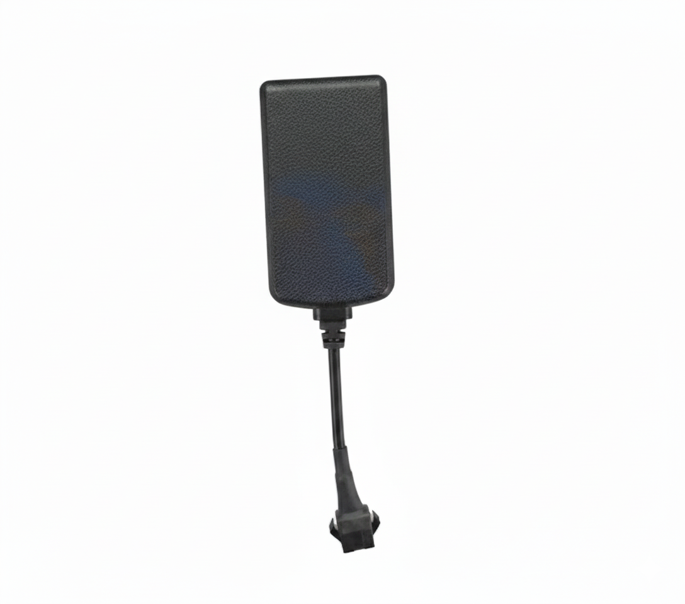

# Protrack - ET300

El Protrack ET300 es un rastreador GPS robusto pensado para el monitoreo confiable de vehículos y el control básico de flotas. Albergado en una caja con certificación IP65, el ET300 está diseñado para soportar instalaciones expuestas y ofrecer telemetría y registro de eventos esenciales para autos, motocicletas y vehículos comerciales ligeros. Entre sus funciones principales se encuentran alertas por geocerca, avisos de exceso de velocidad, control de corte de combustible y registro histórico de viajes.

Como dispositivo compatible con Plaspy desde su salida de fábrica, el ET300 integra esas capacidades directamente en el entorno de seguimiento y gestión de flotas de Plaspy. Al conectarlo a Plaspy, el ET300 suministra fijaciones de ubicación continuas y reportes de eventos que se convierten en vistas de mapa en vivo, alertas oportunas e informes históricos sencillos, lo que lo hace práctico para pequeñas flotas y propietarios de vehículos que requieren rastreo fiable sin complejidad innecesaria.

## Características principales

- Compatible con Plaspy para integración directa en flujos de trabajo de seguimiento en tiempo real y gestión de flotas
- Carcasa resistente IP65 adecuada para instalaciones expuestas en vehículos
- Capacidad de corte de combustible e inmovilizador para apoyar procesos de prevención de robo
- Detección y reporte de cortes de energía para evidenciar manipulación o pérdida de alimentación externa
- Alertas configurables de geocerca y exceso de velocidad para ayudar a aplicar rutas y políticas
- Registro histórico de viajes para análisis retrospectivo de rutas y revisiones de cumplimiento
- Enfocado en telemetría esencial y reportes de eventos confiables para pequeñas flotas y vehículos individuales

## Cómo funciona con Plaspy

Al conectarse a Plaspy, el ET300 entrega telemetría de ubicación y eventos que Plaspy procesa y presenta como información útil para la gestión de flotas. Plaspy transforma los datos del dispositivo en vistas de seguimiento en vivo, notificaciones de alerta e informes históricos, para que los operadores puedan supervisar vehículos, responder a incidentes y analizar viajes pasados.

- Actualizaciones de ubicación en tiempo real y visualización en mapa para monitoreo en vivo
- Alertas por ruptura de geocerca y exceso de velocidad enviadas a Plaspy para notificación inmediata
- Eventos de corte de combustible y acciones de inmovilizador registrados y visibles en la plataforma
- Notificaciones de corte de energía reportadas para detectar posible manipulación o extracción de batería
- Historias de viajes y historial de eventos accesibles para auditorías, entrenamiento de conductores y revisión de rutas

## Casos de uso típicos

- Antirrobo e inmovilización remota de autos y vehículos comerciales ligeros mediante controles de corte de combustible
- Monitoreo de conducta del conductor y aplicación de políticas de velocidad con alertas de exceso de velocidad y revisión de viajes
- Seguimiento de pequeñas flotas y optimización de rutas mediante visibilidad centralizada en tiempo real y datos históricos
- Rastreo de motocicletas y vehículos expuestos donde una carcasa resistente al agua es necesaria
- Monitoreo basado en eventos, como pérdida de energía y activaciones de geocerca, para facilitar respuestas rápidas

## Por qué elegir este rastreador con Plaspy

El ET300 es adecuado para organizaciones y propietarios que necesitan un rastreador GPS duradero y sin complicaciones que aporte telemetría confiable a una plataforma de flotas. Su clasificación IP65 y su conjunto de funciones esenciales lo convierten en una opción práctica para instalaciones expuestas y supervisión sencilla de flotas sin añadir complejidad innecesaria.

Para conocer más sobre cómo Plaspy presenta los datos del ET300 y cómo el rastreador puede encajar en sus operaciones, visite https://www.plaspy.com. Las especificaciones del producto, la disponibilidad y los datos del fabricante pueden cambiar con el tiempo; para la información técnica más reciente, verifique las especificaciones en el sitio del fabricante http://www.protrackgps.in/.
