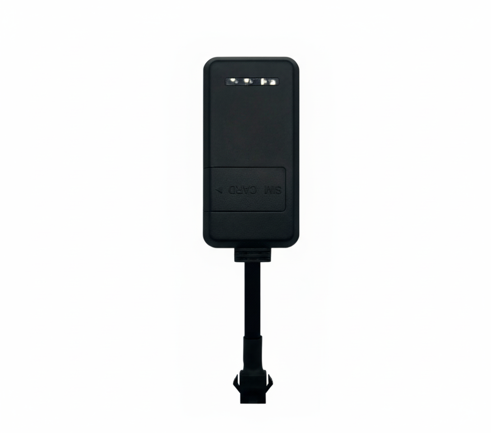

# Protrack - VT05C

El VT05C es un rastreador GPS compacto y cableado, diseñado para un monitoreo confiable de vehículos y protección contra el robo. Construido para resistir entornos exigentes con una clasificación IP65, este rastreador GPS compatible con Plaspy ofrece seguimiento en tiempo real continuo para automóviles y motocicletas. Su factor de forma discreto, ligero y su conexión de alimentación por cable lo hacen ideal para la gestión de flotas y el uso en vehículos personales donde la operación ininterrumpida y la resistencia a manipulaciones son importantes.

Diseñado para una instalación sencilla y una larga vida útil, el VT05C combina características de telemetría y seguridad esenciales — detección ACC, alertas de vibración, geocercas, avisos de sobrevelocidad, reproducción histórica y corte de combustible \(inmovilizador del motor\) — para ayudar a los operadores a reducir el riesgo de robo, monitorizar el comportamiento del conductor y mantener registros precisos de las rutas. Cuando se integra con la plataforma Plaspy, el VT05C alimenta datos de ubicación y eventos en tiempo real hacia un panel unificado para alertas, informes y funciones de control remoto.

## Puntos Clave

- Compatible con Plaspy para seguimiento en tiempo real sin interrupciones y gestión centralizada de la flota.
- Carcasa con clasificación IP65 que resiste la entrada de polvo y chorros de agua para uso duradero en exteriores y en vehículos.
- Detección ACC y reporte del estado de ignición para rastrear con precisión eventos de encendido/apagado del motor.
- Soporte de inmovilizador \(corte de combustible\) para una respuesta anti‑robo efectiva.
- Detección de vibración y alertas de geocerca para notificar manipulación o movimiento no autorizado.
- Aviso de sobrevelocidad y grabación histórica para análisis del comportamiento del conductor y reproducción de rutas.
- Diseño con alimentación por cable para operación ininterrumpida mientras está instalado en un vehículo.

## Cómo Funciona con Plaspy

Cuando se integra con Plaspy, el VT05C pasa a formar parte de una solución completa de telemetría y control de activos. La unidad transmite datos de ubicación y eventos a los servidores de Plaspy, donde la plataforma procesa, visualiza y almacena la información para monitoreo en tiempo real, alertas automatizadas e informes históricos. Gestores de flotas, técnicos de servicio y propietarios de vehículos pueden utilizar las interfaces web y móviles de Plaspy para ver la ubicación en vivo, revisar rutas reproducidas y responder ante eventos de seguridad.

- Seguimiento en tiempo real: actualizaciones continuas de posición entregadas a Plaspy para el monitoreo basado en mapas.
- Informe de ignición/ACC: Plaspy recibe eventos de encendido/apagado del motor para cronometrar viajes y detectar arranques no autorizados.
- Control del inmovilizador y anti‑robo: las alertas de corte de combustible se entregan a Plaspy; los eventos del inmovilizador pueden registrarse y actuarse a través de la plataforma cuando se configure.
- Alertas y telemetría: incumplimientos de geocerca, avisos de sobrevelocidad y alertas de vibración/manipulación activan notificaciones en Plaspy para una respuesta inmediata.
- Reproducción histórica: los registros de posición almacenados por Plaspy permiten reproducir rutas, analizar el comportamiento del conductor y generar informes de cumplimiento.
- Integración de sensores: Aunque las especificaciones de VT05C no listan sensores Bluetooth, Plaspy puede combinar datos de dispositivos BLE externos u otras fuentes de telemetría para ampliar flujos de trabajo de monitorización y monitoreo de combustible cuando sea necesario.

## Resumen Técnico

| Modelo | VT05C |
| --- | --- |
| Tipo de Producto | Rastreador GPS por cable para vehículos \(compacto\) |
| Conectividad | Enlace celular para seguimiento en tiempo real \(la tecnología celular específica y las bandas no se detallan\) |
| Alimentación y Batería | Conexión de alimentación por cable para operación continua; batería interna de respaldo no especificada |
| Interfaces | Detección ACC \(entrada de ignición\), soporte de inmovilizador/corte de combustible, detección de vibración |
| GNSS | Posicionamiento GPS para ubicación en tiempo real y grabación histórica \(otros GNSS no especificados\) |
| Bluetooth | No se reportan sensores Bluetooth en la especificación de VT05C |
| Protección de Ingreso | IP65 — protegida contra polvo y chorros de agua |
| Formato | Perfil ligero y discreto diseñado para instalación en automóvil y motocicleta |

## Casos de Uso

- Antirrobo de flotas y inmovilización remota — monitorear eventos de encendido y activar el corte de combustible cuando sea permitido.
- Comportamiento y seguridad del conductor — avisos de sobrevelocidad y reproducción histórica ayudan a coaching de conducción segura y a reducir riesgos.
- Monitoreo de rutas y cumplimiento — registrar viajes para verificación de despacho, prueba de servicio y optimización de rutas.
- Seguridad de motocicletas y coches — instalación compacta y difícil de manipular con detección de vibración para alertas de manipulación.
- Telemetría de activos mixtos — combinar datos de VT05C en Plaspy con otros sensores o sistemas para apoyar monitoreo de combustible y necesidades telemétricas más amplias.

## Por Qué Elegir Este Rastreador con Plaspy

El VT05C ofrece un equilibrio práctico entre durabilidad, instalación discreta y las funciones básicas de telemetría que las operaciones de flota y los propietarios de vehículos necesitan. Su conexión de alimentación por cable minimiza el tiempo de inactividad, mientras que la protección IP65 lo hace confiable en diversos entornos de vehículos. Al ser un rastreador GPS compatible con Plaspy, se integra directamente en una plataforma lista para empresa para seguimiento en tiempo real centralizado, alertas e informes históricos — permitiendo una mejor gestión de la flota, respuestas anti‑robo más rápidas y una visibilidad más clara de los eventos de ignición e inmovilizador. Para las organizaciones que priorizan un seguimiento de vehículos confiable y de fácil implementación y telemetría directa, el VT05C es una opción diseñada para funcionar bien junto con las capacidades de monitoreo y control de Plaspy.

