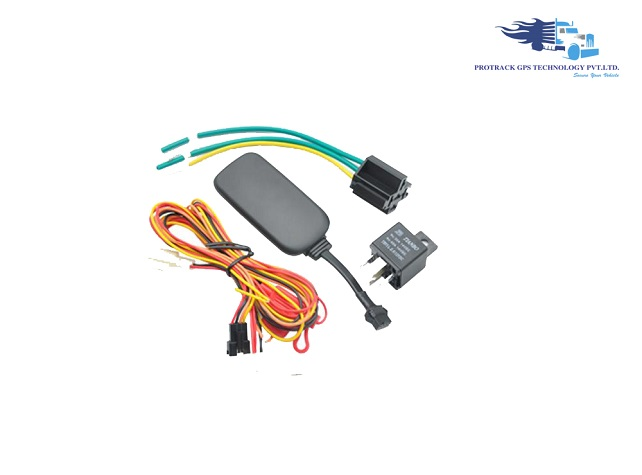

# Protrack - VT05S

El Protrack VT05S es un rastreador vehicular cableado y compacto diseñado para el monitoreo continuo en tiempo real de automóviles y motocicletas. Su tamaño reducido y la resistencia al agua IP65 lo hacen apropiado para entornos exteriores exigentes, mientras que funciones integradas como detección de encendido (ACC), soporte de geocercas, detección de vibraciones, alerta por exceso de velocidad y almacenamiento interno ofrecen un conjunto práctico de características para el seguimiento rutinario y la protección de activos.

Como dispositivo compatible con Plaspy, el VT05S puede enviar datos de ubicación y estado al entorno de gestión de flotas de Plaspy para habilitar visibilidad, alertas y reproducción histórica. La compatibilidad permite a los administradores incluir unidades VT05S en los paneles y flujos de informes de Plaspy para que las flotas y los responsables puedan monitorizar movimientos, recibir notificaciones de geocercas y estados, y revisar los datos registrados cuando la conectividad sea intermitente.

## Aspectos destacados

- Rastreador miniaturizado y cableado, ideal para instalación discreta en autos y motocicletas
- Seguimiento en tiempo real para visibilidad continua de la ubicación
- Resistencia al agua IP65 para operación confiable en condiciones exteriores adversas
- Detección de encendido (ACC) y alertas por vibración para informar cambios de estado del vehículo
- Notificaciones de entrada y salida de geocercas para controlar cumplimiento de zonas y rutas
- Almacenamiento interno para registrar datos de ubicación durante pérdidas temporales de conectividad celular
- Registro histórico y aviso por exceso de velocidad para revisar comportamientos y realizar análisis

## Cómo funciona con Plaspy

Cuando se integra con Plaspy, las unidades VT05S forman parte de una vista unificada de la flota donde se recopilan y presentan datos de posición y eventos para uso operativo. Plaspy procesa las señales del rastreador y las muestra en mapas, sistemas de alertas e informes para que los equipos puedan actuar sobre información en vivo y registrada.

- Visualice la ubicación en vivo de vehículos equipados con VT05S en los mapas de Plaspy para supervisión en tiempo real
- Configure reglas de geocerca en Plaspy para generar alertas de entrada y salida basadas en eventos del VT05S
- Muestre eventos de encendido y vibración en notificaciones de Plaspy para destacar posibles problemas de seguridad o uso
- Acceda a rutas históricas y a los datos almacenados en Plaspy para revisar viajes y analizar incidentes
- Incluya los datos del VT05S en los informes de Plaspy sobre rendimiento de flota, utilización y cumplimiento

## Casos de uso típicos

- Monitoreo de autos y motocicletas en flotas mixtas donde se prefieren rastreadores compactos
- Seguridad de activos para vehículos que operan en exteriores o entornos exigentes
- Seguimiento de entregas y logística donde las alertas de geocerca y las rutas históricas ayudan a verificar paradas
- Supervisión de vehículos de alquiler y compartidos para controlar encendido y patrones de movimiento
- Operaciones de pequeñas flotas que requieren visibilidad sencilla de ubicación y un historial grabado

## Por qué elegir este rastreador con Plaspy

El VT05S ofrece un equilibrio entre diseño compacto y características de seguimiento prácticas que encajan bien con las capacidades de monitoreo e informes de Plaspy. Su construcción resistente a la intemperie y el almacenamiento interno lo convierten en una opción sólida para vehículos que operan al aire libre o con conectividad intermitente, mientras que la detección de eventos integrada respalda flujos de trabajo de seguridad y operación que Plaspy puede mostrar y gestionar.

Para organizaciones que usan Plaspy, emparejar unidades VT05S permite ampliar la visibilidad de la flota sin añadir complejidad innecesaria. Las funciones principales del dispositivo responden a requisitos telemáticos habituales como precisión de ubicación, supervisión de geocercas, estado de encendido y reproducción histórica, lo que facilita su incorporación en procesos de seguimiento, alerta e informes dentro de Plaspy.

Para obtener más información sobre cómo las unidades VT05S pueden funcionar con Plaspy, visite https://www.plaspy.com. Las especificaciones del producto, la disponibilidad y los detalles del fabricante pueden cambiar con el tiempo; para la información técnica más actual consulte el sitio oficial de Protrack en http://www.protrackgps.in/.
