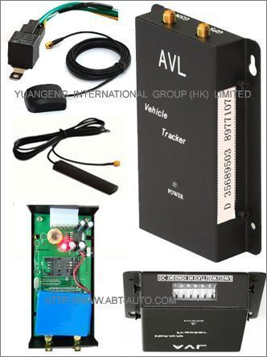

# PST - AVL-011

El PST AVL-011 es un rastreador GPS para vehículos pensado para ofrecer protección avanzada contra robos en autos, camionetas y camiones. Integra seguimiento de ubicación con funciones de inmovilización remota, lo que permite a los responsables interrumpir el suministro de energía o combustible del vehículo cuando sea necesario. Además, cuenta con función SOS y la capacidad de monitorear audio ambiental, y puede instalarse en un lugar discreto para permanecer oculto a inspecciones casuales.

Como dispositivo compatible con Plaspy, el AVL-011 se puede integrar a la plataforma de monitoreo de flotas y activos de Plaspy para incorporar funciones antirrobo dentro de un flujo de trabajo centralizado. Los usuarios de Plaspy pueden ver la ubicación del vehículo, recibir alertas y aprovechar las funciones de emergencia e inmovilización del AVL-011 dentro de sus procesos operativos, sin depender de detalles de producto más allá de lo que el rastreador ofrece.

## Aspectos destacados

- Capacidad de inmovilización remota para cortar alimentación eléctrica o de combustible en respuesta a incidentes de seguridad.
- Diseño para instalación sigilosa que permite ubicar el dispositivo discretamente.
- Función de emergencia SOS con posibilidad de monitoreo de audio alrededor del vehículo.
- Diseñado para uso en autos, camiones y vehículos similares que requieran medidas antirrobo.
- Complementa los flujos de trabajo de monitoreo de flotas cuando se integra con una plataforma compatible.
- Valor práctico para operadores que necesitan intervención rápida y control remoto en casos de pérdida o robo.

## Cómo funciona con Plaspy

Al integrarse con Plaspy, el AVL-011 amplía la visibilidad y el control operativo sobre vehículos individuales y flotas. Plaspy agrega datos de ubicación e indicadores de eventos provenientes de rastreadores compatibles para ofrecer una visión unificada de activos e incidentes.

- Seguimiento centralizado y visualización en mapa de vehículos equipados con AVL-011.
- Gestión de eventos y alertas en Plaspy para activaciones SOS y acciones de inmovilización.
- Herramientas de supervisión operativa para que los responsables de flota monitoreen el estado de los vehículos y respondan a incidentes.
- Informes históricos y registros de actividad para apoyar la recuperación y revisiones post incidente.
- Notificaciones configurables para informar al personal pertinente cuando se produzcan eventos de seguridad.

## Casos de uso típicos

- Recuperación de vehículos robados combinando visibilidad de ubicación con la capacidad de inmovilización remota.
- Protección de vehículos de alto valor o activos en operaciones de flota que requieren rastreo discreto.
- Situaciones de emergencia en las que el monitoreo de audio SOS ayuda a evaluar amenazas inmediatas.
- Operaciones de alquiler y vehículos compartidos que necesitan capacidades de intervención remota.
- Programas de seguridad de flotas que demandan acción rápida y manejo centralizado de incidentes.

## Por qué elegir este rastreador con Plaspy

El AVL-011 es una opción enfocada para organizaciones que priorizan funciones antirrobo e instalación discreta. Su combinación de inmovilización remota y monitoreo SOS lo hace valioso tanto para flotas orientadas a la seguridad como para la protección de vehículos individuales. Al integrarlo con Plaspy, las capacidades del rastreador se incorporan a flujos de trabajo estandarizados de monitoreo, alertas y respuesta a incidentes sin complicar la gestión de la flota.

Si desea explorar cómo el PST AVL-011 puede cubrir sus necesidades de rastreo y seguridad, conozca más sobre Plaspy en el sitio principal https://www.plaspy.com. Las especificaciones del producto, disponibilidad y detalles del fabricante pueden variar con el tiempo, por lo que le recomendamos verificar la documentación oficial del fabricante para obtener la información más precisa y actualizada.
