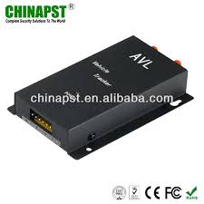

# PST - PST-AVL01

El PST-AVL01 es un rastreador GPS GSM GPRS diseñado para el seguimiento vehicular en tiempo real y la gestión de flotas. Equipado con un receptor GPS de alta sensibilidad y conectividad GPRS estable, ofrece actualizaciones continuas de posición y un rendimiento fiable, apto tanto para vehículos individuales como para flotas más grandes. El dispositivo destaca por su tamaño compacto y su construcción resistente, e incluye funciones habituales en rastreo vehicular como geocercas, inmovilización remota y alertas SOS.

Como dispositivo compatible con Plaspy, el PST-AVL01 puede enviar sus datos de ubicación y eventos a la plataforma Plaspy para ofrecer una visión consolidada de toda su flota. Con Plaspy conectado, las actualizaciones de posición en tiempo real y las notificaciones de eventos del rastreador se integran en paneles, vistas de mapas e informes periódicos para apoyar la supervisión operativa, la seguridad y la optimización de rutas.

## Puntos clave

- Rastreo GPS en tiempo real para conocer la ubicación de los vehículos al instante
- Conectividad GSM y GPRS para transmisión continua de datos
- Módulos GPS y GPRS de buena sensibilidad y desempeño estable
- Diseño compacto y resistente, adecuado para el uso cotidiano en vehículos
- Funciones integradas como geocercas para detectar entradas y salidas de áreas
- Inmovilización remota y alertas SOS para seguridad y respuesta ante emergencias

## Cómo funciona con Plaspy

Plaspy recibe los datos de ubicación y eventos de rastreadores compatibles como el PST-AVL01 y los presenta mediante paneles de flota, mapas y flujos de alertas. La integración está enfocada en ofrecer visibilidad clara de las posiciones de los vehículos y de los eventos relevantes, para que los gestores de flota puedan actuar con información oportuna.

- Ubicación en vivo de los vehículos mostrada en los mapas de Plaspy para conciencia situacional inmediata
- Eventos de geocerca enviados a Plaspy para alertas automáticas e informes de entrada y salida
- Alertas SOS visibles en Plaspy para que los operadores respondan a señales de emergencia
- Historial de seguimiento y reproducción de rutas disponible para informes y revisiones posteriores
- Monitorización y vistas de estado a nivel de flota para priorizar despachos y mantenimiento
- Cuando el rastreador y la implementación soportan comandos remotos, las acciones de inmovilización se pueden coordinar desde las interfaces de Plaspy

## Casos de uso típicos

- Seguimiento diario de la flota y supervisión operativa centralizada
- Monitoreo de rutas y análisis histórico de desplazamientos para entregas y vehículos de servicio
- Flujos de seguridad y recuperación utilizando alertas SOS y funciones de inmovilización
- Control de vehículos de renta o leasing para mejorar la gestión de activos
- Coordinación de vehículos de servicio en campo y control de tiempos en sitio para optimizar operaciones

## Por qué elegir este rastreador con Plaspy

El PST-AVL01 combina funciones prácticas de rastreo con un diseño compacto, lo que lo hace adecuado para organizaciones que requieren actualizaciones de posición confiables y funciones básicas de seguridad. Al integrarlo con Plaspy, los datos del rastreador se consolidan en una plataforma única para simplificar la monitorización, las alertas y la generación de informes en toda la flota.

Para organizaciones que buscan visibilidad vehicular clara y controles esenciales de gestión de flotas, el PST-AVL01 junto con Plaspy ofrece una solución equilibrada que prioriza el rastreo fiable y eventos útiles sin complejidad innecesaria.

Para obtener más información sobre Plaspy y el soporte a rastreadores compatibles visite https://www.plaspy.com. Las especificaciones del producto y la disponibilidad pueden cambiar con el tiempo, por lo que le recomendamos verificar los detalles técnicos actuales y la documentación del fabricante en los recursos oficiales de PST antes de tomar decisiones finales.
