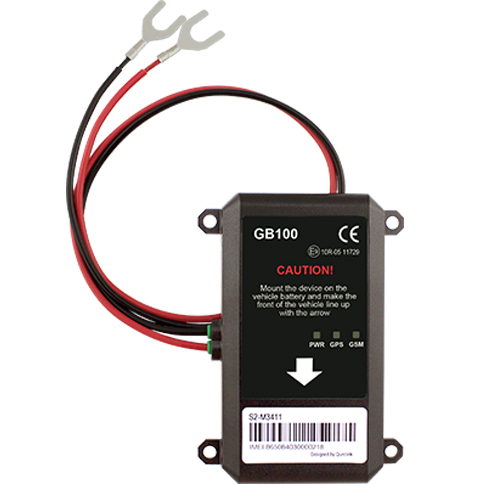

# QuecLink - GB100

El rastreador GPS GB100 montado en vehículos de una familia de dispositivos telemáticos consolidada es compatible con Plaspy y está diseñado para reducir los costos de instalación en proyectos telemáticos a gran escala, como el seguro basado en uso \(UBI\), el financiamiento automotriz y la gestión de flotas. Con un conjunto de antenas GNSS/GSM internas dentro de una carcasa impermeable IP65 y un formato compacto, el GB100 ofrece seguimiento en tiempo real y datos de comportamiento de alta resolución, incluso cuando está instalado debajo del capó.

El GB100 combina telemetría robusta \(posición, velocidad, eventos del acelerómetro\) con una amplia capacidad de almacenamiento de mensajes y comunicaciones flexibles \(TCP/UDP/SMS\). Eso lo convierte en un rastreador GPS ideal para flotas y programas de seguros que requieren ubicación precisa, monitoreo del comportamiento del conductor y una entrega de datos confiable a Plaspy para paneles en vivo, alertas y analítica.

## Aspectos clave

- Rastreador GPS compatible con Plaspy diseñado para despliegues telemáticos, UBI y financiamiento automotriz.
- Carcasa impermeable IP65 y tamaño compacto \(91.5 × 51.5 × 11 mm\) para instalaciones ocultas bajo el capó.
- Receptor GNSS All‑in‑One de alta sensibilidad de u‑blox con precisión de posición \<2.5 m CEP y TTFF rápido \(~1 s en arranque en caliente\).
- GSM cuádruple banda \(850/900/1800/1900 MHz\) con clase multi‑slot GPRS 10 y opciones de comunicación TCP/UDP/SMS para seguimiento en tiempo real hacia Plaspy.
- Acelerómetro de 3 ejes integrado \(100 Hz\) con paquetes de datos de choque y trazas previas y posteriores al evento para el comportamiento del conductor y la reconstrucción de accidentes.
- Batería de respaldo NiMH recargable interna \(200 mAh\) más un amplio rango de tensión de funcionamiento \(8–32 V DC\) para una amplia compatibilidad con vehículos.
- Almacenamiento en búfer en el propio dispositivo de hasta 10,000 mensajes para proteger la integridad de los datos durante interrupciones temporales de la red.

## Cómo funciona con Plaspy

Cuando se integra con Plaspy, el GB100 transmite la posición y la telemetría en tiempo casi real y suministra los datos de eventos necesarios para paneles, alertas y analítica a largo plazo. Las comunicaciones pueden canalizarse por TCP o UDP para telemetría continua o mediante SMS para mensajes de respaldo, asegurando que Plaspy reciba actualizaciones críticas, ya sea que el dispositivo esté en la red o en una zona de cobertura débil.

- Actualizaciones de ubicación y telemetría en tiempo real \(intervalos de reporte configurables hasta 1 segundo durante la conducción\).
- Telemetría de comportamiento del conductor: frenadas bruscas, aceleración rápida y paquetes de datos de choque del acelerómetro de 3 ejes para analíticas de Plaspy y puntuación UBI.
- Estado de la alimentación externa y de la batería interna, con alertas para detectar manipulación o pérdida de energía.
- Alertas de geocerca y velocidad \(hasta 20 geocercas circulares configurables en el propio dispositivo\) para la gestión de flotas y monitorización anti‑robo mediante flujos de trabajo de Plaspy.
- Almacenamiento en búfer offline robusto \(hasta 10,000 mensajes\) para que Plaspy reciba telemetría en cola cuando se restablece la conexión.

## Resumen técnico

| Conectividad | GSM de cuádruple banda 850/900/1800/1900 MHz; clase multi‑slot GPRS 10; transporte de datos TCP, UDP o SMS |
| --- | --- |
| Bandas | GSM 850 / 900 / 1800 / 1900 MHz \(cuádruple banda\) |
| Alimentación y Batería | Tensión de funcionamiento 8–32 V DC; batería interna NiMH de respaldo recargable, 200 mAh; monitoreo de alimentación externa y alertas de estado |
| Interfaces / Funciones | Informes programables por tiempo/distancia/kilometraje; hasta 20 geocercas circulares; alertas de velocidad; monitorización del comportamiento del conductor \(frenadas bruscas/aceleración\); paquetes de datos de choque |
| GNSS | Receptor GNSS All‑in‑One de u‑blox; alta sensibilidad \(seguimiento hasta −162 dBm\); precisión de posición \<2.5 m CEP \(modo independiente\); TTFF rápido \(promedio arranque en caliente ~1 s\); registro de 1 s durante la conducción |
| Acelerómetro | Acelerómetro integrado de 3 ejes, muestreo a 100 Hz; trazas previas y posteriores al evento para reconstrucción de accidentes |
| Rendimiento RF | Potencia máxima de transmisión hasta 33 dBm \(GSM850/900\); sensibilidad del receptor hasta −108 dBm en rango de entrada |
| Almacenamiento / Búfer | Memoria/Almacenamiento en búfer interno de hasta 10,000 mensajes |
| Ambiente | Carcasa IP65; rango de operación −20 °C a +70 °C; 0–95% de humedad no condensante |
| Formato | Diseño compacto montado en vehículo, 91.5 × 51.5 × 11 mm; peso 75 g |
| Gestión Remota | Comunicación vía TCP/UDP/SMS para la integración con plataformas back‑end; FOTA/gestión remota en el dispositivo no especificada |

## Casos de uso

- Despliegues a gran escala de UBI: datos GNSS y acelerómetro de alta frecuencia alimentan los algoritmos de puntuación de Plaspy para programas de seguro basado en uso.
- Gestión de flotas y supervisión de rutas: seguimiento en tiempo real, alertas de velocidad y monitorización de geocercas para operaciones logísticas y de servicios.
- Financiación de activos y reducción del riesgo de recuperación: telemetría continua más alertas de pérdida de energía ayudan a supervisar vehículos financiados.
- Reconstrucción de accidentes y coaching de conductores: paquetes de datos de choque y trazas previas/post‑evento proporcionan evidencia para análisis de incidentes y formación de conductores.
- Detección y alerta anti‑robo: seguimiento de ubicación y alertas de alimentación externa/batería proporcionan la telemetría que Plaspy necesita para iniciar flujos de recuperación.

## Por qué elegir este rastreador con Plaspy

El GB100 fue diseñado específicamente para despliegues telemáticos con restricciones de costo que requieren datos confiables y de alta calidad. Su carcasa impermeable y compacta, junto con las antenas internas, simplifica instalaciones ocultas que reducen el tiempo de montaje y los costos de material. Con el rendimiento GNSS de u‑blox, un acelerómetro de alta frecuencia y un sólido almacenamiento de mensajes, el GB100 proporciona la ubicación y la telemetría de comportamiento consistentes que Plaspy necesita para el rastreo en tiempo real, analítica de gestión de flotas, puntuación UBI y flujos de trabajo anti‑robo.

Elegir un rastreador GPS compatible con Plaspy como el GB100 implica una integración más rápida, un flujo de datos fiable y una menor carga de soporte continuo para programas de gran escala. Sus comunicaciones flexibles \(TCP/UDP/SMS\), monitoreo de pérdidas de energía y capacidades de eventos integradas reducen la necesidad de personalización de hardware mientras entregan la telemetría y alertas que impulsan insights accionables en Plaspy —desde mapas en vivo hasta informes históricos y políticas basadas en comportamientos.

