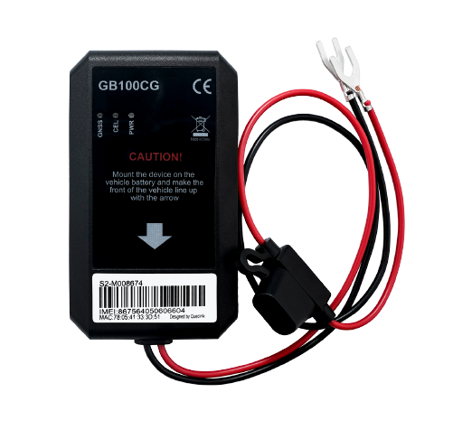

# QuecLink - GB100CG

El GB100CG es un rastreador GPS compacto de montaje en batería, diseñado para telemática automotriz y soluciones de seguros basados en uso (UBI). Combina una carcasa resistente con certificación IP67, conectividad celular amplia y un sensor de movimiento de 6 ejes de alta frecuencia para ofrecer actualizaciones continuas de posición, datos de comportamiento al conducir y registros de eventos aptos para aseguradoras, operadores de flota y sistemas de seguridad vehicular.

Como dispositivo compatible con Plaspy, el GB100CG puede alimentar a Plaspy con telemetría de ubicación, movimiento y eventos que posibilita la supervisión en tiempo real, alertas y análisis. Sus opciones configurables de reporte y emparejamiento con accesorios lo hacen práctico para visibilidad de flotas, procesos antirobo y análisis detallados de incidentes cuando se usa junto con los paneles y herramientas de informes de Plaspy.

## Aspectos clave

- Factor de forma compacto de montaje en batería con carcasa IP67 para uso rudo en campo.
- Sensor de movimiento de 6 ejes y alta frecuencia para capturar con detalle comportamiento de conducción y eventos de choque.
- Conectividad LTE Cat 1 con fallback a 2G para mantener cobertura en áreas diversas.
- Reportes configurables y alarmas de eventos para geocercas, exceso de velocidad, remolque y eventos de energía.
- Emparejamiento BLE con accesorios para ampliar la telemetría de corto alcance mediante sensores externos.
- Diseñado para telemática automotriz, UBI y seguridad vehicular donde la instalación compacta y la confiabilidad en los reportes son prioritarias.

## Cómo funciona con Plaspy

Al integrarse con Plaspy, el GB100CG suministra datos de ubicación, movimiento y eventos que Plaspy ingiere para presentar seguimiento en vivo, alertas y análisis históricos. Plaspy utiliza los reportes y registros de eventos del dispositivo para poblar paneles, disparar notificaciones y sostener flujos de trabajo posteriores en operaciones y reclamos.

- Ubicación en tiempo real y actualizaciones periódicas de posición para visibilidad de la flota y monitoreo de rutas.
- Segmentación de viajes y lógica de ignición virtual basada en movimiento y estado de energía para reportes de viaje y métricas de uso.
- Registros de movimiento a alta frecuencia y datos de eventos de choque que alimentan reconstrucción de incidentes y análisis de comportamiento de conducción.
- Alertas de entrada y salida de geocerca, velocidad y remolque que generan notificaciones inmediatas y registros históricos de eventos.
- Correlación de telemetría de corto alcance de sensores emparejados por BLE con eventos GPS para un contexto situacional más completo.

## Casos de uso habituales

- Programas de seguros basados en uso que requieren muestreo de movimiento de alta fidelidad y reportes programados para cálculo de riesgo y análisis de siniestros.
- Gestión de flotas para seguimiento en tiempo real, registro de kilometraje y alertas basadas en eventos para mejorar operaciones y supervisión de conductores.
- Recuperación de vehículos robados y procesos antirobo usando detección de remolque e informes de manipulación para apoyar una respuesta rápida.
- Detección de choques y reconstrucción de incidentes para asistir a equipos de reclamos y programas de seguridad con datos detallados de eventos.
- Monitoreo aumentado con sensores donde accesorios BLE proporcionan telemetría suplementaria como temperatura u ocupación.

## Por qué elegir este rastreador con Plaspy

El GB100CG ofrece una combinación equilibrada de robustez, alcance de red y sensibilidad en el sensor de movimiento que se ajusta a los requerimientos frecuentes de telemática y seguros. Para organizaciones que usan Plaspy, la capacidad del dispositivo para configurar reportes y soportar accesorios facilita alimentar la plataforma con los datos de ubicación y eventos necesarios para seguimiento, alertas y análisis sin complejidad innecesaria.

Al estar diseñado para despliegue automotriz y colocación compacta, es ideal en escenarios donde la instalación discreta, la continuidad de reporte ante pérdida de energía y la detección fiable de eventos son importantes. En conjunto con Plaspy, el rastreador puede ayudar a mejorar la supervisión de la flota, acelerar la respuesta ante incidentes y sustentar análisis tipo UBI mediante telemetría consistente y reportes estructurados de eventos.

Para obtener más información sobre cómo este modelo de QuecLink funciona con Plaspy visite https://www.plaspy.com. Las especificaciones del producto, la disponibilidad y los detalles del fabricante pueden cambiar con el tiempo, por lo que le recomendamos verificar la información técnica y regulatoria actual en el sitio oficial de QuecLink https://www.queclink.com/ antes de tomar decisiones de compra o despliegue.
