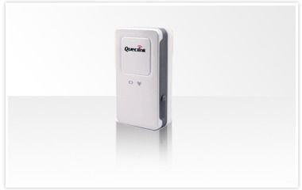

# QuecLink - GL100M

El QuecLink GL100M es un rastreador GPS compacto diseñado para el seguimiento de vehículos, mascotas y activos. Ofrece posicionamiento de alta sensibilidad con un tiempo rápido de primera fijación y envía informes periódicos de posición a través de canales celulares. El equipo opera en frecuencias GSM quad band y cuenta con una clara pantalla OLED blanca para mostrar información local. Su carcasa resistente al agua y su bajo consumo energético hacen al GL100M adecuado para despliegues variados y para periodos prolongados en modo standby.

Como dispositivo compatible con Plaspy, el GL100M puede reportar datos de ubicación y eventos a plataformas de gestión de flotas y activos. Su protocolo embebido @Track y el soporte para envío por datos celulares o SMS facilitan la integración con los sistemas Plaspy para visibilidad en tiempo real, cargas programadas de posición y flujos de trabajo de alertas. Esta compatibilidad convierte al GL100M en una opción práctica para organizaciones que requieren hardware de rastreo confiable que alimente paneles operativos e informes en Plaspy.

## Características clave

- Conectividad GSM quad band para amplia cobertura celular y reportes confiables
- Tiempo rápido de primera fijación y alta sensibilidad de recepción para actualizaciones de posición consistentes
- Diseño resistente al agua, apto para uso en exteriores y entornos mixtos
- Pantalla OLED blanca integrada para ver el estado y la información local de forma sencilla
- Bajo consumo de energía para prolongar el periodo en espera y facilitar despliegues de largo plazo
- Sensor de movimiento 3D incorporado para detección de movimiento y activación de alertas
- Certificaciones según estándares industriales comunes que aumentan la confianza en su implementación

## Cómo funciona con Plaspy

Al integrarse con Plaspy, el GL100M transmite posiciones y eventos a la plataforma Plaspy, donde usted puede monitorearlos, analizarlos y generar reportes. Plaspy procesa los informes del rastreador y los presenta en mapas, líneas de tiempo y flujos de alertas para apoyar la supervisión operativa y la toma de decisiones.

- Envíe informes de posición periódicos y recíbalos en Plaspy para visibilidad de ubicación en tiempo real
- Active alertas basadas en detección de movimiento y permita que Plaspy notifique a los operadores o registre los eventos para su revisión
- Use notificaciones de geocercas y cruces de límites dentro de Plaspy para supervisar el movimiento de activos
- Agregue datos de dispositivos para informes a nivel de flota y reproducción histórica en Plaspy
- Configure reportes programados para equilibrar la frecuencia de actualización y el uso de datos según sus operaciones

## Casos de uso típicos

- Rastreo de vehículos de flota para monitoreo de rutas y asignación de activos
- Seguimiento de mascotas donde el tamaño compacto y la resistencia al agua son relevantes
- Rastreo general de activos para equipos que requieren informes periódicos de posición
- Despliegues a largo plazo que necesitan bajo consumo en modo espera y reportes confiables
- Activos móviles que se benefician de alertas activadas por movimiento y posiciones programadas

## Por qué elegir este rastreador para usar con Plaspy

El GL100M es una opción versátil para organizaciones que buscan un equilibrio entre sensibilidad, durabilidad y flexibilidad en los reportes. Su soporte celular quad band y su protocolo de reporte embebido facilitan su incorporación a flujos de trabajo existentes en Plaspy para rastreo en vivo, alertas y análisis histórico. El diseño resistente al agua y su perfil de bajo consumo también son ventajas cuando los dispositivos se instalan en entornos donde la durabilidad y la larga autonomía son prioritarias.

Si usted busca un rastreador compacto que pueda alimentar Plaspy con datos de ubicación y eventos mientras soporta detección de movimiento y reportes programados, el QuecLink GL100M es una opción práctica a evaluar. Learn more about Plaspy on the main website https://www.plaspy.com and verify current product specifications and availability with the manufacturer at https://www.queclink.com/ as details and certifications can change over time.
