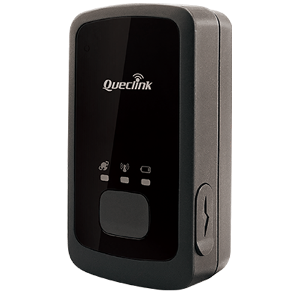

# QuecLink - GL300

# Queclink GL300

El Queclink GL300 es un rastreador GPS compacto y robusto, probado en escenarios de monitoreo en vivo y ahora disponible como un dispositivo compatible con Plaspy. Diseñado para la seguridad personal, eventos de resistencia y el seguimiento de activos al aire libre, el GL300 ofrece seguimiento continuo y en tiempo real desde un localizador GNSS resistente al agua que admite GPS y GLONASS. Su fiabilidad demostrada en campo lo convierte en una opción excelente cuando se requieren flujos de ubicación consistentes hacia la plataforma Plaspy para la visibilidad de la situación y la gestión de operaciones.

El historial probado del GL300 en entornos desafiantes —desde senderos costeros hasta terrenos expuestos— demuestra cómo un rastreador GNSS compacto y duradero puede mejorar la seguridad de eventos, la visibilidad de activos y los flujos de trabajo de monitoreo remoto. Como rastreador GPS compatible con Plaspy, el GL300 se integra en los paneles de Plaspy para proporcionar actualizaciones de ubicación en tiempo real y telemetría que respaldan la gestión de flotas, la monitorización anti-robo y la generación de informes operativos.

## Aspectos destacados

- Compatible con Plaspy: integración sencilla para entregar seguimiento en tiempo real y flujos de ubicación a los paneles de Plaspy.
- GNSS multiconstelación: admite GPS y GLONASS para mejorar la disponibilidad de satélites y la precisión de posicionamiento en terrenos variados.
- Robusto y resistente al agua: diseñado para uso en exteriores, manteniendo una operación fiable en condiciones húmedas y entornos costeros.
- Desempeño probado en campo: utilizado en el monitoreo de eventos en vivo \(Icebug Xperience\) para rastrear a los participantes de forma continua a través de terrenos difíciles.
- Formato compacto: fácil de desplegar en personas o activos pequeños sin añadir volumen ni peso.
- Conciencia situacional fiable: permite a organizadores y equipos de seguridad responder rápidamente con datos de ubicación en vivo y reproducción histórica.
- Flujo de telemetría flexible: proporciona datos de ubicación consistentes a Plaspy para informes, geocercas y flujos de alertas.

## Cómo funciona con Plaspy

Cuando se integra con Plaspy, el GL300 proporciona datos de posición y estado GNSS en tiempo real que Plaspy procesa para mapas, alertas y análisis. Plaspy utiliza la ubicación y la telemetría del rastreador para impulsar vistas de seguimiento en tiempo real, reproducción de rutas históricas y notificaciones basadas en eventos. Dado que el GL300 es un localizador GNSS compacto con fiabilidad demostrada en condiciones exteriores, resulta especialmente útil para el seguimiento de personal y la monitorización de activos donde se requiere una visibilidad continua de la ubicación.

- Actualizaciones de ubicación y telemetría en tiempo real entregadas a Plaspy para mapas y paneles en tiempo real.
- GNSS multiconstelación \(GPS + GLONASS\) garantiza una cobertura satelital más amplia para fijaciones más consistentes en terrenos desafiantes.
- Su diseño resistente al agua mantiene la continuidad del seguimiento en entornos lluviosos o costeros, reduciendo las interrupciones de datos enviados a Plaspy.
- Soporta flujos de trabajo comunes de Plaspy, como geocercas, alertas y análisis de rutas históricas para la seguridad y la planificación operativa.
- Permite la gestión de flotas y la monitorización anti-robo en Plaspy cuando se utiliza como parte de implementaciones telemáticas más amplias; entradas o periféricos adicionales pueden ampliar las capacidades \(ver notas de integración\).

## Resumen técnico

| Fabricante | Queclink |
| --- | --- |
| Modelo | GL300 |
| GNSS | GPS y GLONASS \(multiconstelación\) |
| Robustez | Resistente al agua, diseñado para exteriores y condiciones costeras |
| Factor de forma | Localizador GNSS compacto para uso personal y de activos, apto para montarse en personas o activos pequeños |
| Conectividad | Integración de datos en tiempo real con los ecosistemas de seguimiento de Queclink y Plaspy; las interfaces específicas varían según la implementación \(no especificado\) |
| Alimentación y batería | No especificado en la descripción |
| Interfaces | No especificado en la descripción |
| Bluetooth | No se proporcionan detalles de Bluetooth en la descripción |
| Gestión remota | Se integra con los sistemas de seguimiento y gestión de activos de Queclink para flujos en vivo; la gestión a nivel de plataforma está disponible mediante la integración con Plaspy |

## Casos de uso

- Seguridad de eventos y seguimiento de participantes: flujos de ubicación continuos para organizadores y equipos de seguridad durante eventos de resistencia y desafíos al aire libre.
- Seguridad personal para actividades al aire libre: caminantes, guías y personal de campo se benefician de un rastreador GPS resistente al agua que informa de la ubicación de forma fiable a Plaspy.
- Visibilidad de activos en entornos adversos: rastrear equipos y activos portátiles de alto valor en áreas costeras y terrenos expuestos donde la durabilidad es crucial.
- Monitoreo operativo y análisis post-evento: utiliza Plaspy para reproducir rutas, auditar la cobertura y optimizar la logística a partir de la telemetría del GL300.

## Por qué elegir este rastreador para Plaspy

El Queclink GL300 combina un rendimiento GNSS probado en campo con un diseño duradero e resistente al agua para entregar un seguimiento en tiempo real confiable en Plaspy. Para las organizaciones que requieren una conciencia de posición fiable en entornos desafiantes, húmedos o costeros, el GL300 reduce las lagunas de datos y ayuda a los equipos de seguridad y a los organizadores a mantener la visibilidad de la situación. La integración del GL300 en la plataforma de Plaspy ofrece telemetría, cartografía y alertas simplificadas, respaldando la gestión de flotas, la monitorización anti-robo y la generación de informes operativos sin añadir complejidad. Cuando se requieren telemáticas extendidas como monitorización de combustible, control de encendido o flujos de inmovilización, Plaspy puede combinar las señales de ubicación del GL300 con otros dispositivos compatibles para construir una solución integral.

En resumen, el GL300 es un rastreador GPS compacto y de confianza que aporta precisión GNSS multiconstelación y fiabilidad robusta a los sistemas de rastreo impulsados por Plaspy. Su uso probado en eventos reales subraya su idoneidad para la seguridad personal, el rastreo en exteriores y la visibilidad de misión crítica donde la fiabilidad del seguimiento en tiempo real y la integración son cruciales.

  \<meta itemprop="brand" content="Queclink">

