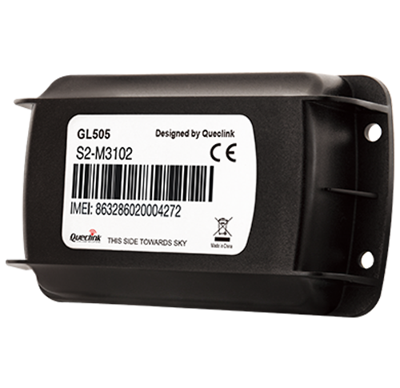

# QuecLink - GL505

El GL505 es un rastreador GPS compacto de QuecLink diseñado para el seguimiento de larga duración y bajo mantenimiento de ganado y activos remotos al aire libre. Pensado para entornos rurales y pastoriles, el GL505 combina posicionamiento GNSS de alta precisión con geocercas configurables y alertas de inactividad basadas en movimiento, todo en una carcasa resistente a la intemperie y a manipulaciones, con un tamaño apto para colocarse dentro de collares animales.

Como dispositivo compatible con Plaspy, el GL505 envía datos fiables de ubicación y eventos a su plataforma Plaspy para que usted mantenga visibilidad sobre rebaños y activos. Su diseño orientado a una larga vida en espera y a la construcción robusta lo hace ideal para usuarios de Plaspy que necesitan monitoreo continuo con mantenimiento mínimo en campo.

## Características principales

- Compatible con Plaspy para enviar datos de ubicación y alertas a una plataforma centralizada de monitoreo
- Vida en espera excepcional de hasta cinco años si se configura con baja frecuencia de reporte
- Carcasa robusta e IPX7 adecuada para polvo, barro y exposición prolongada al exterior
- Posicionamiento GNSS de alta precisión con historial de movimiento para seguimiento en el tiempo
- Geocercas configurables que generan alertas cuando los animales entran o salen de zonas predefinidas
- Sensor de movimiento con detección de inactividad para notificar a los cuidadores sobre inmovilidad prolongada
- Diseño resistente a la manipulación que permite instalación y ocultamiento dentro de collares animales

## Cómo funciona con Plaspy

Al integrarse con Plaspy, el GL505 transmite telemetría de ubicación y eventos a la plataforma para que usted pueda ver posiciones en vivo, recibir alertas y conservar registros históricos de movimiento para análisis y procesos de recuperación. Plaspy utiliza esos datos para ofrecer visibilidad centralizada y notificaciones configurables adaptadas a necesidades agrícolas y de activos remotos.

- Actualizaciones de ubicación en tiempo real y reproducción de historial dentro del panel de Plaspy para monitoreo en directo
- Eventos y alertas de geocercas que informan a los gestores sobre brechas de perímetro o entradas a áreas restringidas
- Alarmas por inactividad basadas en movimiento para ayudar a detectar posibles problemas de bienestar o animales perdidos
- Notificaciones de manipulación y de colocación para reducir el riesgo de hurto y pérdida de dispositivos mediante montaje discreto
- Datos formateados para integración en informes y flujos operativos de Plaspy para auditoría y recuperación

## Casos de uso habituales

- Prevención de robos y recuperación rápida de ganado como bovinos, ovinos y caprinos mediante alertas de geocerca e historial de ubicaciones
- Monitoreo del bienestar donde las alertas por movimiento identifican animales que han dejado de moverse
- Gestión remota de rebaños para reducir recorridos de campo y automatizar la vigilancia perimetral
- Análisis de rotación de pasturas y movimientos para apoyar la planificación de pastoreo y la asignación de recursos
- Seguridad y monitoreo de equipos remotos o activos rurales estáticos donde importa la larga duración de batería

## Por qué elegir este rastreador con Plaspy

El GL505 está diseñado para entornos donde los dispositivos deben resistir condiciones adversas y operar durante largos periodos sin reemplazo frecuente de baterías. En conjunto con Plaspy, el GL505 convierte las lecturas GNSS precisas y los eventos de movimiento en información accionable que apoya la respuesta ante robos, el monitoreo de bienestar y la gestión rutinaria del rebaño.

Si busca un rastreador compacto y de bajo mantenimiento que envíe ubicaciones y alertas a una plataforma de gestión centralizada, el GL505 es una opción práctica para despliegues agrícolas y de activos remotos. Conozca más sobre Plaspy y cómo puede centralizar sus flujos de trabajo de seguimiento en https://www.plaspy.com. Las especificaciones del producto, disponibilidad y detalles del fabricante pueden cambiar con el tiempo, por lo que verifique la información técnica actual en el sitio oficial de QuecLink en https://www.queclink.com/.
