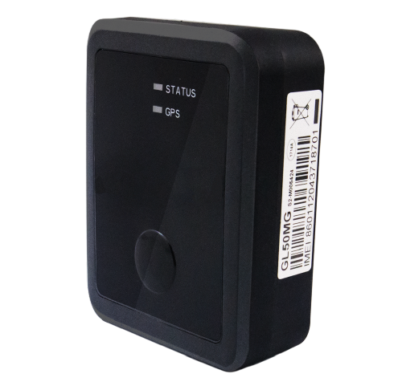

# QuecLink - GL50MG

El GL50MG es un rastreador GPS compacto e impermeable diseñado para la protección de activos a largo plazo y despliegues discretos. Optimizado para redes celulares de área amplia de bajo consumo con compatibilidad retroactiva a 2G, el dispositivo está pensado para casos de uso como recuperación de vehículos robados, flotas de alquiler y seguimiento de activos de alto valor. Su formato micro sin necesidad de instalación y su sellado IP67 lo hacen apropiado para montajes ocultos donde la durabilidad y el bajo mantenimiento son prioritarios.

Como dispositivo compatible con Plaspy, el GL50MG transmite datos de ubicación y eventos a la plataforma para ofrecer visibilidad en tiempo real, alertas y reproducción histórica. Su larga autonomía, el botón programable y el Bluetooth Low Energy integrado para accesorios convierten al GL50MG en una opción práctica para clientes que requieren seguimiento duradero y de bajo mantenimiento, integrable en los flujos de trabajo de Plaspy para supervisión de flotas y respuestas antirrobo.

## Aspectos destacados

- Rastreador compatible con Plaspy que ofrece conectividad LTE Cat M1 y NB-IoT con retroceso a 2G para amplio alcance celular.
- Autonomía de espera extremadamente prolongada, de hasta tres años según perfiles de reporte típicos, reduciendo las necesidades de mantenimiento.
- Carcasa con clasificación IP67 para resistencia al agua y polvo, apta para entornos exigentes y colocaciones encubiertas.
- Bluetooth Low Energy integrado para accesorios inalámbricos y sensores opcionales que amplían la telemetría sin cableado.
- Botón programable para reportes inmediatos de eventos como alertas de emergencia o comprobaciones de estado, integrados en las notificaciones de Plaspy.
- Formato micro compacto y sin instalación que facilita el montaje discreto y la ocultación resistente a manipulación.
- Certificaciones y hoja de datos de referencia del fabricante disponibles para facilitar la planificación de integración.

## Cómo funciona con Plaspy

Al configurarse para su uso con Plaspy, el GL50MG envía flujos de ubicación y eventos que la plataforma procesa para mapeo, geocercas, reportes y notificaciones automatizadas. Los mensajes del dispositivo son ingeridos por Plaspy y presentados junto con otros datos de la flota para apoyar la supervisión operativa y la respuesta a incidentes.

- Actualizaciones de ubicación en tiempo real y reproducción histórica de rutas disponibles en Plaspy para monitorear el movimiento del activo.
- Los eventos del botón programable se reenvían a Plaspy y pueden activar reglas de alerta para notificaciones de emergencia o reporte de robo.
- Los accesorios y sensores BLE se comunican a través del dispositivo para que Plaspy muestre telemetría adicional cuando se utilizan periféricos.
- La larga vida de la batería reduce la frecuencia de intervenciones en campo, manteniendo reportes regulares hacia Plaspy para una visibilidad consistente.
- El sellado IP67 y el montaje discreto mejoran la resistencia del dispositivo y la efectividad antirrobo cuando se combinan con las alertas y flujos de recuperación de Plaspy.

## Casos de uso típicos

- Recuperación de vehículos robados y monitoreo antirrobo de flotas con instalación oculta y alertas gestionadas desde Plaspy.
- Operaciones de alquiler y leasing que requieren rastreo de bajo mantenimiento para vehículos y equipos.
- Seguimiento de activos de alto valor como remolques, maquinaria de construcción y bienes portátiles donde la durabilidad es crítica.
- Despliegues remotos en campo que se benefician de larga autonomía en espera y reportes periódicos.
- Integraciones con sensores BLE para telemetría adicional como temperatura o movimiento cuando se despliegan accesorios.

## Por qué elegir este rastreador con Plaspy

El GL50MG es una opción adecuada para organizaciones que buscan un rastreador GPS discreto y de bajo mantenimiento que se integre en una plataforma moderna de gestión de flotas y activos. Su combinación de larga autonomía, durabilidad IP67 y soporte para accesorios permite desplegar dispositivos en ubicaciones donde las visitas de servicio son costosas y la ocultación es esencial. Emparejado con Plaspy, usted obtiene visibilidad consolidada, alertas y análisis histórico para apoyar flujos de trabajo de recuperación y operaciones.

Para obtener más información sobre cómo Plaspy puede funcionar con dispositivos compatibles como el QuecLink GL50MG, visite https://www.plaspy.com. Las especificaciones del producto, certificaciones y disponibilidad pueden cambiar con el tiempo, por lo que le recomendamos verificar los detalles técnicos actuales y las variantes regionales con el fabricante en https://www.queclink.com/.
