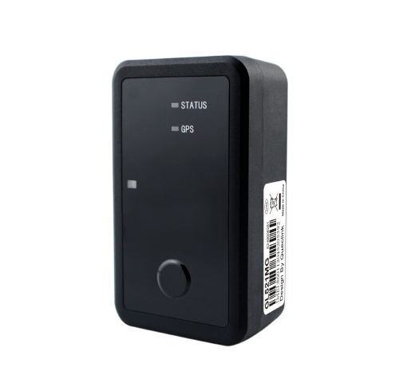

# QuecLink - GL521MG

El GL521MG es un rastreador GPS recargable de larga autonomía diseñado para el monitoreo robusto de activos y la gestión por lotes. Integra conectividad celular con posicionamiento GNSS interno, carga inalámbrica Qi, soporte para accesorios BLE y una carcasa resistente con certificación IP67, ofreciendo telemetría fiable de ubicación y condiciones ambientales ideal para cadena de frío, bodegas y activos estáticos.

Como dispositivo compatible con Plaspy, el GL521MG puede enviar posiciones, lecturas ambientales y eventos de alarma a Plaspy para visibilidad centralizada. Su diseño de bajo mantenimiento, modos de energía configurables y elementos de telemetría comunes facilitan la integración en los flujos de trabajo de Plaspy para rastreo, alertas e informes programados en flotas mixtas de activos.

## Aspectos clave

- Rastreador de activos recargable y de larga autonomía, pensado para despliegues de campo prolongados y bajo mantenimiento.
- Conectividad celular global con mecanismos de conmutación para mayor cobertura y telemetría eficiente en consumo de energía.
- Carcasa resistente IP67 con opción de montaje magnético para uso en vehículos, contenedores y activos estáticos.
- Sensores ambientales integrados, incluyendo temperatura interna y detección de luz para control de condiciones.
- Soporte para carga inalámbrica Qi, que facilita la recarga en campo y reduce tiempos de manipulación.
- Compatibilidad con accesorios BLE para ampliar la telemetría mediante balizas o sensores externos.
- Detección de movimiento y alarmas por geocerca para apoyo en prevención de robos y reportes de activación.

## Cómo funciona con Plaspy

Plaspy recibe telemetría estándar y eventos de alarma desde el GL521MG, permitiendo a los equipos monitorear activos en tiempo real y revisar la actividad histórica. La compatibilidad de protocolo del dispositivo y sus sensores incorporados permiten a Plaspy unificar datos de ubicación, condiciones ambientales y estado en paneles, alertas e informes.

- Actualizaciones de posición en tiempo real y programadas a Plaspy para seguimiento en vivo y reproducción histórica.
- Lecturas de temperatura y luz entregadas a Plaspy para alertas ambientales y análisis de tendencias.
- Eventos de movimiento y manipulación encaminados a Plaspy para activar flujos de seguridad y notificaciones.
- Alarmas de geocerca e informes de activación usados para automatizar avisos de entrada, salida y cadena de custodia.
- Datos de accesorios BLE agregados en Plaspy para enriquecer la telemetría con información de balizas o sondas externas.

## Casos de uso típicos

- Logística de cadena de frío donde la combinación de ubicación y monitoreo de temperatura soporta cumplimiento normativo y alertas.
- Transporte por carretera y gestión de activos por lotes para contenedores compartidos y rutas con múltiples paradas que requieren larga autonomía.
- Rastreo de activos en bodegas e interiores usando accesorios BLE y carcasas compactas montables.
- Vigilancia de activos estáticos de alto valor que se benefician de la protección IP67, montaje magnético y alarmas de movimiento.

## Por qué elegir este rastreador con Plaspy

El GL521MG combina características prácticas de despliegue con los tipos de telemetría que Plaspy utiliza con mayor frecuencia: posiciones GNSS, sensores ambientales, eventos de movimiento y geocerca. Su diseño recargable, la comodidad de la carga inalámbrica y los modos de energía configurables ayudan a equilibrar la capacidad de respuesta con la autonomía, mientras que la carcasa resistente reduce las visitas de servicio en activos distribuidos.

Si busca un dispositivo que alimente a Plaspy con datos de activos y ambientales para monitoreo centralizado, informes y alertas, el GL521MG es una opción capacitada y fácil de desplegar. Conozca más sobre Plaspy y cómo se usan los rastreadores compatibles en flujos de trabajo de flota y activos en el sitio principal de Plaspy https://www.plaspy.com. Las especificaciones del producto, disponibilidad y datos del fabricante pueden cambiar con el tiempo, por lo que le recomendamos verificar las especificaciones y la documentación actual con QuecLink en https://www.queclink.com/.
