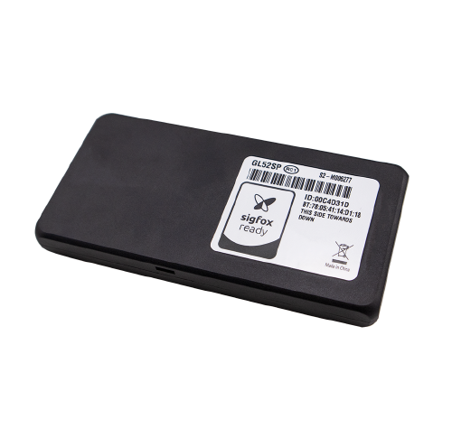

# QuecLink - GL52SP

El QuecLink GL52SP es un rastreador de activos en espera mini de Sigfox diseñado para aplicaciones de monitoreo de activos. Con su diseño ultra delgado y mini, es perfecto para el monitoreo de activos estacionarios, control de inventario y otras aplicaciones de gestión de seguimiento que requieren un tamaño pequeño y una larga vida útil de la batería. El GL52SP tiene un tiempo de espera de más de cuatro años, lo que garantiza un seguimiento continuo sin la necesidad de reemplazos frecuentes de batería.

Una de las características clave del GL52SP es su soporte para posicionamiento GNSS, lo que permite un seguimiento preciso e información de ubicación. También tiene resistencia a las técnicas de interferencia existentes, lo que garantiza un seguimiento confiable e ininterrumpido incluso en entornos desafiantes. El dispositivo está certificado como Sigfox Ready Class 0, lo que proporciona una mejor conectividad de red, movilidad y una mayor tasa de éxito al recibir información y datos.

El GL52SP funciona en la red Sigfox, que ofrece costos de red más bajos en aplicaciones de bajo uso de datos. Admite múltiples regiones, incluyendo Europa, Oriente Medio, África, Brasil, Canadá, México, Puerto Rico, Estados Unidos, América Latina, Asia Pacífico y Rusia.

Con sus dimensiones compactas de 89.8 × 44 × 10.5 mm y un diseño ligero de 48 g, el GL52SP es fácil de instalar y ocultar. También cuenta con una batería de respaldo con una capacidad de 2400 mAh, lo que garantiza largos tiempos de espera incluso con un consumo mínimo de energía. El dispositivo admite BLE 5.0 para comunicación inalámbrica y tiene indicadores LED para el estado de la alimentación.

En general, el QuecLink GL52SP es una opción ideal para aplicaciones de monitoreo de activos que requieren un dispositivo de seguimiento pequeño, duradero y confiable. Su integración Sigfox, posicionamiento GNSS y resistencia a las técnicas de interferencia lo convierten en una solución potente para el seguimiento de activos.

### Características destacadas:

- Rastreador de activos en espera mini de Sigfox
- Soporta posicionamiento GNSS
- Tiempo de espera de más de 4 años
- Diseño ultra delgado y mini
- Resistente a las técnicas de interferencia existentes
- Ideal para aplicaciones de monitoreo de activos

### Especificaciones técnicas:

| Sigfox Especificaciones |
| --- |
| Región compatible | RC1: Europa, Francia de Ultramar, Oriente Medio y África RC2: Brasil, Canadá, México, Puerto Rico, EE. UU. RC4: América Latina, Asia Pacífico RC7: Rusia |
| Frecuencia RF | RC1: Tx:868.13MHz Rx:869.525MHz RC2: Tx:902.2MHz Rx:905.2MHz RC4: Tx:920.8MHz Rx:922.3MHz RC7: Tx:868.8MHz Rx:869.1MHz |
| Potencia de salida de transmisión | RC1: 13.5dBm \("15" configuración\) RC2: 22.5dBm \("24" configuración\) RC4: 22.5dBm \("24" configuración\) RC7: 13.5dBm \("15" configuración\) |
| Sensibilidad del receptor | RC1: -127dBm \(600bps, GFSK\) RC2: -129dBm \(600bps, GFSK\) RC4: -129dBm \(600bps, GFSK\) RC7: -127dBm \(600bps, GFSK\) |
| Tolerancia de error de frecuencia | ±2.5ppm \(25°C\) |
| Emisión espuria del receptor | -54dBm \(30MHz~12.75GHz\) |
| Especificaciones GNSS |
| Tipo GNSS | Receptor GNSS todo en uno u-blox |
| Sensibilidad | Autónomo: -147 dBm Inicio en caliente: -156 dBm Reacquisición: -160 dBm Seguimiento: -162 dBm |
| Precisión de posición \(CEP\) | Autónomo: &lt; 2.5m |
| TTFF \(Cielo abierto\) | Inicio en frío: 27s promedio Inicio en caliente: 27s promedio Inicio rápido: 1s promedio |
| Especificaciones generales |
| Dimensiones | 89.8 × 44 × 10.5mm \(3.54’’\(L\) ×1.73’’\(W\) ×0.41’’\(H\)\) |
| Peso | 48g \(1.69oz\) |
| Batería de respaldo | Batería de dióxido de manganeso de litio, 2400 mAh |
| Tiempo de espera \(BLE apagado, sensor de movimiento apagado\) | 1 informe/día: 1750 días 1 informe/6 horas: 540 días |
| Temperatura de funcionamiento | -20°C ~+60°C |
| Soporte BLE | BLE 5.0 |
| Interfaces |
| Antena Sigfox | Solo interna |
| Antena GNSS | Solo interna |
| Antena BLE | Solo interna |
| Indicador LED | Encendido |
| Protocolo de interfaz aérea |
| Conjunto de comandos | Protocolo de interfaz aérea Lite de @Track |
| Protocolo de transmisión | Protocolo Sigfox |
| Modos de trabajo | Modo continuo, para seguimiento de emergencia Modo de ahorro de energía, para tiempo de espera prolongado |
| Informe de programación de tiempo | Informes de posición y estado en intervalos preestablecidos |
| Detección de movimiento | Alarma de movimiento basada en acelerómetro interno de 3 ejes |
| Informe de activación | Activación en intervalos preestablecidos |

