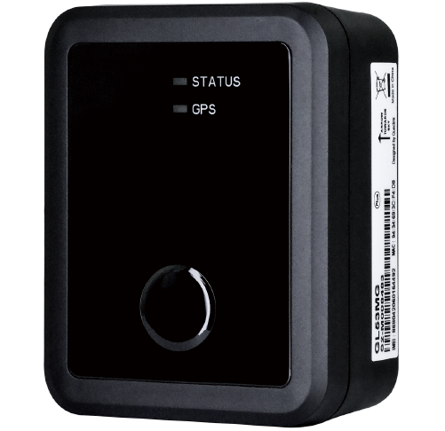

# QuecLink - GL53MG

El QuecLink GL53MG Plus es un rastreador de activos resistente al agua y de espera micro LTE de alto rendimiento diseñado para diversas aplicaciones de seguimiento y monitoreo. Utiliza la tecnología global LTE Cat M1/NB2 con retroceso a 2G, lo que garantiza una conectividad confiable y eficiente. Con su solución de antena única, ofrece un área de cobertura más amplia y una mayor intensidad de señal.

Una de las características destacadas del GL53MG Plus es su impresionante tiempo de espera de hasta 4 años, gracias a su batería interna de 4400mAh. Esto lo hace ideal para el seguimiento a largo plazo de activos sin la necesidad de recargas frecuentes. Además, su tamaño micro permite una instalación encubierta, asegurando un seguimiento discreto.

El GL53MG Plus está diseñado para resistir entornos difíciles, ya que es resistente al agua y cumple con el estándar IP67. Esto significa que se puede utilizar en entornos exteriores sin preocuparse por daños causados por agua o polvo. También es compatible con BLE 5.2, lo que permite la conectividad con una amplia gama de accesorios inalámbricos.

Este rastreador es particularmente adecuado para la recuperación de vehículos robados y el monitoreo de activos. Su tecnología LTE garantiza un seguimiento rápido y preciso, mientras que su diseño compacto y construcción resistente al agua lo hacen adecuado para su uso en diversas industrias, incluyendo financiamiento de automóviles, alquiler y arrendamiento de automóviles, y más.

#### Características destacadas:

- Tecnología global LTE Cat M1/NB2 con retroceso a 2G
- Hasta 4 años de tiempo de espera con batería interna de 4400mAh
- Tamaño micro que permite una instalación encubierta
- Resistente al agua, cumple con el estándar IP67
- Compatible con BLE 5.2
- Ideal para la recuperación de vehículos robados y el monitoreo de activos

#### Especificaciones técnicas:

- Banda de operación: LTE Cat M1/NB2
- Transmisión de datos: eMTC \(DL\) 348 Kbps, eMTC \(UL\) 1.08 Mbps, NB2 \(DL\) 121 Kbps, NB2 \(UL\) 150 Kbps
- Frecuencia: EGPRS 850/900/1800/1900 MHz
- Tipo de GNSS: Receptor todo en uno
- Precisión de posición \(CEP\):
- Dimensiones: 64.6 × 51 × 28.3mm
- Peso: 93.5g
- Batería interna: Batería de dióxido de manganeso de litio, 4400mAh
- Resistente al agua: Cumple con el estándar IP67
- Temperatura de funcionamiento: -20℃ ~ +60℃
- Compatibilidad con BLE: Protocolo BLE 5.2
- Mensajes de búfer: Hasta 10,000 mensajes de búfer

El QuecLink GL53MG Plus es un rastreador de activos confiable y versátil que combina tecnología LTE avanzada con un diseño compacto y resistente. Ya sea que necesite rastrear vehículos o monitorear activos valiosos, este rastreador ofrece el rendimiento y las características necesarias para un seguimiento eficiente y efectivo.

