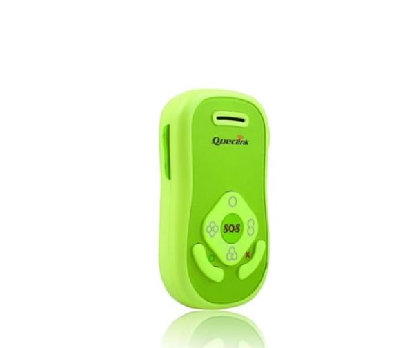

# QuecLink - GT200

El GT200 GPS Safety Phone de QuecLink es un dispositivo compacto diseñado principalmente para la seguridad infantil. Integra un receptor GPS de alta sensibilidad junto con un subsistema GSM GPRS cuatribanda para ofrecer información de ubicación oportuna en amplias zonas de cobertura. El equipo incluye un protocolo @Track integrado para la integración de sistemas, un chipset u-blox, un acelerómetro de 3 ejes para detección de caída, antenas internas de GSM y GPS, botones de marcación rápida, bajo consumo energético y certificación CE.

Como dispositivo compatible con Plaspy, el GT200 puede enviar sus posiciones e informes de alerta a Plaspy para gestión y visibilidad centralizada. Las capacidades de reporte integradas cubren alertas de emergencia, cruces de geocerca, avisos de batería baja y posiciones GPS programadas con reporte por cell ID, lo que facilita mostrar actualizaciones de ubicación y eventos de seguridad en los paneles, notificaciones e informes de Plaspy.

## Características principales

- Diseñado para la seguridad de niños con botones de marcación rápida para contactos de emergencia
- Receptor GPS de alta sensibilidad y rápida adquisición de señal para actualizaciones de ubicación puntuales
- Soporte GPRS GSM cuatribanda para conectividad amplia en muchas regiones
- Protocolo @Track incorporado que genera reportes estructurados para integración
- Chipset u-blox y antenas internas para recepción confiable y manejo simplificado
- Acelerómetro de 3 ejes integrado para detección de caída y monitoreo adicional de seguridad

## Cómo funciona con Plaspy

El GT200 puede integrarse en Plaspy para proporcionar visibilidad continua de la ubicación y alertas de seguridad desde dispositivos en campo. Una vez configurado para enviar sus reportes, Plaspy ingiere los mensajes de posición y eventos y los presenta mediante mapas, alertas y vistas históricas.

- Visualización en vivo e histórica de posiciones en los mapas de Plaspy para rastrear movimientos a lo largo del tiempo
- Enrutamiento de alertas por señales de emergencia y eventos de geocerca para notificar a operadores o tutores
- Reportes programados de posición y fallback por cell ID que permiten a Plaspy mantener seguimiento cuando el GPS es intermitente
- Notificaciones de batería baja visibles en Plaspy para ayudar en la gestión del tiempo de actividad y planificación de mantenimiento
- Eventos de detección de caída enviados a Plaspy para respuesta operativa rápida y supervisión

## Casos de uso habituales

- Monitoreo parental y conciencia de ubicación de niños en la rutina diaria
- Escuelas y centros de cuidado que rastrean movimientos grupales por seguridad y responsabilidad
- Supervisión por parte de cuidadores de personas vulnerables que requieren alertas de ubicación y emergencia
- Monitoreo de personal a pequeña escala donde se prefieren dispositivos compactos y opciones de contacto rápido
- Entornos que se benefician de antenas internas y gran tiempo de espera para reducir tareas de mantenimiento

## Por qué elegir este rastreador con Plaspy

El GT200 es una opción práctica cuando necesita un dispositivo enfocado en la seguridad infantil que también pueda gestionarse desde una plataforma más amplia de seguimiento de flotas o personal como Plaspy. Su conjunto de reportes integrados y sus funciones de seguridad compactas lo hacen útil para organizaciones que requieren visibilidad clara de la ubicación, alertas confiables y manejo sencillo del dispositivo. Plaspy puede transformar los reportes del GT200 en vistas de mapa, alertas e informes operativos que apoyen el monitoreo rutinario y las respuestas rápidas.

Dado que la descripción del GT200 enfatiza características orientadas a la seguridad y facilidad de integración más que una larga lista de opciones configurables, resulta adecuado para despliegues donde importan la simplicidad, la fiabilidad en el reporte de posiciones y las alertas claras de seguridad. Si usted necesita monitoreo centralizado para un grupo de usuarios o dispositivos, combinar el GT200 con Plaspy ofrece una solución enfocada para la conciencia situacional y la gestión de eventos.

Para saber más sobre cómo Plaspy puede trabajar con dispositivos compatibles como el GT200 visite https://www.plaspy.com. Las especificaciones del producto, la disponibilidad y los detalles del fabricante pueden cambiar con el tiempo, por lo que le recomendamos verificar las características y la información técnica actual en el sitio oficial de QuecLink https://www.queclink.com/.
