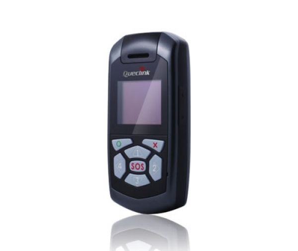

# QuecLink - GT300

El dispositivo QuecLink GT300 es un localizador GPS portátil resistente al agua, diseñado para una variedad de aplicaciones, desde el rastreo de trabajadores solitarios hasta el seguimiento de vehículos, mascotas, contenedores y otros activos. Con su diseño compacto y duradero, este dispositivo es ideal para aquellos que necesitan una solución confiable de rastreo en tiempo real.

Una de las características destacadas del QuecLink GT300 es su botón frontal del tamaño de un pulgar, que permite una rápida notificación de alerta de emergencia. Esto es especialmente útil en situaciones en las que se requiere una respuesta inmediata, como en el caso de un trabajador solitario que enfrenta una emergencia o un vehículo que ha sido robado. Además, este dispositivo también permite el ajuste regular de geo-cercas basadas en la ubicación actual, lo que brinda un mayor control sobre los límites geográficos establecidos.

El QuecLink GT300 utiliza tecnología GPS y GSM para proporcionar una precisión y cobertura confiables. Puede ser monitoreado a través de una plataforma en línea o una aplicación móvil, lo que permite un acceso fácil y conveniente a la ubicación en tiempo real del dispositivo. Además, este localizador GPS cuenta con una batería de larga duración, lo que garantiza un tiempo de funcionamiento prolongado sin necesidad de recargar.

En resumen, el QuecLink GT300 es un localizador GPS portátil resistente al agua, diseñado para una variedad de aplicaciones de rastreo. Con su botón de alerta de emergencia y la capacidad de ajustar geo-cercas, este dispositivo ofrece una solución confiable y conveniente para aquellos que necesitan monitorear la ubicación de trabajadores, vehículos, mascotas, contenedores y otros activos.

### Características destacadas:

- Localizador GPS portátil resistente al agua
- Botón de alerta de emergencia
- Ajuste de geo-cercas basadas en la ubicación actual
- Tecnología GPS y GSM para una precisión y cobertura confiables
- Monitoreo a través de plataforma en línea o aplicación móvil
- Batería de larga duración

