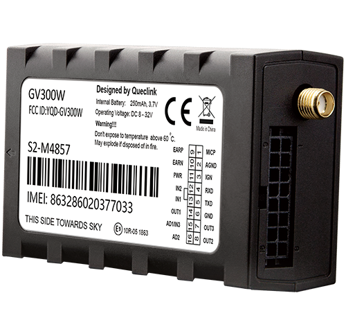

# QuecLink - GV300W

El GV300W es la variante 3G WCDMA de la familia GV300 de QuecLink, diseñado como un rastreador GPS de grado profesional para telemática de vehículos y activos. Basado en un receptor GNSS u-blox y con un conjunto flexible de entradas y salidas para vehículos, el GV300W ofrece posicionamiento preciso, telemetría extendida e integración de accesorios para camiones pesados, automóviles y transporte refrigerado. Su conjunto de características está orientado a reportes de ubicación fiables, registro de eventos e integraciones prácticas para operaciones de flota.

Como dispositivo compatible con Plaspy, el GV300W puede enviar datos GNSS, estado de ignición y una amplia gama de telemetría a Plaspy mediante TCP, UDP o SMS. Su registro en búfer y el control OTA le otorgan robustez en zonas con cobertura intermitente y permiten flujos de trabajo de inmovilizador y antirrobo que se integran con los paneles, alertas e informes de Plaspy, lo que lo hace adecuado para despliegues de flota críticos.

## Puntos clave

- Seguimiento en tiempo real compatible con Plaspy vía TCP, UDP o SMS para ubicación y alertas inmediatas.
- GNSS de alta precisión con receptor u-blox que ofrece típicamente precisión de posición inferior a 2.5 m CEP.
- Entradas y salidas vehiculares completas con disparador de ignición dedicado y múltiples entradas configurables y salidas digitales para telemetría y control.
- Soporte para funciones antirrobo e inmovilización remota mediante control OTA de salidas y una salida de drenador abierto retenida.
- Funciones telemáticas robustas incluyendo geocercas, comportamiento de conducción y detección de colisiones o remolque, con almacenamiento en dispositivo de hasta 10 000 mensajes.
- Factor de forma compacto y resistente y un ecosistema de accesorios para lectores CAN, sensores de temperatura y humedad, y expansores RS232 usados en instalaciones de cadena de frío y vehículos pesados.

## Cómo funciona con Plaspy

La integración con Plaspy es sencilla: configure el GV300W para enviar mensajes de posición y eventos a los endpoints de Plaspy y la plataforma interpretará GNSS, E/S y datos de eventos para ofrecer visibilidad en tiempo real, alertas e informes históricos. Las opciones de registro en búfer y envío programado del dispositivo ayudan a garantizar la continuidad de los datos durante pérdidas temporales de red, por lo que es práctico tanto para monitorización continua como para escenarios de carga intermitente.

- Actualizaciones de ubicación y telemetría en tiempo real enviadas a Plaspy vía TCP, UDP o SMS para mapas en vivo y alertas.
- Informe de estado de ignición y motor desde el disparador positivo dedicado y disparadores negativos adicionales para eventos de línea de tiempo y segmentación de viajes.
- Monitoreo de combustible y telemetría analógica capturada mediante entradas configurables o a través de lectores CAN como accesorios, entregada a Plaspy para informes de consumo.
- Acciones de inmovilización remota y antirrobo implementadas mediante control OTA de salidas digitales y salida de drenador abierto retenida, integradas con los flujos de alarma de Plaspy.
- Datos de sensores externos y accesorios, como temperatura y humedad o dispositivos RS232, dirigidos a Plaspy para soportar monitoreo de cadena de frío y telemetría ampliada de activos.

## Casos de uso típicos

- Gestión de flotas comerciales y supervisión de rutas con seguimiento en vivo, reportes programados y monitoreo del comportamiento del conductor.
- Flujos de trabajo de antirrobo e inmovilización mediante control remoto de salidas y alertas por manipulación para la seguridad vehicular.
- Logística de cadena de frío donde sensores de temperatura y humedad envían telemetría a Plaspy para cumplimiento y alertas por excepciones.
- Detección de incidentes y remolques para proporcionar notificaciones oportunas y reconstrucción de eventos en caso de accidentes o movimientos no autorizados.
- Operaciones en zonas remotas o con cobertura intermitente que se benefician del amplio almacenamiento en el dispositivo para subida posterior al servidor.

## Por qué elegir este rastreador con Plaspy

El GV300W combina posicionamiento GNSS preciso con E/S de grado vehicular y un diseño resistente, lo que lo convierte en una opción práctica para organizaciones que usan Plaspy para la supervisión de flotas. Sus funciones telemáticas y el soporte de accesorios permiten a las flotas recopilar datos operativos relevantes y enviarlos a Plaspy para visibilidad, alertas e informes sin necesidad de cambios extensivos en el hardware.

Dado que el GV300W admite registro en búfer y control OTA, es especialmente adecuado para despliegues donde la continuidad y la gestión remota son importantes. Su ecosistema de accesorios y el rendimiento GNSS probado facilitan la escalabilidad desde vehículos individuales hasta flotas mayores cuando se combina con Plaspy para la monitorización centralizada y la supervisión operativa.

To learn more about Plaspy and platform compatibility visit https://www.plaspy.com. Product specifications availability and manufacturer details can change over time so verify current specifications and official documentation on the Queclink website https://www.queclink.com/.
