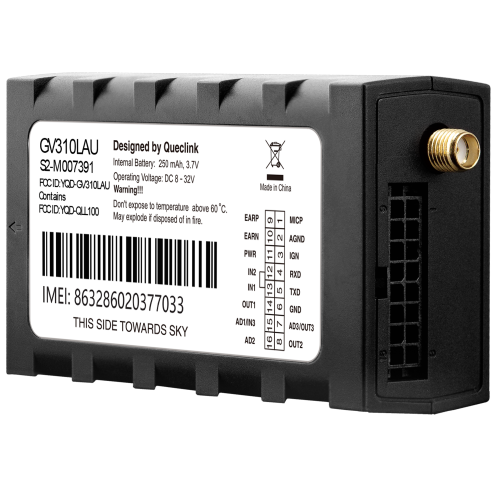

# QuecLink - GV310LAU

El GV310LAU es un rastreador GPS resistente con LTE Cat 4, diseñado para aplicaciones vehiculares exigentes, incluidos camiones pesados y automóviles. Combina posicionamiento GNSS multiconstelación con conectividad celular de alta velocidad para ofrecer ubicación y telemetría confiables en tiempo real. El equipo es compacto y está pensado para uso continuo en vehículos, con entradas configurables, captura CAN y funciones integradas orientadas a la gestión de flotas y a flujos de trabajo antirobo.

Este modelo es compatible con Plaspy desde el primer momento, por lo que los datos del GV310LAU pueden integrarse en Plaspy para paneles, alertas e informes. Sus avanzadas capacidades de alarma y las opciones de control remoto se acoplan de forma natural a los flujos de trabajo de Plaspy, permitiendo a los operadores supervisar el estado del vehículo, responder a eventos e incorporar datos de sensores a las operaciones de la flota sin necesidad de una configuración adicional extensa.

## Características principales

- Rastreador compatible con Plaspy con conectividad LTE Cat 4 y mecanismos de conmutación para seguimiento en tiempo real y resiliente
- GNSS u‑blox multiconstelación para posiciones de alta precisión y rápido tiempo al primer fix
- Amplio soporte de E/S vehicular, incluyendo captura CAN y entradas digitales y analógicas configurables para telemetría diversa
- Soporte interno BLE 5.2 para sensores y beacons Bluetooth, ampliando la monitorización a temperatura y proximidad
- Alarmas avanzadas como choque, interferencia por jamming, remolque y geocercas que pueden activar acciones en Plaspy
- Tolerancia amplia de voltaje de funcionamiento y batería de respaldo para mantener el flujo de datos durante cortes de energía
- Factor de forma compacto y robusto, adecuado para vehículos pesados y despliegues de flotas mixtas

## Cómo funciona con Plaspy

Al conectarse a Plaspy, el GV310LAU transmite ubicación, señales del vehículo y telemetría de sensores para que Plaspy muestre posiciones en vivo, reproduzca rutas y dispare notificaciones basadas en reglas. Las entradas configurables y los estados de alarma del rastreador aparecen como eventos en Plaspy, lo que le permite a usted —como gestor de la flota— crear respuestas automatizadas, informes programados y alertas operativas.

- Actualizaciones de ubicación y telemetría en tiempo real a través de la red celular para visibilidad continua en Plaspy
- Informes de estado del vehículo desde encendido y otras entradas para un seguimiento preciso de ciclos de trabajo y kilometraje
- Telemetría por CAN y entradas analógicas para monitorizar combustible, datos del motor y diagnóstico mostrados en los paneles de Plaspy
- Salidas remotas y mapeo de alarmas que permiten intervenciones iniciadas por Plaspy, como control de inmovilizador cuando los flujos de trabajo y la normativa lo permiten
- Integración de datos de sensores BLE y beacons en Plaspy para monitorización de temperatura o presencia de carga y activos

## Casos de uso típicos

- Gestión de flotas en tiempo real para camiones pesados y flotas mixtas que requieren seguimiento y reportes continuos
- Flujos de trabajo antirobo y recuperación que emplean alarmas y capacidades de intervención remota coordinadas desde Plaspy
- Programas de aseguramiento y monitoreo de riesgo que aprovechan eventos de choque y conducción agresiva para telemática
- Monitorización de carga sensible a la temperatura mediante sensores BLE que alimentan alertas y registros en Plaspy
- Diagnóstico vehicular y control de niveles de combustible vía CAN y entradas analógicas para mejorar la eficiencia operativa

## Por qué elegir este rastreador con Plaspy

El GV310LAU combina conectividad robusta, posicionamiento GNSS preciso y E/S flexible para funcionar como hardware práctico para organizaciones que usan Plaspy. Su conjunto de funciones permite recopilar una amplia gama de datos vehiculares y de sensores y encaminar esa información a Plaspy para supervisión, informes y respuestas automatizadas. El dispositivo es apropiado para flotas mixtas donde la durabilidad, el flujo de datos ininterrumpido y la telemetría ampliada son prioridades.

Al ser compatible con Plaspy desde el primer momento, el esfuerzo de integración se reduce y los equipos de flota pueden centrarse en configurar alertas y flujos de trabajo dentro de Plaspy en vez de resolver detalles de conectividad o protocolo. Su soporte BLE, captura CAN y opciones de alarma hacen del GV310LAU una elección útil cuando se extiende Plaspy a monitorización de combustible, cargas refrigeradas y programas antirobo.

Para saber más sobre cómo Plaspy puede usar el GV310LAU para seguimiento de flotas y telemetría visite https://www.plaspy.com. Las especificaciones del producto y la disponibilidad pueden cambiar con el tiempo, por favor verifique los detalles actuales en el sitio del fabricante https://www.queclink.com/.
