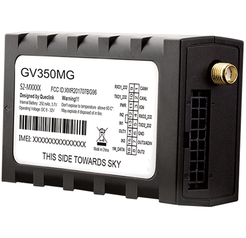

# QuecLink - GV350MG

El GV350MG es un rastreador vehicular compacto con LTE Advanced diseñado para la gestión profesional de flotas, la logística de cadena de frío y el monitoreo de transporte. Combina un receptor GNSS de alta sensibilidad con opciones de integración vehicular y múltiples entradas/salidas para entregar ubicación continua y telemetría en vehículos comerciales. El dispositivo está pensado para operadores que requieren seguimiento preciso y conectividad amplia en un equipo resistente, apto para entornos vehiculares exigentes.

Como equipo compatible con Plaspy desde su activación, el GV350MG puede incorporarse a flotas en Plaspy para ofrecer ubicación en tiempo real, reportes de eventos y datos telemáticos dentro de la plataforma. Al integrarlo con Plaspy, el rastreador ayuda a centralizar el monitoreo, aplicar reglas de alerta y generar reportes que respaldan flujos operativos como supervisión de rutas, transporte sensible a la temperatura y procedimientos anti robo.

## Características principales

- Compatible con Plaspy para integración directa que soporta seguimiento en tiempo real y reportes telemáticos.
- Conectividad global LTE Cat M1 y NB1 con retroceso a 2G para mayor cobertura y resiliencia.
- Receptor GNSS de alta sensibilidad con rendimiento de posicionamiento de submetro para servicios de ubicación precisos.
- Opciones completas de integración vehicular, incluyendo soporte para bus CAN y múltiples interfaces seriales y digitales para datos del motor y sensores.
- Diseñado para flotas comerciales con amplio rango de voltaje de entrada, fuente de respaldo interna y tolerancia extendida de temperatura de operación.
- Funciones telemáticas avanzadas como alarmas de geocerca, detección de remolque y choque, análisis de comportamiento de conducción y almacenamiento local de mensajes.
- Diseño amigable para accesorios con soporte para sensores de temperatura y periféricos externos para ampliar la funcionalidad.

## Cómo funciona con Plaspy

Plaspy procesa la ubicación y la telemetría vehicular del GV350MG para ofrecer un tablero unificado de monitoreo, alertas e informes históricos. El dispositivo envía fijaciones GNSS, parámetros del bus vehicular y eventos de E/S a Plaspy, donde reglas y visualizaciones convierten los datos brutos en información operativa para equipos de flotas y logística.

- Actualizaciones de ubicación y telemetría en tiempo real transmitidas a Plaspy para seguimiento en vivo y reproducción de recorridos.
- Alertas configurables y cumplimiento de geocercas para notificar sobre desviaciones de ruta, aperturas de puertas o eventos de remolque.
- Eventos de vehículo y sensores entregados a Plaspy para monitoreo de combustible, supervisión de temperatura y flujos de trabajo de mantenimiento.
- Almacenamiento local en el dispositivo que garantiza continuidad de datos y manejo de envíos retrasados cuando la conectividad es intermitente.
- Control remoto de salidas y respuestas basadas en eventos gestionadas a través de reglas y paneles en Plaspy.

## Casos de uso habituales

- Flotas: prevención de robo e inmovilización con geocercas y control remoto de salidas para recuperación.
- Logística de cadena de frío: monitoreo con canales para sensores de temperatura y ubicación GNSS precisa para semirremolques refrigerados.
- Gestión de combustible: detección de pérdidas combinando entradas de sensores de combustible con telemetría del vehículo.
- Programas de seguridad y comportamiento del conductor: uso de detección de choques y resúmenes de conducción por evento para retroalimentación y entrenamiento.
- Integración de telemetría y accesorios: soporte para cámaras y dispositivos de terceros para mejorar la rendición de cuentas y el cumplimiento normativo.

## Por qué elegir este rastreador con Plaspy

El GV350MG es una opción práctica para organizaciones que necesitan telemática confiable, conectividad continua e integración a nivel vehicular. Su combinación de GNSS de alta sensibilidad, interfaces para bus vehicular y soporte de accesorios lo hace apto para una variedad de despliegues comerciales, desde supervisión de flotas hasta transporte sensible a la temperatura. Al conectarlo a Plaspy, el rastreador alimenta paneles centralizados, motores de alertas e informes programados que ayudan a los equipos a actuar más rápido y analizar el desempeño en flotas extensas.

Para conocer más sobre cómo funciona el GV350MG con Plaspy y explorar opciones de despliegue, visite Plaspy en el sitio principal https://www.plaspy.com. Las especificaciones del producto y la disponibilidad pueden cambiar con el tiempo, por lo que le recomendamos verificar los detalles actuales y las certificaciones del dispositivo con el fabricante en https://www.queclink.com/.
