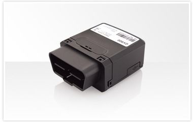

# QuecLink - GV500

El QuecLink GV500 es un dispositivo de rastreo vehicular compacto que se conecta al puerto OBDII del vehículo. Integra un receptor GPS de alta sensibilidad y un subsistema celular cuatribanda para ofrecer posicionamiento fiable y transmisión remota de datos. El equipo incluye un lector OBD interno para extraer datos del vehículo, un acelerómetro de 3 ejes para detección de movimiento y una batería interna que permite operación en modo espera y respaldo.

Como dispositivo compatible con Plaspy, el GV500 puede enviar información de ubicación y estado a la plataforma Plaspy para monitoreo de flotas y supervisión operativa. Su protocolo integrado @Track y sus funciones de reporte lo hacen apto para uso con servidores backend e interfaces móviles, permitiendo a los usuarios de Plaspy consolidar la visibilidad de vehículos, alertas e informes programados dentro de un único entorno de gestión de flotas.

## Características principales

- Conectividad OBDII para integración sencilla y acceso a datos del vehículo
- Receptor GPS de alta sensibilidad para posicionamiento rápido y preciso
- Soporte cuatribanda GPRS/GSM para amplia cobertura regional de comunicaciones
- Acelerómetro interno de 3 ejes para detección de movimiento y ahorro de energía
- Batería interna para reportes en espera y respaldo ante pérdida de alimentación
- Protocolo @Track integrado con funciones completas de reporte y alertas
- Cumple con certificaciones FCC, CE y E-Mark según estándares del sector

## Cómo funciona con Plaspy

El GV500 suministra datos de ubicación y estado del vehículo que Plaspy puede ingerir para seguimiento en vivo, historial, alertas e informes. Una vez que el dispositivo esté configurado para enviar reportes a un servidor compatible con Plaspy, la plataforma puede mostrar la información del dispositivo junto con el resto de los activos de la flota para mejorar la conciencia operativa.

- Posiciones GPS en tiempo real y periódicas que se visualizan en los mapas y líneas de tiempo de Plaspy
- Eventos basados en movimiento y alertas del acelerómetro que se dirigen a las reglas de notificación de Plaspy
- Informes de posición programados y alertas de emergencia disponibles para la generación de reportes en Plaspy
- Información del vehículo extraída por OBDII visible en los paneles de Plaspy cuando está soportado
- Visiones generales de la flota y reproducción histórica para apoyar el análisis operativo

## Casos de uso típicos

- Rastreo de vehículos de flota para despacho y supervisión de rutas
- Detección y recuperación ante robos mediante alertas de movimiento y localización
- Monitoreo de vehículos de alquiler o compartidos con reportes de posición programados
- Visibilidad operativa para flotas comerciales pequeñas y medianas
- Reporte de ubicación de respaldo cuando se interrumpe la alimentación principal del vehículo

## Por qué elegir este rastreador con Plaspy

El GV500 es una opción práctica para organizaciones que buscan un rastreador compacto basado en OBDII que entregue actualizaciones de ubicación consistentes y datos del vehículo a una plataforma central. Su combinación de rendimiento GPS, acelerómetro interno y protocolo de reporte integrado lo hace adecuado cuando la facilidad de instalación y la fiabilidad en los reportes son prioridades.

En conjunto con Plaspy, el GV500 puede integrarse en una solución de gestión de flotas más amplia que enfatiza la visibilidad, las alertas y la consolidación de informes. Si usted necesita un rastreador que funcione con una plataforma de flotas alojada y soporte reportes a nivel vehicular, vale la pena evaluar el GV500 como parte de su despliegue con Plaspy.

Para conocer más sobre Plaspy y cómo puede gestionar dispositivos QuecLink visite https://www.plaspy.com. Las especificaciones del producto y la disponibilidad pueden cambiar con el tiempo; por favor verifique los detalles técnicos y certificaciones actuales en el sitio del fabricante https://www.queclink.com/.
