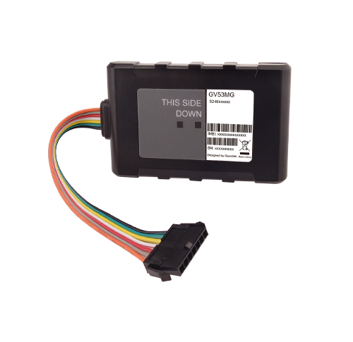

# QuecLink - GV53MG

El QuecLink GV53MG es un rastreador GPS vehicular compacto diseñado para instalaciones discretas en línea en autos y vehículos ligeros. Combina conectividad celular de área amplia de bajo consumo con un receptor GNSS u blox de alta sensibilidad para ofrecer ubicaciones y telemetría en tiempo real con fiabilidad. Con un formato ultradelgado y antenas internas, el equipo es ideal para colocaciones ocultas enfocadas en la protección y recuperación de activos.

Como dispositivo compatible con Plaspy desde el primer momento, el GV53MG aporta las funciones esenciales que las flotas y los proveedores de servicios esperan para programas de seguimiento y antirrobo. Plaspy procesa la telemetría y los mensajes en búfer del dispositivo para mostrar la posición en vivo, alertas de eventos e informes históricos, además de habilitar funciones operativas como geocercas, reportes programados y control remoto de salidas para inmovilización u otras acciones de recuperación.

## Aspectos destacados

- Compatible con Plaspy para seguimiento en tiempo real, paneles de flota, informes programados y alertas basadas en eventos.
- Conectividad LTE Cat M1 y NB2 con fallback EGPRS 2G para cobertura amplia y uso de datos económico.
- Receptor GNSS u blox de alta sensibilidad que ofrece buen rendimiento de posicionamiento para actualizaciones confiables.
- Capacidad de seguridad AES 256 para ayudar a proteger la telemetría y los datos de ubicación en tránsito hacia Plaspy.
- Batería de respaldo integrada y amplio rango de voltaje de funcionamiento para mantener la operación ante cortes de energía.
- Formato ultradelgado con antenas internas, apto para instalaciones discretas en programas de renta, leasing y financiamiento.
- Control remoto OTA de salidas digitales para soportar flujos de trabajo de inmovilización y activación remota.

## Cómo funciona con Plaspy

Al integrarse con Plaspy, el GV53MG envía de forma segura ubicación y telemetría al backend de Plaspy, donde los mensajes del dispositivo se interpretan para su visualización instantánea, aplicación de geocercas e informes históricos. Plaspy gestiona los registros en búfer y las notificaciones de eventos, de modo que los operadores obtienen seguimiento consistente y pueden actuar sobre alertas incluso después de periodos de conectividad intermitente.

- Actualizaciones de ubicación y telemetría en tiempo real entregadas a Plaspy para visibilidad en vivo de la flota.
- Detección por encendido e inputs que permite reglas dependientes del encendido, reportes programados y flujos de trabajo de odómetro o tiempo de operación cuando hay entradas disponibles.
- Alarmas por remolque, detección de choque y eventos de conducción agresiva que generan alertas inmediatas en Plaspy para monitoreo de seguridad y recuperación.
- Función de inmovilizador remoto vía control OTA de una salida digital que respalda procedimientos antirrobo y de recuperación.
- El almacenamiento en búfer de mensajes en el dispositivo ayuda a que Plaspy reciba datos en cola una vez que se restablece la conectividad.

## Casos de uso típicos

- Gestión de flotas pequeñas y medianas que requieren cobertura económica de área amplia y seguimiento confiable.
- Programas de financiamiento automotor y buy here pay here que necesitan instalación discreta y control remoto del activo.
- Operaciones de renta y leasing de autos que dependen de informes de kilometraje, geocercas y flujos de recuperación por robo.
- Recuperación de vehículos robados y programas antirrobo que utilizan alarma por remolque y control remoto de salidas para apoyar labores de recuperación.
- Despliegues de telemetría básicos que se benefician de mensajería en búfer, respaldo por batería y posicionamiento GNSS preciso.

## Por qué elegir este rastreador con Plaspy

El GV53MG combina hardware compacto con un conjunto de funciones que se alinean claramente con los casos de uso de Plaspy: telemetría segura, conectividad de área amplia de bajo consumo y funciones antirrobo prácticas. Su batería de respaldo y el almacenamiento en búfer de mensajes reducen la probabilidad de pérdida de datos en zonas con cobertura intermitente, y su tamaño reducido lo hace apropiado para instalaciones donde la discreción es clave.

Para organizaciones que usan Plaspy, el GV53MG ofrece un equilibrio entre valor operativo y escalabilidad para el seguimiento de flotas, soporte de alertas por geocerca y habilitación de activaciones remotas en flujos de recuperación. Para más información sobre la integración de Plaspy con rastreadores como el GV53MG visite https://www.plaspy.com. Las especificaciones del producto, la disponibilidad y los datos del fabricante pueden cambiar con el tiempo, por favor verifique las especificaciones vigentes en el sitio oficial de QuecLink https://www.queclink.com/ antes de comprar o desplegar dispositivos.
