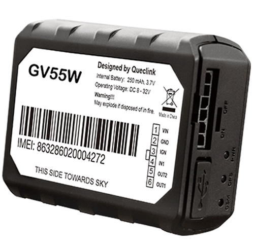

# QuecLink - GV55W

El GV55W es un rastreador GPS compacto, compatible con Plaspy, diseñado para instalación encubierta en telemática de vehículos ligeros. Como variante WCDMA/3G de la serie GV55, el GV55W combina una plataforma de hardware probada en el mercado con un receptor GNSS All‑in‑One de u‑blox integrado y antenas internas celulares/GPS para ofrecer posicionamiento y comunicaciones fiables para la gestión de flotas, la recuperación de vehículos robados, el seguro basado en el uso \(UBI\) y flotas con financiación buy‑here‑pay‑here.

Diseñado para integradores y operadores que requieren un mini rastreador de vehículos que soporte seguimiento en tiempo real y telemetría robusta, el GV55W admite flujos de trabajo telemáticos estándar, incluida la detección de ignición, control remoto del inmovilizador, datos de accidentes y comportamiento de conducción, geocercas y generación de informes programados. Su factor de forma compacto \(63 x 50 x 21.8 mm, 50 g\) y sus antenas internas lo hacen ideal para una instalación discreta, manteniéndose totalmente compatible con Plaspy para informes en la nube, alertas y analítica.

## Aspectos clave

- Rastreador GPS compatible con Plaspy para un seguimiento en tiempo real y telemetría fiables en flotas de vehículos ligeros.
- GNSS de u‑blox integrado que ofrece alta sensibilidad \(hasta −147 dBm en modo autónomo\) y precisión de posición CEP inferior a 2.5 m.
- Conectividad WCDMA/3G y GSM/GPRS \(multibanda\) para una cobertura celular amplia y transporte de datos TCP/UDP/SMS.
- Entradas digitales para detección de ignición y botón de pánico; salidas digitales, incluida una salida latched para inmovilizador o control remoto.
- Detección de impactos, monitorización del comportamiento de conducción \(frenadas y aceleraciones bruscas\), alarmas de remolque y de velocidad para seguridad y analítica de flotas.
- Informes programados \(tiempo, distancia, kilometraje\), geocercas internas \(hasta 20 regiones\) y detección de interferencias para apoyar flujos de trabajo anti‑robo.
- Diseño compacto y discreto con antenas internas y batería de respaldo Li‑Polymer para operación en modo de espera durante pérdidas de energía.

## Cómo funciona con Plaspy

Integrar el GV55W con Plaspy ofrece actualizaciones continuas de ubicación, alertas de eventos y flujos de telemetría a su panel de Plaspy o a los endpoints de la API. El rastreador reporta la posición GNSS y la telemática del vehículo vía TCP, UDP o SMS; Plaspy ingiere estos mensajes, normaliza la telemetría y activa reglas, alarmas e informes en tiempo real. El conjunto de eventos del GV55W se mapea directamente a flujos de trabajo comunes de Plaspy para la gestión de flotas, respuestas ante robos y analítica de seguros.

- Actualizaciones de ubicación y telemetría en tiempo real entregadas a Plaspy a través de TCP/UDP/SMS para seguimiento en vivo y reproducción histórica.
- Estado de ignición y eventos de entradas digitales \(panic, entradas de puerta/aux\) disponibles para Plaspy para el comportamiento del conductor y la segmentación de viajes.
- El inmovilizador remoto y el control de salida latched pueden accionarse desde Plaspy cuando se configuran canales de control seguros.
- La detección de impactos y los datos de comportamiento de conducción alimentan a Plaspy para la reconstrucción de incidentes y la puntuación UBI.
- Flujos de monitoreo de combustible — GV55W proporciona canales de telemetría y E/S digitales que Plaspy puede usar para soportar el monitoreo de combustible cuando se combinan con sensores o hardware de integración adecuados.

## Resumen técnico

| Modelo | GV55W \(mini rastreador de vehículos WCDMA/3G\) |
| --- | --- |
| Conectividad | GSM/GPRS y UMTS/HSPA con transporte TCP/UDP/SMS |
| Bandas | GSM: 850 / 900 / 1800 / 1900 MHz; UMTS/HSPA: 850 / 1900 / 2100 MHz |
| Alimentación y batería | Voltaje de operación 8–32 V DC; batería de respaldo Li‑Polymer 250 mAh \(modo de espera hasta ~34 horas sin informes\) |
| Interfaces | Entradas digitales \(ignición, panic\), salidas digitales \(incluida salida latched para inmovilizador/control remoto\), mini USB para actualización/debug, indicadores LED \(GSM, GPS, PWR\) |
| GNSS | Receptor GNSS All‑in‑One de u‑blox; sensibilidad autónoma a −147 dBm; precisión de posición &lt; 2.5 m CEP \(según especificación\) |
| Bluetooth | No reportado / no hay Bluetooth integrado en esta variante |
| Gestión remota | Control OTA de salidas digitales; compresión/filtrado de datos UBI para optimizar la transmisión; soporte de firmware/actualizaciones vía mini USB |
| Factor de forma y certificación | Compacto 63 x 50 x 21.8 mm, 50 g; antenas internas celulares y GPS; certificado FCC |

## Casos de uso

- Alquiler y arrendamiento de coches — instalación encubierta para monitoreo de ubicación, recuperación ante robo y generación de informes de uso.
- Seguros basados en el uso \(UBI\) — datos de comportamiento de conducción, datos de accidentes e informes programados alimentan las analíticas de UBI de Plaspy.
- Recuperación de vehículos robados y anti‑robo — detección de interferencias, geocerca y salida de inmovilizador remoto para respuesta rápida.
- Flotas de compra aquí y pago aquí y financiación — rastreador compacto para soporte de recuperación, cumplimiento de pagos y monitoreo de estado.
- Gestión ligera de flotas — seguimiento en tiempo real, actualizaciones programadas y alarmas de eventos para pequeñas flotas de entrega y servicio.

## Por qué elegir este rastreador con Plaspy

El GV55W es un rastreador GPS miniatura diseñado específicamente para combinar la precisión probada de un módulo GNSS de u‑blox con conectividad celular 3G/GSM de múltiples bandas y un factor de forma compacto y discreto. Al utilizarlo con Plaspy, el GV55W se convierte en un punto final telemático llave en mano: ofrece seguimiento en tiempo real, eventos de ignición y de colisiones, y controles de inmovilización remota que Plaspy puede presentar como alertas, informes de cumplimiento y paneles de flota.

Para operadores e integradores que buscan un dispositivo compatible con Plaspy que minimice la huella de instalación y maximice la telemetría, el GV55W ofrece un conjunto de características equilibrado: E/S digitales para ignición y pánico, salida latched para casos de inmovilizador, antenas internas para colocación discreta y soporte de batería de reserva para mantener el seguimiento ante pérdidas de energía. Su soporte celular de múltiples bandas y el transporte TCP/UDP/SMS facilitan enrutar los datos hacia Plaspy, habilitando una gestión de flotas escalable, flujos anti‑robo y programas UBI sin complejidad innecesaria.

