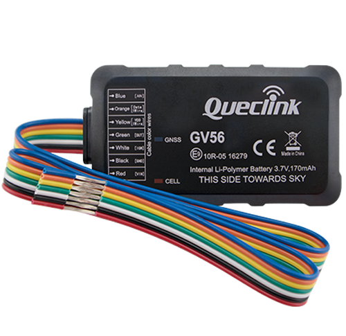

# QuecLink - GV56

El GV56 es un rastreador GPS micro compacto diseñado para telemática profesional en vehículos ligeros. Pensado para la gestión de flotas, arrendamiento y renta de autos, seguros basados en uso y recuperación de vehículos robados, combina posicionamiento GNSS, conectividad GSM GPRS cuatribanda e integración Bluetooth para ofrecer seguimiento en tiempo real y telemetría en un formato reducido con antenas internas e indicadores LED de estado.

Como dispositivo compatible con Plaspy, el GV56 puede transmitir datos de ubicación y eventos a la plataforma Plaspy para monitoreo en vivo, alertas e informes. Sus múltiples entradas y salidas, canal analógico e interfaz 1-Wire permiten a operadores de flota y proveedores capturar estado de ignición, señales de combustible o sensores, temperatura o identificadores iButton, y activar salidas remotas — todo lo cual Plaspy puede usar para crear reglas, paneles e itinerarios operativos.

## Aspectos destacados

- Rastreador micro compacto pensado para telemática de vehículos ligeros y uso en flotas
- Posicionamiento GNSS confiable junto con conectividad GSM GPRS cuatribanda para informes consistentes
- Soporte integrado de Bluetooth para periféricos como sensores y llaveros
- Múltiples E/S, incluyendo detección de ignición, entrada analógica e interfaz 1-Wire para mayor telemetría
- Antenas internas e indicadores LED para reducir la complejidad de instalación y ofrecer retroalimentación de estado
- Diseñado para soportar flujos antirobo, monitoreo de combustible, alertas de comportamiento de conducción e informes programados cuando se conecta a un backend como Plaspy

## Funcionamiento con Plaspy

Al conectarse a Plaspy, el GV56 entrega información de posición y eventos a los paneles y flujos de trabajo de Plaspy para que los operadores puedan supervisar activos, responder a incidentes y generar reportes. Plaspy procesa los mensajes del dispositivo y mapea las entradas en visualizaciones y alertas para la supervisión de flotas y la toma de decisiones operativas.

- Actualizaciones de ubicación en tiempo real y reproducción de rutas visibles en Plaspy para seguimiento en vivo y revisión histórica
- Detección de ignición y segmentación de viajes traducida en reportes precisos de motor encendido y apagado
- Datos de entrada analógica disponibles para monitoreo de nivel de combustible y otros análisis basados en sensores dentro de Plaspy
- Control remoto de salidas integrado en los flujos de Plaspy para acciones tipo inmovilizador y escenarios de control remoto del dispositivo
- Telemetría por Bluetooth y accesorios alimentada a Plaspy para ampliar el monitoreo con sensores de temperatura, llaveros y dispositivos similares

## Casos de uso típicos

- Gestión de flotas para monitoreo de rutas, análisis de comportamiento del conductor e informes programados
- Renta y leasing de autos para registro de viajes, métricas para seguros basados en uso y revisiones de estado
- Anti robo y recuperación de vehículos robados mediante geovallas, alertas de movimiento y remolque, además de control remoto de salidas
- Monitoreo de combustible y telemetría combinando entradas analógicas y sensores accesorios con paneles de Plaspy
- Cadena de frío o carga sensible con sensores de temperatura que reportan a Plaspy para alertas y cumplimiento

## Por qué elegir este rastreador con Plaspy

El GV56 ofrece un paquete equilibrado de diseño compacto y canales de telemetría prácticos que se adaptan a despliegues en vehículos ligeros y flotas de renta. Sus antenas internas e indicadores de estado facilitan la instalación, mientras que la variedad de entradas y el soporte Bluetooth habilitan múltiples escenarios de monitoreo que Plaspy puede convertir en alertas, informes y respuestas automáticas.

Al ser compatible con Plaspy, las organizaciones pueden combinar el hardware del dispositivo con las capacidades de la plataforma Plaspy para mejorar la visibilidad, reaccionar con mayor rapidez ante incidentes y automatizar reglas operativas. Si requiere un rastreador de formato reducido con entradas flexibles para sensores y soporte para accesorios en tareas comunes de telemática vehicular, el GV56 es una opción relevante para evaluar junto a Plaspy.

Learn more about Plaspy on the main website https://www.plaspy.com. Product specifications availability and manufacturer details can change over time so please verify current technical specifications and compatibility on the official QuecLink website https://www.queclink.com/.
