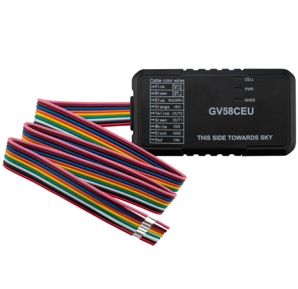

# QuecLink - GV58CEU

# GV58CEU Mini GNSS Tracker — Plaspy Compatible

El GV58CEU es un rastreador GNSS/GPS miniatura y rentable, diseñado para una gestión de flotas y telemática de vehículos confiable. Compatible con Plaspy desde fábrica, el GV58CEU combina LTE Cat 1 con respaldo a 2G, soporte BLE 5.2 y un factor de forma compacto para ofrecer seguimiento en tiempo real, telemetría y flujos de trabajo de antirrobo para automóviles, flotas de alquiler y vehículos comerciales ligeros.

Diseñado para una instalación encubierta sin sacrificar la capacidad de E/S, el GV58CEU ofrece detección de ignición, control de corte de combustible y una entrada analógica configurable, junto con la integración BLE para identificación del conductor y telemetría de sensores. Su tamaño compacto, antenas internas y rendimiento GNSS robusto lo convierten en una opción eficaz para la gestión escalable de flotas, telemática de seguros \(UBI\) y recuperación de vehículos robados cuando se utiliza con la plataforma de Plaspy.

## Key Highlights

- Rastreador GPS miniatura compatible con Plaspy para seguimiento en tiempo real en flotas y vehículos de alquiler.
- LTE Cat 1 con respaldo a EGPRS \(2G\) para una amplia cobertura celular y entrega fiable de telemetría.
- BLE 5.2 integrado para identificación del conductor e integración con sensores Bluetooth \(temperatura, nivel de combustible, inclinación\).
- E/S esenciales: detección de ignición, control de corte de combustible, una entrada analógica configurable y múltiples entradas de disparo para alarmas.
- Factor de forma compacto y encubierto \(86.7 × 46.4 × 18.1 mm\) con antenas internas y indicadores LED para verificaciones rápidas del estado.
- Batería de respaldo Li‑Polímero de 190 mAh a bordo y rango de voltaje de operación amplio \(8–32 V DC\) para instalaciones de vehículos robustas.
- Soporta gestión OTA/FOTA y control remoto de salidas para la configuración a nivel de flota y flujos de trabajo de inmovilización.

## How It Works with Plaspy

Cuando se integra con Plaspy, el GV58CEU transmite la ubicación y la telemetría a la plataforma utilizando transporte TCP/UDP estándar o SMS. Plaspy ingiere las posiciones GNSS, lecturas de sensores BLE y estados de entradas digitales para ofrecer seguimiento en tiempo real, alertas de geocerca, informes programados y acciones remotas. Los gestores de flotas utilizan Plaspy para visualizar el historial, activar alarmas y enviar comandos remotos, como control de salidas para inmovilización o funciones auxiliares.

- Actualizaciones de ubicación y telemetría en tiempo real enviadas a Plaspy mediante transporte LTE/2G.
- Detección de ignición e informe de estado para eventos de encendido/apagado del motor y la programación por kilometraje.
- Monitoreo de combustible mediante sensores BLE o integración de entrada analógica para telemetría de nivel de combustible y alertas.
- Control remoto estilo inmovilizador: corte de combustible y control de salidas digitales disponibles a través de comandos remotos de Plaspy.
- Sensores Bluetooth e identificación del conductor \(1‑wire o BLE\) compatibles para temperatura, inclinación y asignación segura del conductor.

## Technical Overview

| Conectividad | LTE Cat 1 con respaldo a EGPRS \(2G\); transporte TCP/UDP/SMS soportado |
| --- | --- |
| Bandas | LTE‑FDD B1 / B3 / B7 / B8 / B20 / B28; EGPRS 900 / 1800 MHz |
| Alimentación & Batería | Voltaje de operación 8–32 V DC; batería de respaldo Li‑Polímero de 190 mAh; alarma de baja batería soportada |
| Interfaces | 1 entrada digital positiva \(ignición\), 2 entradas de disparo negativas \(una configurable como analógica\), 1 entrada analógica configurable, 1 salida digital \(open drain, 150 mA\), 1 salida digital con latch \(reservada\), micro USB \(firmware/debug\), interfaz 1‑wire para iButton/temperatura |
| GNSS | Receptor all‑in‑one de u‑blox; GPS / GLONASS / Galileo / BeiDou; sensibilidad de seguimiento −167 dBm; precisión de posición autónoma \< 2,0 m CEP; TTFF 24 s en frío, 1 s en caliente |
| Bluetooth | BLE 5.2 para sensores Queclink y de terceros, identificación del conductor e integración de accesorios |
| Gestión remota | Actualización de firmware OTA y control remoto de salidas digitales; informes programados por tiempo/distancia/kilometraje |
| Factor de forma e Indicadores | Dimensiones 86.7 × 46.4 × 18.1 mm; peso 80 g; antenas internas de celular/GNSS/BLE; indicadores LED para CEL, GNSS y Alimentación |
| Certificaciones | CE, E‑MARK, UKCA |

## Use Cases

- Gestión de flotas: seguimiento en tiempo real, informes de kilometraje e identificación del conductor para optimizar rutas y utilización.
- Alquiler y leasing de coches: instalación encubierta con detección de ignición y control remoto de salidas para recuperación del vehículo o inmovilización.
- Recuperación de vehículos robados \(SVR\): posicionamiento GNSS fiable y corte remoto de combustible para soportar flujos de trabajo anti‑robo a través de Plaspy.
- Telemática y seguros \(UBI\): recopilar telemetría, eventos de conducción agresiva y datos de sensores BLE para programas de seguros basados en el uso.
- Logística y monitoreo de activos: sensores de temperatura, inclinación y nivel de combustible vía BLE para mercancía sensible y prevención de robo de combustible.

## Why Choose This Tracker with Plaspy

El GV58CEU combina hardware compacto con la flexibilidad operativa que proporciona Plaspy. Su conectividad LTE Cat 1 con respaldo a 2G garantiza una comunicación persistente a través de redes mixtas, mientras BLE 5.2 facilita telemetría moderna e identificación del conductor en el edge. Para gestores de flota y aseguradoras que requieren seguimiento en tiempo real escalable, monitoreo de combustible y controles anti‑robo \(incluido el corte remoto de combustible y la gestión de salidas\), el GV58CEU ofrece un conjunto equilibrado de funciones sin complejidad innecesaria.

La gestión OTA integrada y los protocolos de transporte estándar permiten a los equipos implementar, mantener y actualizar dispositivos de forma remota a través de Plaspy, reduciendo las llamadas de servicio y el tiempo de inactividad. Certificado para uso en vehículos y con posicionamiento GNSS preciso, el GV58CEU es una opción práctica y compatible con Plaspy para organizaciones enfocadas en un seguimiento fiable, telemetría y flujos de trabajo de inmovilización seguros.

