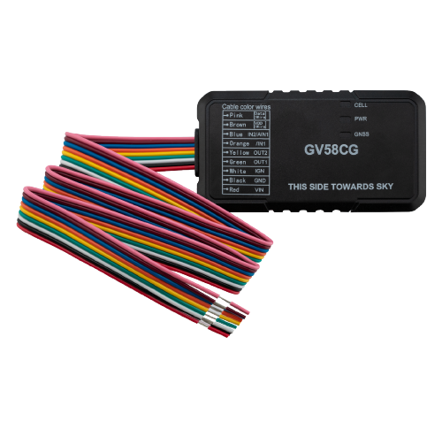

# QuecLink - GV58CG

El GV58CG es un rastreador telemático GNSS compacto de QuecLink diseñado para la gestión de flotas y la seguridad vehicular. Combina posicionamiento preciso, entradas E/S prácticas y soporte de accesorios, y un diseño de tamaño reducido para ofrecer capacidades de seguimiento en tiempo real, telemetría y control vehicular adecuadas para operadores de flotas, servicios de alquiler de autos y procesos de recuperación de vehículos robados.

Como dispositivo compatible con Plaspy, el GV58CG puede transmitir ubicación y estado del vehículo a Plaspy para monitoreo centralizado, alertas e informes históricos. Su conectividad celular con mecanismos de conmutación, GNSS de alta sensibilidad, opciones de identificación de conductor y la integración de sensores BLE lo convierten en una opción versátil para organizaciones que desean extender la visibilidad de Plaspy hasta la telemetría a nivel de vehículo y los flujos de trabajo de prevención de robos.

## Aspectos clave

- Compatible con Plaspy para integración fluida de seguimiento en tiempo real y gestión de flotas
- Conectividad celular con mecanismos de respaldo para mantener la entrega continua de telemetría
- Posicionamiento GNSS de alta sensibilidad para reportes de ubicación vehicular precisos
- Detección de encendido y control de corte de combustible para flujos de trabajo antirrobo e inmovilizadores
- BLE 5.2 y soporte 1-Wire para identificación de conductor y telemetría basada en sensores
- Factor de forma compacto con batería de respaldo interna y reportes avanzados de alarmas

## Cómo funciona con Plaspy

Cuando se utiliza con Plaspy, el GV58CG transmite actualizaciones de posición, eventos de estado y telemetría de sensores a la plataforma Plaspy, donde los administradores de flota pueden ver la ubicación en vivo, recibir alertas y generar informes históricos. Plaspy procesa los datos del dispositivo y los pone a disposición en paneles, mapas y herramientas de reportes para la supervisión operativa.

- Actualizaciones de ubicación y telemetría en vivo entregadas a Plaspy para visibilidad continua de la flota
- Detección de encendido reportada a Plaspy para soportar eventos de motor encendido/apagado y registros de turnos
- Monitoreo de combustible mediante entrada analógica y sensores BLE opcionales con tendencias y alertas en Plaspy
- Acciones remotas de inmovilizador y corte de combustible ejecutadas desde Plaspy vía comandos configurables
- Sensores BLE e identificación de conductor con iButton integrados en los flujos de trabajo de Plaspy para monitoreo ambiental y atribución de conductor

## Casos de uso típicos

- Gestión antirrobo e inmovilización de flotas usando detección de encendido y controles de corte de combustible
- Operaciones de alquiler y leasing para identificación del conductor y responsabilidad en viajes
- Recuperación de vehículos robados con seguimiento continuo y notificaciones de remolque o alarma
- Monitoreo logístico y cumplimiento de rutas con reportes programados y alertas por geocerca
- Monitoreo ambiental de activos usando sensores BLE para temperatura, humedad o datos de inclinación

## Por qué elegir este rastreador con Plaspy

El GV58CG combina un hardware telemático diseñado para propósitos concretos con la visibilidad centralizada y los informes que ofrece Plaspy. Su diseño compacto y las entradas compatibles lo hacen adecuado para instalaciones donde el espacio es limitado pero se requiere seguimiento confiable y control vehicular sencillo. Para flotas e integradores, esa combinación permite supervisión simplificada, mitigación de robos y telemetría básica sin necesidad de hardware voluminoso o complejo.

Si desea explorar más la compatibilidad con Plaspy o evaluar cómo encaja el GV58CG en su flota, conozca más sobre Plaspy en el sitio principal https://www.plaspy.com. Tenga en cuenta que las especificaciones del producto, la disponibilidad y los detalles del fabricante pueden cambiar con el tiempo; verifique la información técnica actual y la documentación oficial en el sitio web de QuecLink https://www.queclink.com/.
