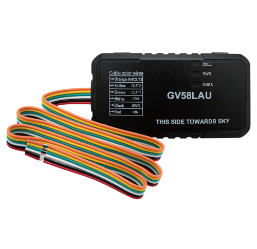

# QuecLink - GV58LAU

El QuecLink GV58LAU es un rastreador GPS compacto diseñado para aplicaciones de seguridad vehicular y gestión de flotas. Integra un receptor GNSS u-blox de alta sensibilidad con conectividad celular LTE Cat 4 para ofrecer posicionamiento en tiempo real y telemetría resiliente. La unidad está pensada para instalaciones discretas en automóviles, flotas de alquiler y vehículos comerciales ligeros, donde una ubicación precisa y comunicación fiable son fundamentales para operaciones y procesos de recuperación.

Como dispositivo compatible con Plaspy, el GV58LAU puede enviar actualizaciones de posición en vivo, eventos de E/S y telemetría de accesorios a los paneles y reportes de Plaspy. Su soporte para accesorios BLE, detección de encendido y salidas digitales configurables lo hacen una opción práctica para clientes que desean extender la visibilidad en Plaspy hacia identificación de conductores, sensores ambientales y acciones de control remoto sin rehacer el cableado.

## Aspectos clave

- Compatible con Plaspy para integración fluida de seguimiento en tiempo real y gestión de flotas
- Receptor GNSS u-blox multiconstelación de alta precisión útil para recuperación y seguimiento exacto
- Conectividad LTE Cat 4 con conmutación entre redes para mantener la telemetría y actualizaciones de baja latencia
- Factor de forma compacto y discreto, apto para montaje oculto en autos, flotas de alquiler y vehículos comerciales ligeros
- Soporte BLE 5.2 para sensores y identificación de conductor que amplían la telemetría sin cableado adicional
- Detección de encendido y salidas digitales configurables para segmentación de viajes y flujos de trabajo de control remoto
- Alarmas avanzadas y modos de reporte para geocercas, remolque y eventos relacionados con la conducción que facilitan respuestas proactivas

## Cómo funciona con Plaspy

Al emparejarse con Plaspy, el GV58LAU transmite fijaciones de posición y datos de eventos a la plataforma para que los operadores puedan monitorear vehículos en tiempo real y analizar viajes históricos. Plaspy procesa datos GNSS, eventos de entrada y telemetría de accesorios, convirtiéndolos en vistas de mapa, alertas y reportes que apoyan la supervisión operativa.

- Actualizaciones de ubicación y telemetría en tiempo real para seguimiento en vivo y reproducción de rutas en Plaspy
- Eventos de encendido y entradas digitales utilizados para segmentación de viajes e informes de horas de motor
- Datos de accesorios BLE, como sensores ambientales o identificación de conductor, integrados en las vistas de estado del activo y atribución
- Control remoto de salidas mediante las salidas del dispositivo coordinadas a través de Plaspy para inmovilización o acciones de alarma
- Alarmas configurables por violación de geocerca, remolque y eventos de choque que disparan notificaciones y flujos de trabajo automatizados

## Casos de uso típicos

- Gestión de flotas para monitoreo de ubicación en vivo, optimización de rutas y planificación de mantenimiento
- Operaciones de alquiler y leasing donde la instalación discreta y el reporte de viajes reducen el uso indebido y aceleran la gestión de devoluciones
- Recuperación de vehículos robados y flujos anti robo que emplean fijaciones GNSS precisas y control remoto de salidas
- Monitoreo logístico y de última milla con alertas por geocerca y verificación de entregas
- Monitoreo de condiciones de activos combinando sensores BLE de temperatura o humedad con la ubicación para cadena fría o carga sensible

## Por qué elegir este rastreador con Plaspy

El GV58LAU combina un diseño compacto con funciones que amplían la visibilidad y el control que Plaspy ofrece a las flotas vehiculares. Su receptor GNSS de alta sensibilidad y la conectividad celular multi red ayudan a mantener el flujo de posición y telemetría en entornos difíciles, mientras que el soporte BLE y las E/S configurables permiten telemetría y control adicionales sin grandes cambios en el cableado. Para organizaciones que requieren instalación discreta, reportes sensibles al encendido y capacidad de salida remota, este modelo ofrece funcionalidad práctica que escala desde soluciones anti robo para vehículos individuales hasta despliegues en flotas mayores.

Para saber más sobre cómo funciona este rastreador con Plaspy visite https://www.plaspy.com. Las especificaciones del producto y su disponibilidad pueden cambiar con el tiempo, por lo que le recomendamos verificar los detalles técnicos actuales y las variantes regionales en el sitio del fabricante https://www.queclink.com/.
