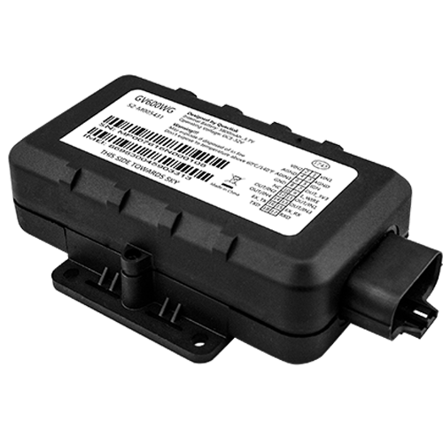

# QuecLink - GV600WG

El QuecLink GV600WG es un rastreador GPS robusto diseñado para activos de alta exigencia como remolques, cisternas, unidades refrigeradas y plataformas. Combina una carcasa resistente con clasificación IP67, un diseño de antena a prueba de manipulación y una batería interna de gran capacidad para ofrecer seguimiento continuo y telemetría fiable en entornos de transporte y logística exigentes.

Como dispositivo compatible con Plaspy, el GV600WG se integra fácilmente en los flujos de trabajo de gestión de flotas para ofrecer seguimiento en tiempo real, reenvío de alarmas y telemetría histórica. Su posicionamiento GNSS, amplio soporte celular y conjunto extensible de E/S lo convierten en una opción práctica para operadores que requieren larga autonomía en espera, capacidades de control remoto y soporte para sensores adicionales dentro de la plataforma Plaspy.

## Características principales

- Carcasa impermeable IP67 y diseño resistente a manipulación, apropiado para entornos de flota hostiles y transporte de combustible o productos químicos.
- Larga autonomía en espera gracias a la batería interna de alta capacidad, ideal para remolques y activos sin alimentación externa continua.
- Posicionamiento GNSS preciso mediante receptor basado en u-blox para actualizaciones de ubicación confiables en escenarios típicos de flotas.
- Amplio soporte celular para cargas de telemetría consistentes en zonas de amplia cobertura.
- Soporte completo de E/S y accesorios para detección de encendido, telemetría analógica y sensores auxiliares que amplían la visibilidad de la flota.
- Almacenamiento en el dispositivo y control remoto de salidas para preservar la continuidad de los datos y permitir intervenciones tipo inmovilizador cuando se integra con un backend.
- Compatibilidad con accesorios BLE para incorporar sensores de temperatura y llaveros, útil en flujos de trabajo de cumplimiento de carga y antirobo.

## Cómo funciona con Plaspy

Al integrarse con Plaspy, el GV600WG forma parte de una solución de seguimiento de extremo a extremo: el dispositivo recoge datos GNSS y de sensores, envía mensajes a Plaspy, y Plaspy decodifica, visualiza y archiva esos datos para monitoreo, alertas e informes. Esta integración soporta supervisión operativa continua, alarmas oportunas y análisis histórico para los responsables de flota.

- Ubicación y telemetría en tiempo real visibles en los paneles de seguimiento en vivo de Plaspy y conservadas para informes históricos.
- Eventos de encendido y movimiento utilizados por Plaspy para registrar inicio y fin de rutas, resúmenes de comportamiento de conductores y métricas de utilización.
- Entradas analógicas y de sensores encaminadas a las reglas de alarma y umbrales personalizados de Plaspy para monitorizar combustible o parámetros de equipos.
- Control remoto de salidas disponible mediante flujos de trabajo de Plaspy para apoyar intervenciones antirobo y acciones de gestión de activos.
- Lecturas de sensores BLE y presencia de accesorios integradas en las alertas de Plaspy para control de temperatura y vigilancia de seguridad.
- Eventos de geocerca, notificaciones de batería baja y otras alarmas reenviadas a Plaspy para notificación inmediata y respuesta operativa.

## Casos de uso típicos

- Seguimiento de flota de remolques para programación, contabilización de kilometraje e informes de utilización cuando la alimentación externa es intermitente.
- Protección antirobo con control remoto de salidas y alertas para permitir intervenciones rápidas por parte del equipo operativo.
- Monitorización de cargas refrigeradas usando sensores de temperatura accesorios para mantener el cumplimiento y reducir riesgo de pérdida.
- Rastreo de cisternas y mercancías peligrosas donde se requiere una carcasa impermeable y telemetría fiable.
- Despliegues estacionales o de remolques en renta que se benefician de la larga autonomía en espera y del almacenamiento en el dispositivo.

## Por qué elegir este rastreador con Plaspy

El GV600WG es adecuado para flotas que necesitan un rastreador duradero con gran autonomía en espera y una interfaz flexible para sensores. Su enfoque en la resistencia de la batería, posicionamiento GNSS confiable y soporte de accesorios lo hace ideal para operaciones centradas en remolques, transporte refrigerado y programas de protección de activos. Al emplearlo con Plaspy, los operadores obtienen visibilidad centralizada, manejo coherente de eventos y flujos de trabajo de alarmas integrados que simplifican la supervisión diaria de la flota.

Para obtener más información sobre el uso del GV600WG con Plaspy visite https://www.plaspy.com. Las especificaciones del producto, disponibilidad y detalles del fabricante pueden cambiar con el tiempo; por favor verifique las especificaciones técnicas actuales y el estado del ciclo de vida con Queclink en https://www.queclink.com/ antes de tomar decisiones de compra o despliegue.
