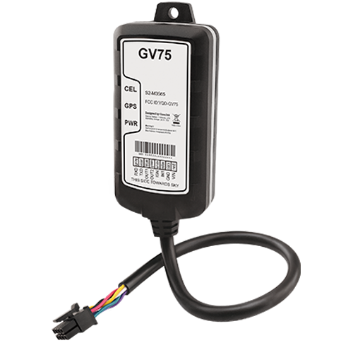

# QuecLink - GV75

El GV75 es un rastreador GPS resistente con certificación IP67 diseñado para entornos exteriores exigentes y aplicaciones vehiculares. Construido alrededor de un receptor u‑blox GNSS y comunicaciones celulares cuatribanda, el GV75 ofrece seguimiento de ubicación en tiempo real fiable, telemetría extendida y una serie de alarmas antirrobo. Su carcasa robusta y su amplio rango de temperatura operativa lo hacen adecuado para motocicletas, embarcaciones, maquinaria agrícola y equipos pesados donde la durabilidad y el seguimiento continuo son esenciales.

Como dispositivo compatible con Plaspy, el GV75 se integra con la plataforma de seguimiento de Plaspy para ofrecer actualizaciones de posición en vivo, alertas configurables por geocerca e informes de gestión de flota. Cuando está conectado a Plaspy, el almacenamiento con búfer de mensajes del rastreador y el registro de eventos ayudan a garantizar la continuidad de los datos de ubicación y alarmas para la supervisión operativa, los flujos de trabajo de seguridad y el análisis histórico.

## Aspectos destacados

- Carcasa resistente e impermeable IP67, apta para uso en exteriores, embarcaciones y vehículos industriales.  
- Posicionamiento GNSS preciso mediante un receptor u‑blox para informes de ubicación fiables.  
- Amplio búfer de mensajes para mejorar la retención de datos cuando los activos se salen de cobertura celular.  
- Batería de respaldo integrada para mantener el reporte durante pérdidas temporales de energía.  
- Múltiples entradas y una interfaz serial para admitir telemetría extendida e integración de sensores externos.  
- Alarmas configurables incluyendo arrastre (towing), batería baja y encendido para soportar alertas de seguridad y operación.

## Cómo funciona con Plaspy

Al funcionar con Plaspy, el GV75 envía fijaciones de ubicación y eventos del dispositivo a la plataforma para que los gestores de flota puedan monitorear activos en tiempo real, revisar recorridos históricos y recibir notificaciones automáticas de eventos configurados. Plaspy procesa la telemetría y los datos de alarma del equipo, mostrándolos en mapas en vivo, en reportes y como parte de las alertas operativas.

- Actualizaciones de ubicación y telemetría en tiempo real a Plaspy para seguimiento en mapas en vivo y visibilidad de rutas.  
- Entradas digitales y eventos de encendido informados a Plaspy para registrar actividades de arranque y paro y eventos del conductor.  
- Alarmas de arrastre, batería baja y encendido entregadas a Plaspy para notificación y reporte inmediato.  
- Integración serial para incorporar telemetría extendida como sensores externos o datos de identificación de conductor en Plaspy.  
- Mensajes en búfer y comportamiento ante fallas celulares que mejoran la continuidad de datos para activos que entran y salen de cobertura.

## Casos de uso típicos

- Gestión de flotas para seguimiento continuo de ubicación, informes basados en geocercas y supervisión operativa.  
- Antirrobo y recuperación de vehículos robados utilizando alarmas de arrastre y encendido combinadas con mensajería en búfer.  
- Monitoreo de motocicletas y embarcaciones donde se requiere un diseño compacto e impermeable y fijaciones GNSS fiables.  
- Supervisión de equipos pesados y maquinaria agrícola con carcasa robusta y amplia compatibilidad de voltaje.  
- Recolección de telemetría extendida cuando se conectan sensores externos o sistemas de identificación de conductor a través de la interfaz serial.

## Por qué elegir este rastreador con Plaspy

El GV75 combina hardware resistente con posicionamiento GNSS fiable y conectividad flexible para cubrir diversas necesidades de seguimiento de vehículos y activos. Su carcasa impermeable, amplio búfer de mensajes y conjunto de alarmas configurables lo convierten en una opción práctica para organizaciones que requieren seguimiento resiliente en entornos adversos. Plaspy integra los datos del GV75 en un panel unificado para visibilidad en vivo, alertas e informes, ayudando a los equipos a actuar de forma más eficiente ante eventos de ubicación y seguridad.

Para obtener más información sobre el uso del GV75 con Plaspy visite https://www.plaspy.com y consulte la documentación del fabricante en https://www.queclink.com/ para conocer las especificaciones técnicas y la disponibilidad más recientes. Las especificaciones y la disponibilidad de los productos pueden cambiar con el tiempo, por lo que le recomendamos verificar los detalles actuales con la documentación oficial del fabricante.
