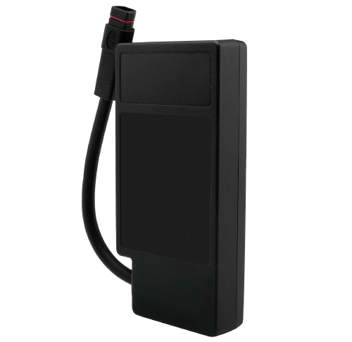

# QuecLink - SC350MG

El QuecLink SC350MG es un rastreador GNSS compacto y resistente al agua diseñado específicamente para bicicletas eléctricas. Admite LTE Cat M1/NB2 con retroceso a 2G, lo que garantiza una comunicación confiable y eficiente. Con su amplio rango de voltaje de DC 8-60V, el SC350MG se puede instalar fácilmente en varios modelos de bicicletas eléctricas.

Una de las características clave del SC350MG es su capacidad para leer datos de ECU/BMS, lo que permite un monitoreo y control avanzados del rendimiento de la bicicleta eléctrica. Puede comunicarse con controladores de vehículos, instrumentos y sistemas de gestión de baterías a través del puerto CAN o UART, lo que permite una gestión inteligente de las bicicletas eléctricas.

Además, el SC350MG está equipado con un sensor de aceleración de 3 ejes para la detección de movimiento y vibración. Esto garantiza que cualquier movimiento no autorizado o manipulación de la bicicleta eléctrica pueda ser detectado e informado.

Las capacidades GNSS del SC350MG están alimentadas por un receptor GNSS All-in-One de u-blox, que proporciona información precisa y confiable de posicionamiento. Tiene una precisión de posición de menos de 2.5m \(CEP\) y un tiempo de primera fijación \(TTFF\) rápido de solo unos segundos.

Con su tamaño compacto, resistencia al agua y características avanzadas, el QuecLink SC350MG es una opción ideal para propietarios de bicicletas eléctricas y administradores de flotas que desean mejorar la seguridad y gestión de sus vehículos.

### Características destacadas:

- LTE Cat M1/NB2 con retroceso a 2G
- Resistente al agua
- Lectura de datos de ECU/BMS
- Amplio rango de voltaje DC 8-60V
- Sensor de aceleración de 3 ejes para detección de movimiento
- Posicionamiento GNSS con receptor All-in-One de u-blox

### Especificaciones generales:

- Dimensiones: 95\*45\*16.2mm
- Peso: 88.5g
- Voltaje de funcionamiento: 8~60V DC
- Batería de respaldo: 500mAh de polímero de litio
- Temperatura de funcionamiento: -20℃ ~ +70℃
- Resistente al agua: IPX5

### Especificaciones LTE:

- Banda de operación: LTE-FDD:Cat M1: B1/B2/B3/B4/B5/B8/B12/B13/B18/B19/B20/B25/B26/B27/B28 /B66/B85Cat NB2: B1/B2/B3/B4/B5/B8/B12/B13/B18/B19/B20/B25/B28/B66/B71 /B85GSM/GPRS: 850/900/1800/1900 MHz

### Interfaces:

- CAN: 1 x CAN alto y CAN bajo
- Puertos seriales: 1 x UART
- Salidas digitales: 2 x salidas digitales
- Entrada digital: 1 entrada de disparo positivo para detección de encendido
- USB BLE: BLE 5.2, para desbloquear la bicicleta eléctrica

Tenga en cuenta que el soporte de ECU y UART para la lectura de datos puede requerir personalización según el tipo específico de ECU.

