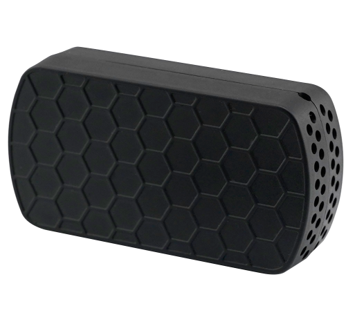

# QuecLink - WTH301

El WTH301 es un sensor compacto de temperatura y humedad de QuecLink diseñado para la logística profesional de la cadena de frío y la monitorización en transporte. Pensado para entornos de remolques y contenedores, ofrece mediciones ambientales continuas con protección robusta IP66 y un diseño pequeño que se instala discretamente dentro de activos refrigerados. El dispositivo está orientado a operaciones que requieren datos fiables de condiciones para mercancías sensibles durante el transporte y el almacenamiento.

Como dispositivo compatible con Plaspy cuando se usa junto a rastreadores o gateways con BLE, el WTH301 integra la telemetría ambiental en soluciones de seguimiento basadas en Plaspy. Los sensores emparejados envían lecturas de temperatura y humedad a Plaspy junto con la ubicación y las señales del vehículo, permitiendo visibilidad combinada para cumplimiento, alertas e informes históricos dentro de la plataforma Plaspy.

## Puntos clave

- Sensor BLE compatible con Plaspy que se empareja con rastreadores y gateways con BLE para enviar telemetría ambiental a los paneles e informes de Plaspy.
- Alta precisión en la medición de temperatura, con un rango adecuado para operaciones de cadena de frío.
- Monitoreo fiable de humedad para vigilar cargas sensibles a la humedad y apoyar flujos de trabajo de cumplimiento.
- Larga vida operativa que reduce la carga de mantenimiento y los reemplazos de batería en despliegues de gran escala.
- Carcasa resistente IP66 y formato compacto para un montaje sencillo dentro de remolques, contenedores y otros activos.
- Conectividad BLE 5.1 para mayor alcance hacia rastreadores de vehículo o gateways fijos y bajo consumo energético.

## Cómo funciona con Plaspy

Cuando se despliega junto a un gateway BLE compatible con Plaspy o un rastreador GPS con BLE, el WTH301 transmite lecturas de temperatura y humedad que se recogen y reenvían a Plaspy. La plataforma correlaciona esos valores ambientales con la ubicación GPS y la telemetría del vehículo, de modo que los equipos pueden monitorear condiciones en tiempo real y revisar viajes históricos con contexto ambiental.

- Integración en tiempo real de ubicación y telemetría para que las lecturas ambientales aparezcan junto a los datos GPS y ofrezcan un seguimiento con contexto.
- Alertas y umbrales en Plaspy que pueden notificar a los equipos cuando la temperatura o la humedad se salen de los límites configurados.
- Correlación de eventos combinada, donde el estado de ignición, puertas o alarmas reportado por el rastreador emparejado se visualiza junto con los datos del sensor para facilitar la resolución de incidencias.
- Informes enriquecidos en Plaspy que incluyen métricas ambientales para soporte de cumplimiento y reclamaciones.
- Funciones de supervisión operativa como control de condiciones por ruta y resúmenes agregados de sensores para gestores de flota.

## Casos de uso típicos

- Monitoreo de la cadena de frío para farmacéuticos, alimentos y otras cargas sensibles a la temperatura durante el transporte.
- Supervisión de transporte refrigerado y remolques donde se requiere datos ambientales por carga junto con la ubicación del vehículo.
- Seguimiento del ambiente en contenedores y activos para instalaciones de larga duración que reduzcan visitas de mantenimiento.
- Informes de cumplimiento y prueba histórica de condiciones para procesos regulatorios o reclamaciones.
- Monitoreo a nivel de flota para apoyar decisiones operativas y la gestión de excepciones.

## Por qué elegir este sensor con Plaspy

Emparejar el WTH301 con rastreadores compatibles con Plaspy ofrece una solución específica para organizaciones que necesitan telemetría ambiental con conciencia de ubicación. La combinación amplía el seguimiento básico con datos precisos de temperatura y humedad, lo que ayuda a los equipos operativos a detectar problemas más rápido, respaldar los informes de cumplimiento y mantener visibilidad sobre activos refrigerados.

Si desea saber más sobre la integración de sensores ambientales en Plaspy y cómo puede encajar el WTH301 en su despliegue visite https://www.plaspy.com. Las especificaciones y la disponibilidad de productos pueden cambiar con el tiempo, por lo que le recomendamos verificar los detalles actuales y la documentación oficial en el sitio del fabricante https://www.queclink.com/ antes de finalizar la compra.
