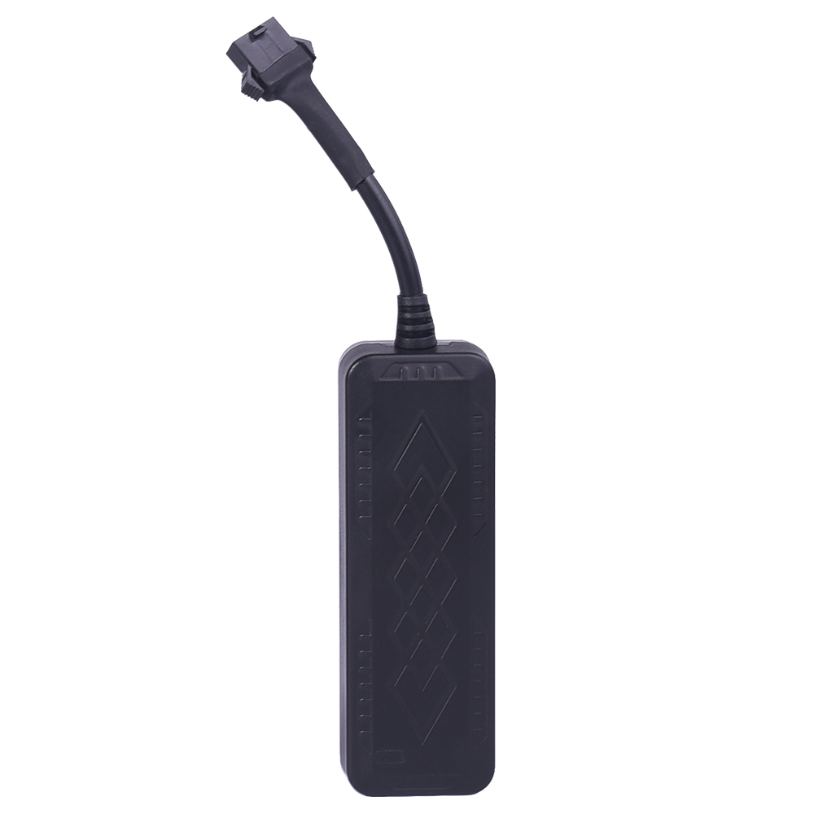

# Reachfar - RF-V03

El rastreador GPS para vehículos 2G Reachfar RF-V03 es una solución confiable y eficiente para monitorear la ubicación de tus vehículos. Equipado con un chip GPS MTK 2503A, este rastreador ofrece una alta sensibilidad de recepción de señal, lo que garantiza una precisión de posicionamiento de 10 a 15 metros. Además, cuenta con una antena GPS activa de cerámica incorporada para una mejor recepción de la señal GPS.

Este rastreador GPS es compatible con redes 2G GSM en las frecuencias 850/900/1800/1900 MHz, lo que garantiza una amplia cobertura y conectividad estable. También cuenta con un estándar GPRS Clase 12 para una transmisión de datos eficiente a través de TCP/IP.

Una de las características destacadas de este rastreador es su capacidad de corte de aceite y energía de forma remota. Esto significa que puedes apagar el motor de tu vehículo de forma remota en caso de robo o uso no autorizado. Además, cuenta con una batería de polímero de litio de 100 mAh incorporada para un respaldo de energía en caso de desconexión de la fuente de alimentación principal.

Otras características notables incluyen la capacidad de establecer geovallas para recibir alertas cuando el dispositivo se mueva dentro o fuera de un área predefinida, la capacidad de rastrear la ruta histórica del vehículo en los últimos 3 meses, y la compatibilidad con sistemas Android e iOS para una fácil gestión y monitoreo a través de la aplicación y la plataforma web.

Con su nivel de impermeabilidad IP66, el rastreador GPS Reachfar RF-V03 es resistente al agua y puede soportar condiciones climáticas adversas. Además, su diseño compacto y duradero lo hace ideal para su instalación en una amplia gama de vehículos.

En resumen, el rastreador GPS para vehículos 2G Reachfar RF-V03 es una opción confiable y versátil para monitorear la ubicación de tus vehículos. Con su capacidad de corte de aceite y energía de forma remota, geovallas y otras características avanzadas, este rastreador te brinda tranquilidad y control sobre tus activos.

### Características destacadas:

- Chip GPS MTK 2503A para una alta sensibilidad de recepción de señal
- Compatibilidad con redes 2G GSM en las frecuencias 850/900/1800/1900 MHz
- Estándar GPRS Clase 12 para una transmisión de datos eficiente
- Precisión de posicionamiento GPS de 10 a 15 metros
- Capacidad de corte de aceite y energía de forma remota
- Batería de polímero de litio de 100 mAh incorporada
- Antena GPS activa de cerámica incorporada
- Geovallas para recibir alertas de movimiento
- Rastreo de ruta histórica
- Compatibilidad con sistemas Android e iOS
- Nivel de impermeabilidad IP66

