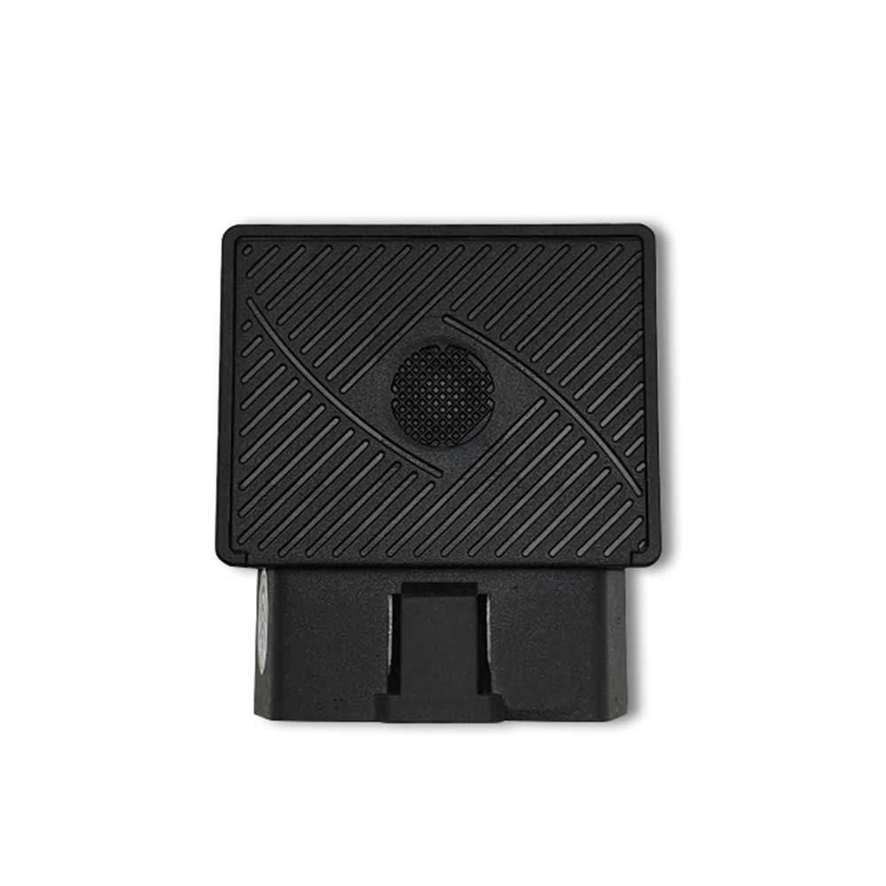

# Reachfar - RF-V03-OBD

El RF-V03-OBD es un rastreador GPS OBDII plug and play diseñado para despliegues rápidos e integración sencilla en flotas. Se conecta directamente al puerto J1962 OBDII del vehículo para proporcionar ubicación en tiempo real, estado de ignición y diagnósticos básicos sin necesidad de cableado fijo. Su formato y la interfaz OBD estandarizada lo hacen ideal para flotas mixtas, vehículos de alquiler y unidades logísticas donde la instalación rápida y no invasiva es prioritaria.

Como dispositivo compatible con Plaspy, el RF-V03-OBD entrega telemetría a la plataforma Plaspy para que los administradores de flota puedan ver posiciones en vivo, recibir alertas y revisar recorridos históricos dentro de sus procesos habituales. Su soporte para múltiples variantes celulares, almacenamiento de respaldo y alertas por eventos se ajusta a los casos de uso comunes de Plaspy en monitoreo, seguridad e informes operativos, siendo una opción práctica al incorporar rastreadores basados en OBD en una flota gestionada por Plaspy.

## Características principales

- Instalación plug and play vía puerto J1962 OBDII para despliegues rápidos.
- Compatibilidad con Plaspy para seguimiento en tiempo real, alertas y reproducción histórica vía SMS, aplicación móvil y web.
- Variantes celulares múltiples para adaptarse a requisitos de conectividad regionales.
- Reporte de estado ACC de ignición y diagnósticos básicos del vehículo a través de la interfaz OBD.
- Batería de respaldo y almacenamiento en zonas sin cobertura para preservar registros durante pérdida de conexión.
- Alarma por vibración y alertas de geocerca para notificaciones de antirrobo y movimiento no autorizado.
- Reproducción de rutas históricas y registro de eventos para cumplimiento y revisión operativa.

## Cómo funciona con Plaspy

Al instalarse, el RF-V03-OBD transmite posiciones GPS y eventos del vehículo por su enlace celular para que Plaspy los procese. Plaspy ingiere estas señales para mapeo, alertas e informes, permitiendo que los equipos de flota supervisen los vehículos en tiempo real y analicen actividad pasada. El almacenamiento local en el dispositivo garantiza continuidad de datos cuando la cobertura se interrumpe y sincroniza con Plaspy una vez que se restablece la conexión.

- Localización en tiempo real y visualización de rutas dentro de Plaspy para supervisión activa de la flota.
- Actualizaciones de estado de ignición y motor para registrar eventos de encendido/apagado y patrones de uso por conductor.
- Diagnósticos básicos basados en OBD entregados a Plaspy para planificación de mantenimiento e información operativa cuando el vehículo lo soporta.
- Eventos de geocerca y alarma por vibración integrados en las reglas de alerta y notificación de Plaspy.
- Sincronización de datos almacenados en zonas muertas y reproducción histórica para recuperar telemetría perdida tras cortes.
- Opciones de monitoreo de voz en variantes seleccionadas que se pueden considerar para flujos de trabajo de seguridad, sujeto al soporte del plan.

## Casos de uso típicos

- Antirrobo y recuperación de flota usando ubicación en vivo, alertas por vibración y notificaciones de geocerca.
- Monitoreo del comportamiento del conductor e ignición para registrar eventos de arranque/parada y uso no autorizado.
- Operaciones de renta y carsharing que requieren instalación no invasiva y reproducción de eventos para resolver disputas.
- Verificación de rutas en logística para confirmación de entregas y supervisión operativa.
- Monitoreo básico de salud del vehículo y planificación de mantenimiento mediante diagnósticos OBD disponibles.

## Por qué elegir este rastreador con Plaspy

El RF-V03-OBD ofrece un equilibrio entre facilidad de uso y funciones telemáticas esenciales para organizaciones que buscan desplegar rastreadores OBD rápidamente. Su interfaz plug and play reduce tiempos de instalación y simplifica despliegues en vehículos de distintas marcas, mientras que el almacenamiento de respaldo y las alertas por eventos aportan resiliencia en operaciones reales de flota. Las variantes celulares múltiples facilitan la selección del dispositivo según requisitos de red regionales y la escala del despliegue.

Integrar el RF-V03-OBD con Plaspy centraliza el seguimiento, las alertas y los informes históricos para que los equipos gestionen flotas con visibilidad consistente y notificaciones accionables. Para saber más sobre Plaspy y cómo este rastreador puede encajar en su programa de flota visite https://www.plaspy.com. Las especificaciones y la disponibilidad del producto pueden cambiar con el tiempo, por lo que le recomendamos verificar los detalles actuales y el soporte de variantes con el fabricante en https://www.reachfargps.com/ antes de concretar cualquier compra.
