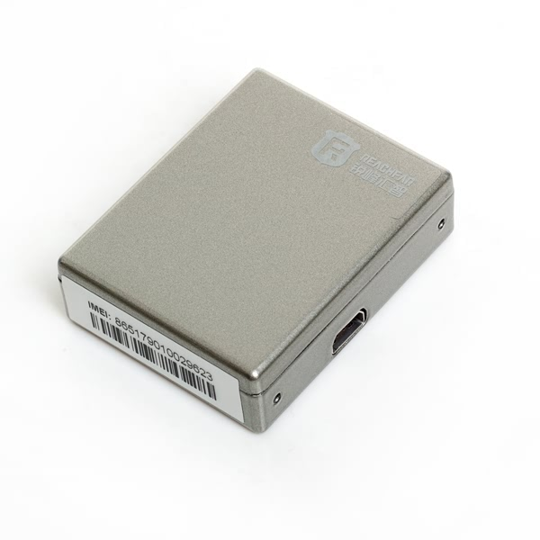

# Reachfar - RF-V11

El Reachfar RF-V11 es un rastreador GPS compacto alimentado por batería que incorpora una alarma antirrobo inalámbrica pensada para pequeños activos, puertas, ventanas y cajas fuertes. No requiere cableado y combina posicionamiento GPS con detección multimodal, incluyendo contacto magnético, detección de vibración y reconocimiento por sonido, para ofrecer protección discreta y reporte de ubicación. El RF-V11 está dirigido a instaladores y usuarios finales que necesitan una solución de alarma y localización fácil de desplegar en entornos donde tender cables de alimentación o datos resulta impráctico.

Como dispositivo compatible con Plaspy, el RF-V11 puede enviar reportes de ubicación y eventos de alarma a un entorno de monitoreo centralizado para visibilidad y respuesta consolidada. Sus funciones de alertas por SMS y llamadas, capacidad de recibir comandos remotos y su formato compacto lo hacen una opción práctica cuando usted desea gestión centralizada de seguimiento y alarmas en Plaspy sin instalaciones complejas.

## Características principales

- Rastreador compatible con Plaspy para monitoreo centralizado y seguimiento en tiempo real de pequeños activos
- Conectividad GSM cuatribanda para amplio alcance de red y alertas fiables por SMS y voz
- Protección antirrobo con múltiples sensores: contacto magnético, detección de impacto por vibración y detección por sonido
- Batería recargable integrada con carga USB y aproximadamente 12 días de espera según el uso
- Notificaciones automáticas por SMS y marcación automática a números preconfigurados para alertas inmediatas
- Función de escucha remota y conjunto de comandos por SMS para gestión remota y verificación situacional
- Factor de forma muy pequeño para colocación discreta en cajas fuertes, puertas, persianas y objetos portátiles

## Cómo funciona con Plaspy

Al integrarse con Plaspy, los eventos y reportes de ubicación del RF-V11 se consolidan en un mismo panel para que operadores y administradores vean las alarmas y la información de posición junto con otros activos rastreados. Plaspy procesa los reportes del dispositivo y los presenta como posiciones mapeadas, historial de eventos y alertas centralizadas para facilitar la supervisión operativa.

- Actualizaciones de ubicación en tiempo real e historial para mapear los elementos rastreados en Plaspy
- Reenvío de eventos de alarma para que los disparadores magnéticos, por vibración y por sonido aparezcan como alertas accionables
- La escucha remota y la confirmación de alertas pueden coordinarse con las notificaciones de Plaspy para mejorar la conciencia situacional
- Monitorización de batería y alertas por batería baja reflejadas en el monitoreo central para ayudar a mantener la disponibilidad del dispositivo
- Coordinación de gestión remota basada en SMS cuando los operadores necesiten consultar o configurar el dispositivo

## Casos de uso típicos

- Cajas fuertes y arcones donde se requiere detección antirrobo discreta y reporte de ubicación
- Fachadas de tiendas, persianas y puertas que necesitan protección perimetral y notificación inmediata ante aperturas forzadas
- Protección de activos portátiles y objetos de valor que requieren monitoreo temporal o encubierto
- Propiedades remotas, kioscos y dependencias donde el tendido de cables es impráctico y se necesita protección autónoma

## Por qué elegir este rastreador con Plaspy

El RF-V11 es una opción sensata para organizaciones que buscan un dispositivo compacto, sin necesidad de cableado, que combine alarma y localización y que pueda enviar eventos a una plataforma central como Plaspy. Su combinación de detección multimodal y reporte de ubicación GPS ofrece notificación inmediata de alarmas y la posibilidad de recuperar o seguir un activo cuando se detecta movimiento. Para seguridad de objetos pequeños, protección perimetral y activos portátiles, el RF-V11 permite un despliegue de bajo mantenimiento e integración operativa sencilla.

Para obtener más información sobre cómo Plaspy centraliza el seguimiento y las alarmas, visite https://www.plaspy.com. Las especificaciones y la disponibilidad del producto pueden cambiar con el tiempo, por lo que le recomendamos verificar los detalles actuales en el sitio del fabricante Reachfar https://www.reachfargps.com/ antes de finalizar cualquier despliegue.
