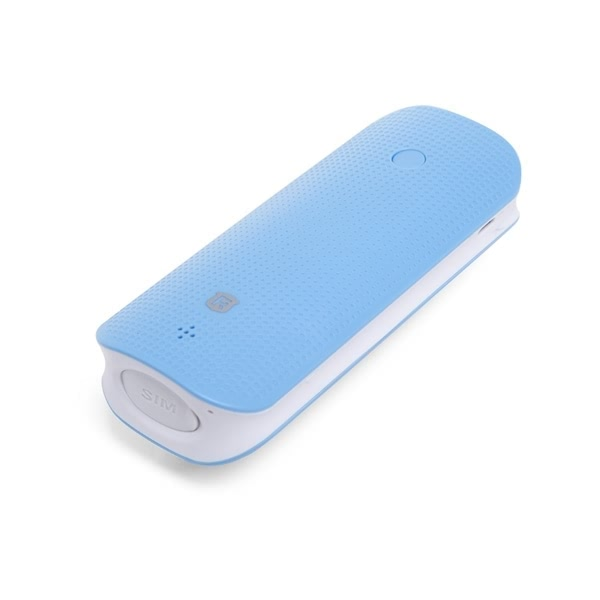

# Reachfar - RF-V20

El Reachfar RF-V20 es un rastreador GPS compacto y versátil pensado para proteger pertenencias y monitorear ubicaciones. Soporta conectividad GSM cuatribanda para cobertura global y ofrece múltiples canales de monitoreo, incluidos web, iOS, Android, WeChat y SMS. El dispositivo combina el seguimiento de posición con varias funciones de seguridad integradas, como sensores magnéticos, de vibración y de sonido, un zumbador de alta frecuencia para alarmas y monitor de voz, además de herramientas prácticas como una batería externa integrada y una linterna LED.

Como dispositivo compatible con Plaspy, el RF-V20 puede integrarse en los flujos de trabajo de gestión de flotas y activos de Plaspy para ofrecer visibilidad centralizada y alertas. Plaspy puede recibir las actualizaciones de ubicación y las notificaciones de estado del RF-V20 para mostrar la posición, reenviar alarmas e incluir el dispositivo en monitoreos agrupados, informes y supervisión operacional. Esa compatibilidad convierte al RF-V20 en una opción pragmática para equipos que desean consolidar datos de rastreo dentro de Plaspy sin renunciar a las funciones de seguridad y la larga autonomía de la batería.

## Aspectos clave

- Conectividad GSM cuatribanda para uso en amplia área y opciones flexibles de SIM
- Canales de monitoreo múltiples: sitio web, aplicaciones iOS y Android, WeChat y SMS
- Tres capas de protección antirrobo con sensores magnéticos, de vibración y de sonido
- Alarma audible integrada y monitor de voz para alertas y verificación in situ
- Gran capacidad de batería de 4500 mAh y tiempo de espera extendido según el fabricante
- Power bank integrado y linterna LED para mayor utilidad en campo o situaciones de emergencia
- Precisión GPS indicada por el fabricante de aproximadamente 10 a 15 metros con respuestas rápidas en fijación fría y caliente

## Cómo funciona con Plaspy

El RF-V20 envía actualizaciones de posición y alertas de estado que Plaspy puede mostrar y gestionar junto con otros dispositivos en su cuenta. Plaspy utiliza esos datos para generar vistas en mapa, notificaciones y reportes históricos que permiten a los operadores actuar frente a movimientos y eventos de alarma.

- Visualización en tiempo real de la ubicación en los mapas de Plaspy para monitoreo activo del RF-V20
- Reenvío de alertas por disparos de sensores antirrobo, batería baja y notificaciones de cambio de SIM
- Registro histórico de posiciones y reproducción en Plaspy para revisar rutas e investigar eventos
- Notificaciones y reportes personalizables que se adaptan a flujos de trabajo de gestión de flota o activos
- Agrupamiento y filtrado dentro de Plaspy para incluir el RF-V20 en listas de vehículos o activos
- Supervisión operativa mediante vistas combinadas de dispositivos y paneles de alertas

## Casos de uso habituales

- Monitoreo antirrobo de vehículos y equipos cuando se requieren alertas discretas de seguridad
- Rastreo de activos portátiles como remolques, contenedores o equipos rentados con necesidad de larga autonomía
- Localización de personal de campo o trabajadores solitarios combinada con capacidad de alarma audible
- Operaciones remotas o al aire libre que se benefician de un power bank integrado y linterna
- Seguimiento en flotas pequeñas y visibilidad de ubicación para sistemas empresariales generales

## Por qué elegir este rastreador con Plaspy

El RF-V20 puede ser una opción práctica para organizaciones que requieren una mezcla de seguimiento de ubicación, alertas antirrobo multisensor y autonomía de batería prolongada. Su compatibilidad con canales de monitoreo comunes y las funciones utilitarias lo hacen adecuado para activos móviles y labores de campo donde importan tanto la visibilidad como las alertas locales del dispositivo.

Si necesita un equipo que alimente datos de ubicación y alarma a una plataforma unificada, combinar el RF-V20 con Plaspy le ofrece mapas centralizados, gestión de alertas e informes sin tener que reemplazar sus flujos de trabajo actuales. Learn more about Plaspy on the main website https://www.plaspy.com. Product specifications, availability, and manufacturer details can change over time, so please verify current specifications on the Reachfar official website https://www.reachfargps.com/.
