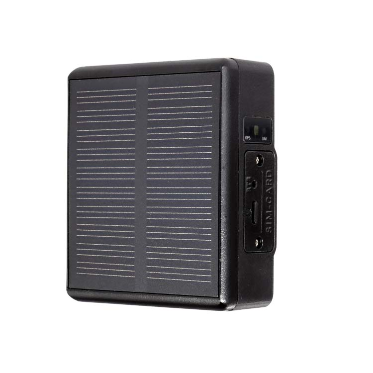

# Reachfar - RF-V24

El RF-V24 es un rastreador GPS solar 4G diseñado para despliegues prolongados en exteriores y un seguimiento confiable compatible con Plaspy. Con una batería interna cargada por panel solar, el RF-V24 reduce los ciclos de mantenimiento y prolonga la autonomía en modo de espera para remolques, contenedores, activos remotos y flotas de vehículos cuando la energía externa continua es limitada. Su combinación de seguimiento en tiempo real, sensores a bordo y funciones de voz de emergencia lo convierten en una opción eficaz para operadores que requieren inteligencia de ubicación persistente y alertas basadas en eventos a través de la plataforma Plaspy.

El RF-V24 incorpora un micrófono integrado, un zumbador audible y un botón SOS dedicado para alertas de voz inmediatas y notificación de emergencias. Múltiples sensores a bordo —incluidos la detección de vibración y de sonido— monitorizan manipulaciones o eventos anómalos y generan alarmas que pueden enviarse a Plaspy para acción inmediata. La documentación para usuarios y un manual de instrucciones descargable son proporcionados por el fabricante para simplificar la instalación, configuración e integración con la plataforma.

## Principales características

- Rastreador GPS 4G alimentado por energía solar para despliegues prolongados con menor mantenimiento y necesidad de reemplazo de baterías.
- Seguimiento en tiempo real sobre redes 4G para la gestión de flotas y visibilidad de activos remotos mediante plataformas compatibles con Plaspy.
- Micrófono integrado, zumbador y botón SOS para alertas de voz inmediatas y llamadas de emergencia.
- Sensores de vibración y sonido que detectan manipulaciones y eventos inusuales para activar alarmas antirrobo y de seguridad.
- Geocercas y reproducción de rutas históricas para informes operativos e investigaciones de incidentes.
- Diseñado para aplicaciones al aire libre en vehículos, remolques, contenedores y activos donde la energía continua es limitada.
- Documentación proporcionada por el fabricante y manual descargable para facilitar la instalación e integración con Plaspy.

## Cómo funciona con Plaspy

Cuando se integra con Plaspy, el RF-V24 transmite datos de ubicación y de eventos a la plataforma para seguimiento en tiempo real, alertas y análisis histórico. La integración compatible con Plaspy permite a los responsables de flotas y operadores ver las posiciones en vivo, configurar alertas de geocerca y recibir notificaciones de eventos \(SOS, manipulación, movimiento o sonido anormal\) en paneles web y móviles. Los datos proporcionados por el RF-V24 enriquecen la telemetría de Plaspy y pueden combinarse con otros inputs de vehículos en una vista unificada de gestión de flota.

- Actualizaciones de ubicación y telemetría en tiempo real entregadas a través de redes 4G para una conciencia situacional continua.
- Llamadas SOS y monitorización de voz a través del micrófono integrado y del botón SOS, que permiten una notificación de emergencia inmediata.
- Detección de manipulación basada en vibración y sonido que activa alarmas y notificaciones en Plaspy.
- Geocercas y reproducción histórica de rutas para cumplimiento, verificación de rutas y revisión de incidentes.
- Se integra con Plaspy junto con otras fuentes de telemetría \(p. ej., monitoreo de combustible, datos de ignición o inmovilizador\) cuando esos inputs están disponibles a través de la plataforma o interfaces adicionales del vehículo.

## Resumen técnico

| Modelo | RF-V24 |
| --- | --- |
| Conectividad | 4G \(LTE\) — informes en tiempo real a través de redes celulares |
| Alimentación y batería | Panel solar integrado para cargar la batería interna, extendiendo el tiempo en espera y reduciendo el mantenimiento |
| Interfaces y E/S | Botón SOS dedicado, micrófono integrado, zumbador audible, sensores de vibración y sonido a bordo |
| GNSS | Posicionamiento basado en GPS para ubicación en tiempo real y seguimiento de rutas históricas |
| Gestión remota | Soporta monitorización remota, geocercas y reproducción histórica a través de plataformas y apps móviles compatibles; la documentación para el usuario y un manual descargable son proporcionados por el fabricante |
| Forma y tamaño | Rastreador resistente para exteriores, diseñado para vehículos, remolques, contenedores y activos remotos |

## Casos de uso

- Gestión de flotas para remolques y camiones que permanecen largos periodos desconectados de la energía: informes continuos de ubicación y reproducción de rutas.
- Seguridad de contenedores y activos con detección de manipulación y alertas de robo enviadas a Plaspy cuando se detecta vibración o sonido anormal.
- Monitoreo remoto de equipos, donde la carga solar mantiene el dispositivo listo y las alertas de voz SOS proporcionan comunicación de emergencia.
- Verificación de rutas y seguimiento de cumplimiento mediante geocercas y reproducción de rutas históricas para auditoría e informes.
- Despliegues temporales o estacionales \(p. ej., equipos de alquiler\) donde la operación solar de bajo mantenimiento reduce la carga de servicio.

## Por qué elegir este rastreador con Plaspy

El RF-V24 es una opción práctica para operadores que requieren un rastreo fiable y de bajo mantenimiento, integrado al ecosistema de monitoreo y gestión de flotas de Plaspy. La carga solar reduce la necesidad de visitas de servicio frecuentes, mientras que el rastreo en tiempo real por 4G mantiene visibles los vehículos y activos. El botón SOS, el micrófono y el zumbador añaden un canal de emergencia por voz, y los sensores de vibración y sonido proporcionan detección activa de manipulación y robo. En conjunto, estas características ofrecen telemetría y alertas accionables que Plaspy puede presentar como alarmas, informes e insights en mapas en vivo.

Al combinar el RF-V24 con Plaspy, las organizaciones obtienen un rastreador GPS robusto que complementa otras telemetrías como el monitoreo de combustible, el estado de encendido e inmovilizador cuando esos datos están disponibles a través de la plataforma o interfaces del vehículo. El resultado es una solución escalable, compatible con Plaspy, para la gestión de flotas, protección anti‑robo y telemetría de activos remotos que prioriza la disponibilidad, alertas accionables e integración sencilla. Consulte la documentación para el usuario del fabricante y el manual descargable para los pasos de instalación, configuración e integración específica de la plataforma.

