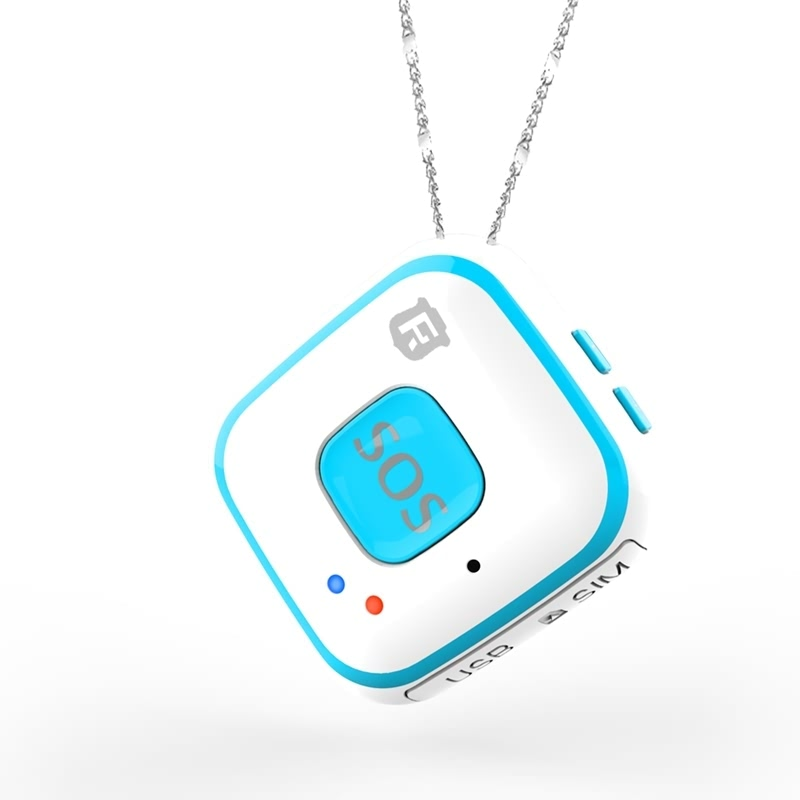

# Reachfar - RF-V28

El colgante SOS RF-V28 de Reachfar es un rastreador personal compacto diseñado para monitoreo continuo de ubicación y respuesta rápida ante emergencias. Diseñado para llevarse como colgante, ofrece posicionamiento por múltiples métodos y un botón SOS para llamadas directas en emergencias, junto con detección automática de caídas y zonas seguras configurables para apoyar la seguridad diaria de personas que requieren vigilancia discreta y fiable.

Como dispositivo compatible con Plaspy, el RF-V28 se integra en los flujos de trabajo de monitoreo de Plaspy sin requerir configuraciones complejas. Los datos y eventos del colgante alimentan la plataforma para que cuidadores y administradores reciban alertas, vean ubicaciones en vivo y rutas históricas, y gestionen el estado del dispositivo desde Plaspy junto con otros activos monitoreados.

## Puntos clave

- Compatible con Plaspy para un seguimiento en tiempo real y entrega de alertas dentro de su plataforma de monitoreo.
- Posicionamiento multimodal que incluye GPS, A-GPS, Wi‑Fi y LBS para reporte de ubicación en exteriores y asistencia en interiores.
- Llamadas de voz bidireccionales y llamadas SOS secuenciales a múltiples números para contactar rápidamente a personas designadas.
- Detección automática de caídas que activa el modo SOS para una respuesta más rápida en situaciones críticas.
- Zonas seguras configurables mediante Wi‑Fi para definir áreas de confianza y recibir alertas inmediatas al entrar o salir.
- Reproducción de rutas históricas para revisión de incidentes y análisis contextual dentro de Plaspy.
- Diseño tipo colgante pensado para mayor discreción, comodidad y uso diario sencillo.

## Cómo funciona con Plaspy

Al registrarse en Plaspy, el RF-V28 envía puntos de ubicación y notificaciones de eventos para que la plataforma muestre mapas, alertas e informes históricos. Plaspy centraliza la telemetría y los eventos de alarma del colgante, ayudando a los equipos a mantener conciencia situacional y responder a incidentes de forma eficiente.

- Seguimiento de ubicación en vivo en los mapas de Plaspy usando las posiciones reportadas por GPS, A-GPS, Wi‑Fi y LBS.
- Alertas de SOS y detección de caídas entregadas a Plaspy para notificaciones inmediatas y flujos de escalamiento.
- Gestión de eventos de geocercas y cercas Wi‑Fi para que Plaspy notifique a las partes interesadas al entrar o salir de zonas definidas.
- Reproducción de rutas históricas y archivo de historial de ubicaciones para revisión posterior y reporte.
- Visibilidad combinada con otros dispositivos compatibles con Plaspy para apoyar una supervisión operativa más amplia.

## Casos de uso típicos

- Monitoreo de personas mayores donde la detección de caídas y la llamada SOS con un solo toque son críticas para la respuesta de cuidadores.
- Seguridad infantil y supervisión parental con rastreo discreto y alertas de zonas seguras.
- Protección de trabajadores que laboran en solitario, ofreciendo un botón de emergencia accesible y compartición de ubicación en vivo.
- Seguridad personal y escenarios anti‑robo que requieren reporte de ubicación rápido y procedimientos de escalamiento.
- Despliegues mixtos que combinan rastreadores personales con telemetría de flotas o instalaciones para proporcionar monitoreo unificado.

## Por qué elegir este rastreador con Plaspy

El RF-V28 está enfocado en características de seguridad personal dentro de un paquete portátil y discreto, lo que lo hace adecuado para personas mayores, niños y trabajadores en solitario que necesitan capacidades de emergencia confiables y visibilidad clara de su ubicación. Su posicionamiento multimodal y las llamadas SOS secuenciales ofrecen a los cuidadores herramientas prácticas para la supervisión y la respuesta rápida, y Plaspy integra esas señales en una plataforma centralizada para notificaciones, mapeo y revisión histórica.

Para obtener más información sobre Plaspy y cómo dispositivos compatibles como el Reachfar RF V28 pueden gestionarse en la plataforma, visite https://www.plaspy.com. Las especificaciones del producto y la disponibilidad pueden cambiar con el tiempo, por lo que le recomendamos verificar los detalles actuales en el sitio del fabricante https://www.reachfargps.com/.
