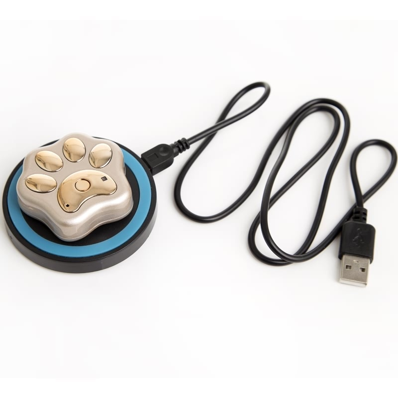

# Reachfar - RF-V32

El RF-V32 es un rastreador GPS compacto y resistente pensado para mascotas y ganado. Combina posicionamiento por GPS con LBS, A-GPS y fallback por WiFi para ofrecer visibilidad de la ubicación tanto en exteriores como en entornos con señal limitada. Diseñado para soportar uso en campo, el RF-V32 cuenta con protección IP67, antenas GSM y GPS integradas, conectividad GSM cuatribanda y modos de reporte múltiples, lo que lo hace apropiado para montaje en collares y tareas habituales de seguimiento animal.

Como dispositivo compatible con Plaspy, el RF-V32 suministra los datos de ubicación y alarmas que Plaspy necesita para monitoreo en vivo y revisión histórica. Su capacidad para reportar ubicación mediante GPRS y SMS y generar alertas por geocerca, batería baja y cambio de SIM permite que usted reciba notificaciones oportunas, vea posiciones en tiempo real y reproduzca el historial de movimiento para recuperación de mascotas o gestión de ganado.

## Características principales

- Compatible con Plaspy mediante reportes por GPRS e integración por SMS para ubicación y alertas
- Posicionamiento multimodal con GPS combinado con LBS, A-GPS y fallback por WiFi para entornos mixtos
- Carcasa robusta con clasificación IP67, adecuada para uso en exteriores con mascotas y ganado
- Larga autonomía en espera para reducir intervalos de mantenimiento de las unidades desplegadas
- Diseño compacto y ligero, fácil de fijar a collares y lo suficientemente liviano para animales
- Reporte de alarmas integrado para violaciones de geocerca, batería baja y cambio de SIM
- Reproducción histórica de rutas disponible en Plaspy para análisis y revisión posterior a eventos

## Cómo funciona con Plaspy

La integración es directa: el RF-V32 transmite mensajes de ubicación y estado que Plaspy procesa para mostrar posiciones en vivo y gestionar alertas. Plaspy ofrece un panel unificado donde propietarios y administradores pueden monitorear animales, configurar geocercas y acceder a los datos históricos de movimiento recopilados por el dispositivo.

- Visualización de la ubicación en vivo en Plaspy con los datos enviados por el RF-V32 para seguimiento casi en tiempo real
- Alarmas como violación de geocerca, batería baja y cambio de SIM encaminadas a Plaspy para notificaciones
- Reproducción histórica de rutas cargada por el dispositivo y visible en Plaspy para revisión de recorridos
- Fiabilidad del posicionamiento mejorada por A-GPS y fallback por WiFi para cobertura en interiores o en zonas de señal débil
- Enfoque del dispositivo en seguimiento animal lo hace ideal para despliegues de Plaspy centrados en mascotas y ganado

## Casos de uso típicos

- Recuperación y monitoreo de mascotas como perros y otros animales de compañía mediante montaje en collar
- Seguimiento de ganado para observar patrones de pastoreo, localizar ejemplares extraviados y gestionar el movimiento del rebaño
- Protección de propiedades rurales y perímetros usando geocercas y notificaciones de alarma
- Análisis de movimientos y comportamiento después de eventos mediante la reproducción de trazas en Plaspy
- Gestión animal a pequeña escala donde se prioriza hardware compacto, robusto y con larga autonomía

## ¿Por qué elegir este rastreador con Plaspy?

El RF-V32 es una opción práctica para organizaciones y particulares que requieren un rastreador compacto y resistente que funcione con Plaspy para obtener visibilidad confiable de la ubicación y reportes básicos de alarmas. Su combinación de posicionamiento asistido por GPS con LBS y fallback por WiFi, junto con protección IP67 y reportes integrados, responde bien a las necesidades habituales de seguimiento animal donde son importantes las actualizaciones constantes y el bajo mantenimiento.

Si sus necesidades principales son rastreo en tiempo real, gestión de geocercas y reproducción histórica para mascotas o ganado, el RF-V32 y Plaspy ofrecen una solución enfocada. Para despliegues que requieran telemetría específica de vehículos, integraciones avanzadas de sensores o ecosistemas de sensores Bluetooth, podría considerar otros modelos compatibles con Plaspy que incluyan esas funcionalidades. Para más información sobre Plaspy visite https://www.plaspy.com. Nota editorial de precisión Las especificaciones del producto RF V32, disponibilidad y detalles del fabricante pueden cambiar con el tiempo por lo que verifique las especificaciones actuales y la información de stock en el sitio oficial de Reachfar https://www.reachfargps.com/
