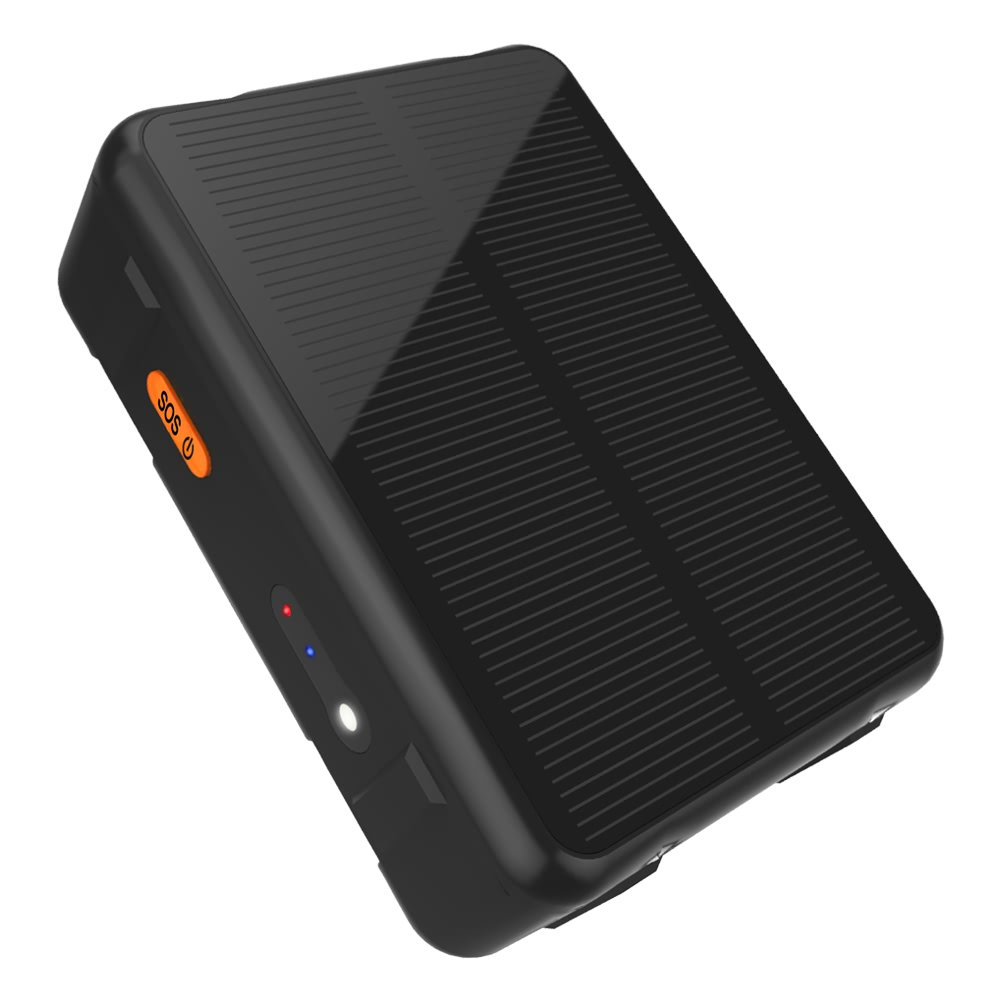

# Reachfar - RF-V34

El RF-V34 es un rastreador GPS resistente y alimentado por energía solar, diseñado para el seguimiento prolongado en exteriores de ganado como bovinos y ovinos. Pensado para el monitoreo remoto de pasturas, combina una batería interna de alta capacidad con carga solar y una carcasa con clasificación IP67 para reducir las visitas de mantenimiento y ofrecer funcionamiento fiable en condiciones de campo exigentes. La unidad puede montarse en el collar y cuenta con conexión magnética USB para facilitar el servicio sin herramientas complejas.

Como dispositivo compatible con Plaspy desde el primer momento, el RF-V34 aporta ubicación y telemetría esencial al sistema Plaspy, facilitando la gestión del ganado y la vigilancia anti robo. Su posicionamiento multimodal y la transmisión de datos por celular lo hacen apropiado para despliegues de varios días donde el acceso a la red eléctrica es limitado, permitiendo a los usuarios de Plaspy supervisar animales y activos remotos desde una única interfaz de gestión de flotas.

## Características principales

- Batería interna de 9000 mAh con apoyo solar para mayor tiempo en espera y operación de varias semanas en pasturas remotas.
- Dispositivo compatible con Plaspy que transmite ubicación y telemetría para mapeo, alertas e informes.
- Posicionamiento multimodal mediante GPS, WiFi y LBS para mantener cobertura de ubicación en distintos entornos.
- Carcasa robusta con grado de protección IP67 y amplio rango de temperatura de operación para un rastreo ganadero fiable en exteriores.
- Montaje en collar con soporte incluido y carga magnética por USB para un mantenimiento de campo sencillo.
- Diseño compacto y liviano para mantener la comodidad durante el uso prolongado por parte de los animales.
- Estado de batería y carga solar reportados para que el personal pueda planificar visitas de mantenimiento de manera efectiva.

## Cómo funciona con Plaspy

El RF-V34 envía ubicación y telemetría del dispositivo mediante datos celulares a la plataforma Plaspy, donde esa información se procesa en mapas en vivo, alertas de eventos y registros históricos de posiciones. Una vez activo en la red y vinculado a una cuenta Plaspy, el dispositivo ofrece visibilidad persistente de los activos y habilita notificaciones configurables e informes para la supervisión operativa.

- Actualizaciones de ubicación en tiempo real y telemetría del dispositivo entregadas a Plaspy para seguimiento en vivo.
- Alertas de geocerca y movimiento visibles en los paneles de Plaspy para apoyar flujos de trabajo anti robo.
- Registros históricos de posiciones y reproducción para análisis de patrones de pastoreo y revisiones operativas.
- Estado de batería y de carga solar reportado a Plaspy para ayudar a programar mantenimiento y reemplazos.
- Despliegue sencillo montado en collar para una implementación rápida en hatos y activos remotos.

## Casos de uso típicos

- Localización de ganado y vigilancia anti robo en grandes propiedades con infraestructura limitada.
- Gestión de pastoreo y uso de la tierra para observar movimientos del rebaño y optimizar recursos a lo largo del tiempo.
- Protección de activos remotos como remolques, equipos e instalaciones temporales en zonas rurales.
- Recolección de telemetría a largo plazo para planificación estacional e informes operativos.
- Despliegues distribuidos donde la baja necesidad de mantenimiento y la larga autonomía de la batería son requisitos clave.

## Por qué elegir este rastreador con Plaspy

El RF-V34 está pensado para despliegues agrícolas y remotos donde la durabilidad, la larga duración y el bajo mantenimiento son prioridades. Su sistema de alimentación asistido por solar y la robustez IP67 reducen la frecuencia de visitas al sitio, mientras que la integración con Plaspy convierte datos de ubicación y telemetría en información accionable para la gestión del rebaño y la seguridad.

Para organizaciones que usan Plaspy, el RF-V34 es una opción práctica cuando la necesidad principal es rastreo fiable en exteriores y autonomía extendida más que telemetría específica de vehículos. Para más información sobre Plaspy visite https://www.plaspy.com. Las especificaciones del producto, disponibilidad y detalles del fabricante pueden cambiar con el tiempo; por favor verifique las especificaciones actuales y la documentación con el fabricante en https://www.reachfargps.com/ antes de la compra.
