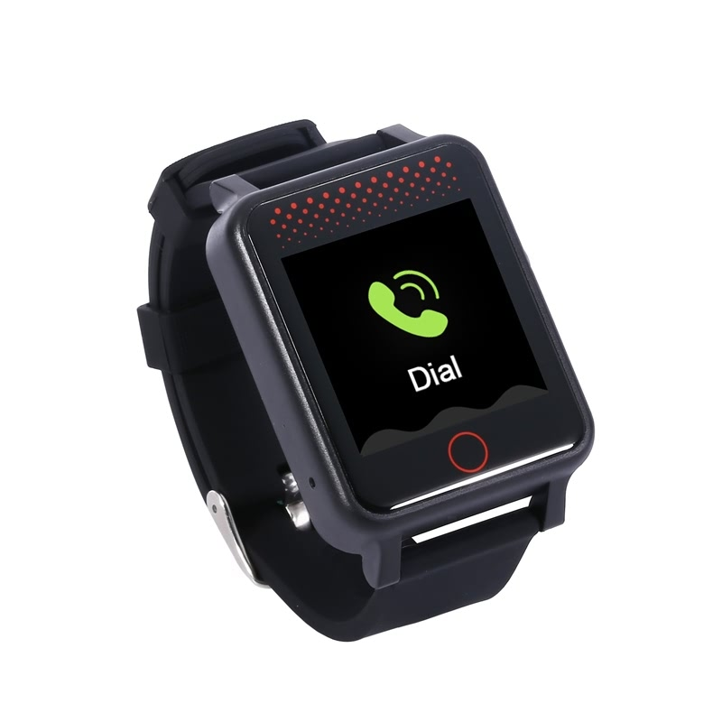

# Reachfar - RF-V36

El RF-V36 es un rastreador GPS portátil en formato de reloj de pulsera diseñado para el cuidado de personas mayores. Combina posicionamiento por GPS en exteriores con posicionamiento interior por Wi‑Fi y LBS asistido, un sensor de movimiento (G‑sensor), monitoreo de ritmo cardíaco y presión arterial, señalización de emergencias SOS, audio bidireccional y recordatorios configurables. El reloj está pensado para monitoreo personal continuo y cuenta con resistencia al agua y al polvo IP67 para el uso diario.

Como dispositivo compatible con Plaspy, el RF-V36 envía ubicación, telemetría de salud y alertas de eventos a la plataforma de Plaspy para que cuidadores y equipos de monitoreo puedan ver el estado en tiempo real, recibir notificaciones y mantener registros históricos. Esta compatibilidad hace del RF-V36 una opción práctica para flujos de trabajo familiares donde la información de ubicación accionable y los datos de salud personal se integran en un solo wearable.

## Aspectos destacados

- Diseño wearable pensado para el cuidado de adultos mayores con GPS integrado y opciones de posicionamiento interior.
- Posicionamiento multimodal con GPS para exteriores, Wi‑Fi para interiores, LBS asistido y lecturas corregidas por movimiento desde el sensor G.
- Telemetría de salud incorporada para ritmo cardíaco y presión arterial, visible para los responsables a través de plataformas emparejadas.
- Funciones de emergencia, incluido un botón SOS y audio bidireccional para contacto inmediato con el cuidador.
- Recordatorios de cuidado y actividad como medicación, alertas por sedentarismo y control de pasos para apoyar rutinas diarias.
- Clasificación IP67 para protección contra polvo y agua durante el uso cotidiano.
- Métodos flexibles de control y notificación, incluyendo acceso web y móvil, soporte para cuentas públicas de WeChat y controles por SMS.

## Cómo funciona con Plaspy

Al conectarse a Plaspy, el RF-V36 entrega de forma continua ubicación y telemetría personal a un panel centralizado para que usted y su equipo de cuidado puedan supervisar el estado, recibir alertas y generar informes. Plaspy recopila las actualizaciones del dispositivo y las pone a disposición en interfaces web y móviles, facilitando notificaciones configurables y revisión histórica.

- Actualizaciones de ubicación en tiempo real para contextos exteriores e interiores, con lecturas de posición corregidas por movimiento.
- Reporte de telemetría de salud para ritmo cardíaco y presión arterial que permite el monitoreo remoto y el análisis de tendencias.
- Alertas SOS y voz bidireccional gestionadas a través de los flujos de trabajo de Plaspy para asegurar la notificación oportuna a los guardianes.
- Geocercas dobles configurables que incluyen límites geográficos exteriores y cercas interiores basadas en Wi‑Fi para alertas inteligentes.
- Visibilidad centralizada en aplicaciones web y móviles para administrar dispositivos, alertas y datos históricos de ubicación y telemetría.

## Casos de uso habituales

- Seguridad de personas mayores y monitoreo remoto de salud cuando los cuidadores requieren ubicación y seguimiento de signos vitales.
- Gestión del cuidado diario con recordatorios de medicación y alertas por inactividad para apoyar rutinas y reducir tareas de cuidado no atendidas.
- Aseguramiento de localización en interiores y exteriores en hogares, residencias asistidas y salidas comunitarias.
- Localización de wearables extraviados y detección de retiro inesperado o movimientos inusuales.
- Tranquilidad familiar mediante contacto de voz inmediato y notificaciones SOS rápidas.

## Por qué elegir este rastreador con Plaspy

El RF-V36 está enfocado en la seguridad personal y la telemetría de salud más que en el monitoreo de vehículos o activos pesados. Para organizaciones y familias que usan Plaspy, este reloj ofrece una forma compacta de combinar conciencia de ubicación con monitoreo básico de signos vitales y alertas inmediatas. La plataforma de Plaspy puede centralizar los datos del RF-V36 junto con otros dispositivos compatibles, permitiendo que los cuidadores vean ubicación y telemetría en un mismo lugar y configuren las reglas de notificación que mejor se adapten a sus flujos de trabajo.

Dado que el RF-V36 se centra en escenarios de atención individual, es una buena opción para guardianes, pequeños equipos de cuidado y servicios de monitoreo que necesitan seguimiento wearable sencillo y respuesta ante emergencias. Para despliegues que requieran otros tipos de telemetría o funciones orientadas a vehículos, Plaspy soporta otros rastreadores compatibles que amplían las capacidades más allá del cuidado personal que ofrece el RF-V36.

Para más información sobre Plaspy y cómo se gestionan los dispositivos compatibles en la plataforma visite https://www.plaspy.com. Tenga en cuenta que las especificaciones del producto, la disponibilidad y los datos del fabricante pueden cambiar con el tiempo y deben verificarse en el sitio del fabricante https://www.reachfargps.com/ para obtener la información más actual.
