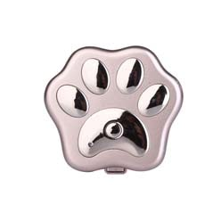

# Reachfar - RF-V40

El Reachfar RF-V40 es un rastreador GPS 3G compacto pensado principalmente para propietarios de mascotas que requieren supervisión de ubicación confiable en tiempo real. Combina posicionamiento GPS con AGPS, LBS y asistencia por WiFi para mejorar la precisión tanto en exteriores como dentro de edificios. Con una carcasa con clasificación IP66, formato reducido y varios modos de localización, el RF-V40 está diseñado para monitoreo móvil continuo y recuperación rápida cuando una mascota se pierde.

Como dispositivo compatible con Plaspy, el RF-V40 se integra en los paneles y las interfaces móviles de Plaspy para centralizar telemetría, alertas e historial junto con otros dispositivos gestionados. Las actualizaciones de ubicación en vivo, la reproducción de trazas y las alertas de geocerca se muestran en Plaspy para una visualización y notificación sencillas, mientras que las alertas de batería baja y cambio de SIM ayudan a los propietarios a mantener el control sin cambiar de sistema.

## Características principales

- Rastreador GPS para mascotas compatible con Plaspy para seguimiento en tiempo real e historial de ubicaciones
- Posicionamiento híbrido que combina GPS con AGPS, LBS y asistencia por WiFi para mejorar las ubicaciones en interiores
- Carcasa resistente al agua IP66 para uso exterior en distintas condiciones climáticas
- Batería integrada de 700 mAh que ofrece rendimiento en espera prolongado bajo intervalos de reporte típicos
- Múltiples interfaces de reporte y consulta, incluyendo verificaciones bajo demanda vía SMS y desde la plataforma móvil o web
- Diseño compacto y liviano, adecuado para collares y mascotas pequeñas
- Alertas por cambio de SIM y batería baja para apoyar la respuesta ante robos o extravíos

## Cómo funciona con Plaspy

Cuando se usa con Plaspy, el RF-V40 forma parte de un entorno de rastreo unificado: el dispositivo reporta posición y estado a través de datos celulares y Plaspy presenta esa información en mapas y líneas de tiempo para una supervisión clara. Usted puede definir reglas y notificaciones, reproducir rutas históricas y consultar un dispositivo bajo demanda desde la interfaz de Plaspy.

- Actualizaciones de ubicación en tiempo real y estado del dispositivo, incluyendo información de batería y conectividad
- Reproducción de trazas y reportes históricos de ubicaciones visibles en los paneles de Plaspy
- Alertas de geocerca y notificaciones de batería baja entregadas a través de los canales de notificación de Plaspy
- Avisos por cambio de SIM para detectar manipulación y apoyar flujos de trabajo anti robo
- Consultas de ubicación bajo demanda desde SMS o los controles de Plaspy para comprobaciones inmediatas

## Casos de uso típicos

- Seguridad de mascotas y monitoreo anti robo con alertas instantáneas e historial de ubicaciones
- Seguimiento de paseos, ejercicio y viajes con reproducción de rutas para mayor tranquilidad
- Mejora del posicionamiento en interiores y zonas urbanas donde la asistencia por WiFi y AGPS reduce puntos ciegos
- Supervisión remota durante estancias en pensión, cuidado o niñeras gracias a reportes de batería y ubicación
- Seguimiento ligero de pequeños activos o jaulas transportadoras que se benefician del tamaño compacto y la resistencia al clima

## Por qué elegir este rastreador con Plaspy

El Reachfar RF-V40 es una solución centrada en propietarios de mascotas que desean reportes de posición confiables en un equipo pequeño y resistente. Su enfoque de posicionamiento híbrido y la carcasa resistente al clima lo convierten en una opción práctica para el uso diario en exteriores y para situaciones donde la ubicación interior puede ser un reto. Integrar el RF-V40 con Plaspy mantiene el historial de ubicaciones, las alertas y el estado del dispositivo en una sola plataforma junto con otros dispositivos compatibles, simplificando la supervisión y la respuesta.

Para obtener más información sobre el uso de Plaspy con rastreadores compatibles visite https://www.plaspy.com. Las especificaciones del producto y la disponibilidad pueden cambiar con el tiempo, por lo que le recomendamos verificar los detalles y la documentación actuales con el fabricante en https://www.reachfargps.com/.
