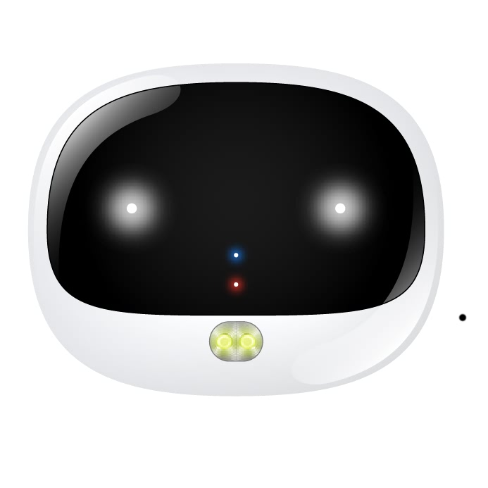

# Reachfar - RF-V43

El Reachfar RF-V43 es un rastreador GPS compacto diseñado principalmente para la seguridad y el monitoreo de mascotas. Utiliza conectividad 4G junto con tres métodos de localización —GPS, LBS y WiFi— para ofrecer actualizaciones de posición continuas y opciones de respaldo cuando el GPS por sí solo puede verse limitado. El dispositivo incorpora funciones útiles para el día a día con mascotas, como geocercas configurables por GPS y WiFi, una luz LED controlable de forma remota para mejorar la visibilidad, reporte de actividad o deporte, función de llamada para comunicación bidireccional cuando sea necesario, protección IP67 contra el agua y el polvo, y carga rápida con alerta de batería baja para ayudar a mantener el tiempo de actividad.

Como dispositivo compatible con Plaspy, el RF-V43 puede integrarse en el entorno de seguimiento de Plaspy para ofrecer visibilidad y alertas junto con otros equipos. Al emparejarlo con Plaspy, las ubicaciones del RF-V43, los eventos de geocerca, los resúmenes de actividad y las advertencias de batería quedan accesibles dentro de una plataforma de monitoreo unificada. Esto hace del RF-V43 una opción práctica para dueños de mascotas y pequeñas operaciones que desean ver el historial de ubicaciones, recibir alertas de límites y agregar rastreadores de mascotas a paneles operativos gestionados en Plaspy.

## Características principales

- Seguimiento en tiempo real por 4G con modos de ubicación GPS, LBS y WiFi para cobertura por capas
- Alertas configurables de geocerca GPS y geocerca WiFi para notificar cuando una mascota abandone un área designada
- Clasificación IP67 para uso fiable en exteriores con humedad o polvo
- Luz LED integrada para mejorar la visibilidad en condiciones de poca luz y función de llamada para comunicación directa
- Datos de actividad o deporte para monitorear el movimiento y los niveles de ejercicio de la mascota
- Carga rápida y alarma de batería baja para reducir el tiempo fuera de servicio y mantener el rastreo continuo

## Cómo funciona con Plaspy

El RF-V43 envía actualizaciones de ubicación y estado del dispositivo que Plaspy puede mostrar en mapas, líneas de tiempo y listas de dispositivos. Plaspy puede presentar la posición del rastreador, los eventos de geocerca y las notificaciones de estado para que usted pueda monitorear mascotas junto con otros activos rastreados. Cuando el rastreador expone funciones remotas, esos controles pueden representarse en Plaspy según la integración configurada.

- Ubicación en vivo y última posición conocida visibles en los mapas de Plaspy para un monitoreo sencillo
- Alertas de geocerca y geocerca WiFi enviadas a Plaspy para notificaciones inmediatas
- Resúmenes de actividad e historial de movimiento disponibles en informes y líneas de tiempo de Plaspy
- Alertas de batería y estado del dispositivo encaminadas a Plaspy para gestionar el tiempo de actividad
- Agrupación y etiquetado en Plaspy para organizar múltiples rastreadores de mascotas o dispositivos en una sola vista

## Casos de uso habituales

- Seguimiento personal de mascotas para seguir paseos, salidas y la ubicación de animales en casa
- Monitoreo de niveles de actividad para vigilar la salud y el ejercicio de la mascota
- Alertas de geocerca para jardines, parques para perros o áreas temporales de contención
- Mantener los rastreadores visibles durante actividades al aire libre o mal tiempo, aprovechando la resistencia del dispositivo
- Gestionar múltiples dispositivos para mascotas desde un único tablero para pequeños criaderos o cuidadores

## Por qué elegir este rastreador con Plaspy

El RF-V43 combina métodos de localización multimoedo y funciones orientadas a mascotas que encajan bien con las fortalezas de Plaspy en visibilidad y alertas. Sus opciones de geocerca y los informes de actividad proporcionan señales prácticas que Plaspy puede usar para notificaciones y revisiones históricas, mientras que la durabilidad del equipo y su carga rápida ayudan a mantener reportes consistentes. Para dueños de mascotas y pequeñas operaciones que buscan centralizar datos de rastreo, emparejar el RF-V43 con Plaspy ofrece una forma directa de mantener dispositivos y ubicaciones bajo observación junto con otros activos.

Si desea saber más sobre Plaspy y cómo dispositivos compatibles como el Reachfar RF-V43 pueden utilizarse dentro de nuestra plataforma, visite https://www.plaspy.com. Las especificaciones, características y disponibilidad del producto pueden cambiar con el tiempo, por lo que le recomendamos verificar los detalles técnicos actuales y la información más reciente del fabricante en el sitio de Reachfar https://www.reachfargps.com/ antes de comprar o desplegar.
