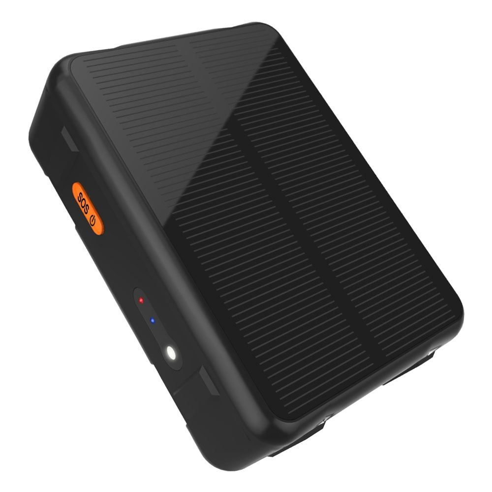

# Reachfar - RF-V44

El RF-V44 es un rastreador 4G resistente, con carga solar, diseñado para despliegues prolongados en campo, como el monitoreo de ganado bovino y ovino. Combina una batería interna de alta capacidad con un circuito integrado de carga solar y protección de batería para reducir la frecuencia de mantenimiento. Diseñado para soportar condiciones exteriores, el RF-V44 cuenta con protección IP66, un amplio rango de temperatura de operación y una carcasa compacta adecuada para montaje en collar, así como instalaciones magnéticas o con tornillos.

Como dispositivo compatible con Plaspy, el RF-V44 puede añadirse a una flota o cuenta de activos en Plaspy para consolidar ubicación en vivo, telemetría y alertas en una sola plataforma. La integración con Plaspy aporta visibilidad en tiempo real, geocercas, reproducción histórica de rutas e informes de alarma en sus paneles, de modo que las fincas y flotas pequeñas puedan gestionar el pastoreo, la prevención de robo y los activos remotos con mayor control operativo.

## Aspectos destacados

- Batería interna de 9000 mAh con carga solar para mayor autonomía y menos visitas de mantenimiento.
- Compatible con Plaspy para seguimiento centralizado en tiempo real, geocercas y paneles de telemetría.
- Conectividad celular multinetwork que incluye 4G Cat1, 3G WCDMA y 2G EDGE para amplia cobertura y subida de datos confiable.
- Carcasa robusta con clasificación IP66 y amplio rango de temperatura, apta para montaje en collar y uso exterior.
- Posicionamiento GNSS con respaldo por LBS y Wi-Fi para mantener visibilidad de ubicación donde el GPS es débil.
- Operación optimizada de bajo consumo para soportar despliegues a largo plazo con recarga solar.
- Funciones de gestión animal como detección de remoción, alertas por zumbador y monitoreo de audio remoto.

## Cómo funciona con Plaspy

Cuando se conecta a Plaspy, el RF-V44 transmite fijaciones de ubicación, telemetría de batería y carga, y eventos de alarma a la plataforma para que usted pueda monitorear activos y animales desde un panel web o móvil. Plaspy procesa la mejor posición disponible usando GPS y fuentes de respaldo, presenta rutas históricas y envía alertas configurables para simplificar la respuesta operativa.

- Las ubicaciones y actualizaciones de telemetría en tiempo real aparecen en los mapas y widgets del panel de Plaspy.
- Geocercas con alertas instantáneas y reproducción histórica de rutas para análisis de pastoreo y monitoreo perimetral.
- Alarmas de batería, carga solar y desconexión dirigidas a Plaspy para programar mantenimientos proactivos.
- Alertas por despegue, remoción y sensor infrarrojo integradas en los flujos de trabajo de alarma de Plaspy para prevención de robo y control de bienestar.
- La activación remota del zumbador y el monitoreo de audio pueden coordinarse a través de Plaspy cuando la implementación lo soporte.

## Casos de uso típicos

- Seguimiento de ganado y gestión de pastoreo para monitorear el movimiento del hato y el historial de rutas durante períodos extendidos.
- Monitoreo anti robo para collares y activos remotos mediante detección de remoción y alertas por geocerca.
- Rastreo de activos exteriores a largo plazo donde la recarga solar y el bajo consumo reducen las visitas al sitio.
- Monitoreo remoto de bienestar y comportamiento utilizando funciones de audio y zumbador para verificar el estado animal.
- Supervisión mixta de flota y equipos rurales centralizando la telemetría de los rastreadores junto con otros datos de activos en Plaspy.

## Por qué elegir este rastreador con Plaspy

El RF-V44 es ideal para operaciones que requieren rastreo duradero y de bajo mantenimiento en zonas abiertas y activos remotos. Su capacidad de carga solar y su batería de gran tamaño disminuyen la frecuencia de servicio, mientras que la carcasa compacta y resistente al clima facilita los montajes en collar y externos. Estas ventajas prácticas lo convierten en una opción natural para fincas, ranchos y el monitoreo de equipos remotos.

En conjunto con Plaspy, el RF-V44 forma parte de una solución unificada de rastreo y telemetría que simplifica la supervisión en tiempo real, la gestión de alarmas y el análisis histórico de animales y activos. Si necesita visibilidad consolidada y controles operativos en una sola plataforma, el RF-V44 con Plaspy ofrece una opción equilibrada para despliegues prolongados en exteriores. Conozca más sobre Plaspy en el sitio principal https://www.plaspy.com y verifique las especificaciones de producto y disponibilidad en el sitio del fabricante https://www.reachfargps.com/ ya que los detalles y el firmware pueden cambiar con el tiempo.
