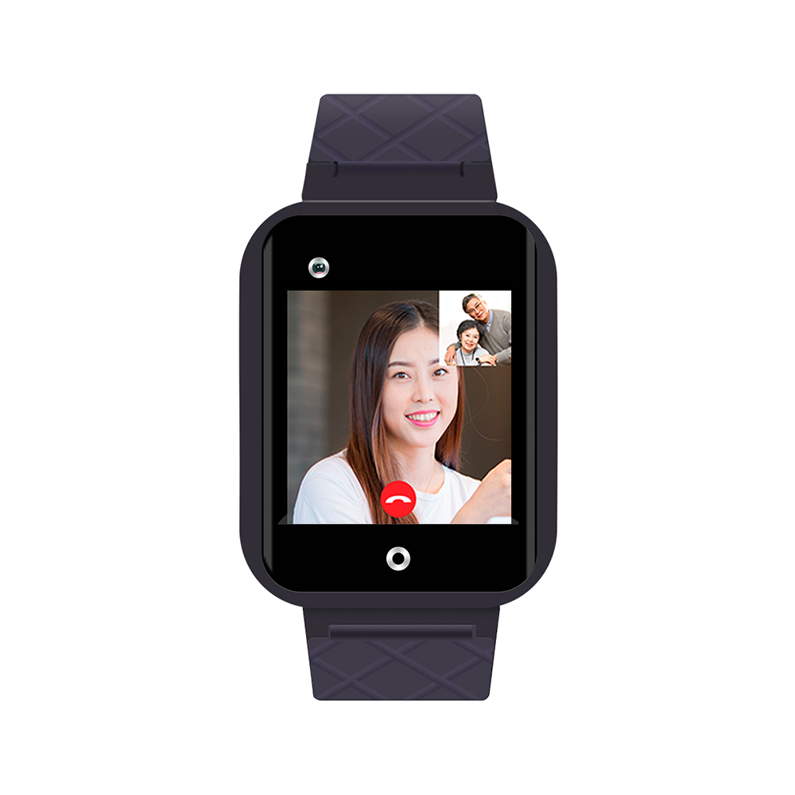

# Reachfar - RF-V46

El RF-V46 es un reloj inteligente con conectividad 4G, posicionamiento GPS y videollamadas, diseñado para cuidadores, familias y organizaciones que necesitan un seguimiento personal fiable y compatible con Plaspy, así como monitoreo remoto. Combinando conectividad móvil 4G con posicionamiento GPS y sensores biométricos básicos, el RF-V46 ofrece seguimiento en tiempo real y comunicación bidireccional para que los cuidadores puedan verificar la ubicación, llamar al usuario y ver telemetría de salud básica mediante integraciones como Plaspy.

Construido como un reloj de pulsera impermeable con funciones de voz y teléfono y capacidad opcional de videollamada, el RF-V46 se centra en casos de uso de cuidado de personas mayores y seguridad infantil. Al vincularse con Plaspy, el dispositivo amplía su valor para seguimiento en tiempo real, alertas y monitoreo remoto, proporcionando telemetría esencial como ritmo cardíaco y presión arterial junto con los datos de ubicación para una comprensión situacional inmediata.

## Aspectos destacados

- Dispositivo ponible compatible con Plaspy que ofrece seguimiento en tiempo real a través de 4G y GPS para la seguridad personal y la monitorización por cuidadores.
- Funciones de voz y teléfono bidireccionales para una comunicación directa entre cuidador y usuario; capacidad de videollamada opcional según disponibilidad.
- Sensores de ritmo cardíaco y presión arterial a bordo para telemetría biométrica básica que complementa los datos de ubicación y mejora el contexto situacional.
- Diseño de reloj de pulsera impermeable pensado para uso diario, fácil de colocar para personas mayores y niños que requieren monitoreo continuo.
- El soporte de red 4G garantiza transmisiones de datos y voz fiables, con actualizaciones de posición más rápidas que los dispositivos legados que solo usan 2G.
- Recursos de usuario simples incluidos: video del producto, galería y instrucciones de usuario descargables para acelerar la implementación y la formación del usuario.

## Cómo funciona con Plaspy

El RF-V46 transmite datos esenciales por 4G e informa de la posición GPS y métricas biométricas a Plaspy para una monitorización unificada, alertas e informes. Plaspy actúa como la capa de plataforma: recibe pings de ubicación y telemetría, muestra la posición en tiempo real en mapas y puede generar notificaciones o escalar eventos a los cuidadores cuando se crucen umbrales predefinidos.

- Actualizaciones de ubicación y telemetría en tiempo real: la posición GPS se envía por 4G para un seguimiento continuo en los paneles de Plaspy.
- Voz bidireccional \(teléfono\) y videollamada opcional: permite una comunicación inmediata entre el cuidador y el usuario; la disponibilidad de video se indica como opcional y depende de la configuración del dispositivo y de las condiciones de la red.
- Telemetría de ritmo cardíaco y presión arterial: los datos biométricos básicos se transmiten para que Plaspy pueda mostrar parámetros de salud junto con la ubicación.
- El diseño de reloj de pulsera impermeable admite el uso diario, permitiendo un monitoreo persistente sin necesidad de quitarse el reloj con frecuencia.
- Alertas para cuidadores y registro de eventos: Plaspy puede registrar el historial de ubicaciones y eventos biométricos para auditoría, revisión y coordinación del cuidado.

## Resumen técnico

| Conectividad | Conectividad celular 4G para voz y datos \(se confirmó soporte de red 4G\) |
| --- | --- |
| Banda\(s\) | No especificado en la descripción del producto |
| Alimentación y batería | No especificado en la descripción del producto |
| Interfaces | Funciones de voz/teléfono; función de videollamada opcional; sensores de ritmo cardíaco y de presión arterial a bordo |
| GNSS | Posicionamiento GPS para ubicación en tiempo real \(precisión no especificada\) |
| Bluetooth | No especificado en la descripción del producto |
| Gestión remota | Instrucciones de usuario y video del producto proporcionados; gestión remota/FOTA no especificada |
| Factor de forma | Reloj de pulsera; carcasa impermeable adecuada para uso diario |

## Casos de uso

- Monitoreo de cuidado de personas mayores: rastrear la ubicación de una persona mayor en tiempo real y recibir telemetría básica de ritmo cardíaco y presión arterial para revisiones diarias y respuesta a incidentes.
- Seguridad infantil y monitoreo de niños que quedan solos: proporciona a padres y cuidadores seguimiento GPS en directo y contacto de voz directo para una rápida tranquilidad y coordinación.
- Seguridad personal para usuarios independientes: viajeros que van solos, trabajadores que viajan solos y personas con preocupaciones médicas pueden usar el reloj para comunicación inmediata y compartir ubicación.
- Coordinación del cuidado en residencias asistidas: el personal puede monitorizar ubicaciones de los residentes y signos vitales básicos en entornos compartidos, manteniendo al mismo tiempo un formato de reloj de muñeca discreto.
- Cuidados posteriores y monitoreo tras el alta: lecturas biométricas simples junto con la ubicación mejoran el seguimiento remoto y reducen las comprobaciones en persona innecesarias.

## Por qué elegir este rastreador con Plaspy

Cuando se integra con Plaspy, el RF-V46 se convierte en algo más que un rastreador GPS independiente: es una solución de monitoreo personal compatible con Plaspy que combina ubicación, comunicación por voz y telemetría básica en un único dispositivo ponible. La conectividad 4G y el posicionamiento GPS permiten a los cuidadores confiar en flujos de ubicación actualizados, mientras que los sensores de ritmo cardíaco y presión arterial proporcionan telemetría suplementaria para informar decisiones. El diseño de reloj de pulsera impermeable admite un uso continuo, lo que mejora la continuidad de los datos y la capacidad de respuesta en escenarios reales de cuidado.

Para organizaciones o familias que necesitan un rastreador personal fiable que se conecte con Plaspy para paneles, alertas e informes, el RF-V46 ofrece un conjunto de funciones centrado en la seguridad, la comunicación y el monitoreo básico de la salud. Su simplicidad, combinada con la capacidad de Plaspy para mostrar el seguimiento en tiempo real, rutas históricas y telemetría, lo convierten en una opción práctica para el cuidado de mayores, la seguridad de los niños y la protección personal cuando la conciencia situacional inmediata es crucial.

