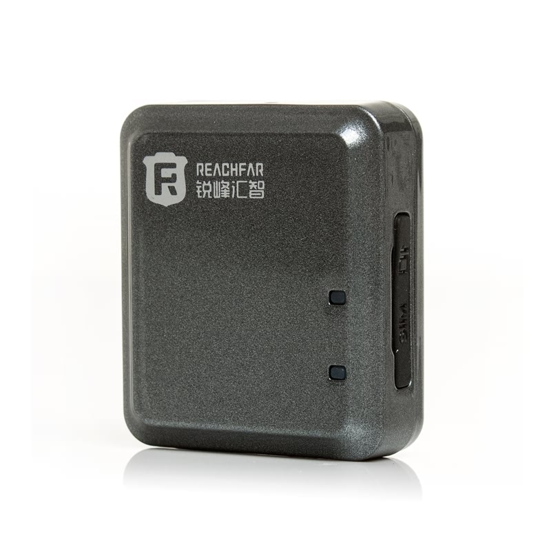

# Reachfar - RF-V8

El RF‑V8 es un rastreador GPS súper compacto diseñado para ofrecer protección antirrobo discreta y monitorización de ubicación en tiempo real confiable. Su tamaño reducido y bajo peso lo hacen ideal para una colocación oculta en vehículos, equipos portátiles o pertenencias personales. El dispositivo integra posicionamiento GNSS con múltiples sensores antirrobo, como detección de vibración, alarma por ruido, notificación de cambio de SIM y alertas de batería baja, además de escucha remota y varias opciones de control remoto.

Como el RF‑V8 envía datos de posición y eventos mediante GPRS, puede integrarse con Plaspy para monitorización centralizada y envío de alertas. Plaspy procesa la telemetría del dispositivo para que los administradores visualicen ubicaciones en vivo, reciban eventos antirrobo, revisen trazas históricas y gestionen múltiples unidades RF‑V8 junto con otros modelos desde un único panel de control de flotas o activos.

## Aspectos principales

- Compatible con Plaspy vía GPRS cuadribanda para seguimiento en tiempo real y reproducción de trazas históricas.
- Factor de forma supermini ideal para colocación discreta en vehículos o activos portátiles.
- Posicionamiento GNSS que ofrece precisión fiable en cielo abierto para visibilidad operativa.
- Funciones antirrobo integradas: detección de vibración ajustable, alarmas por ruido, alertas por cambio de SIM y notificaciones de batería baja.
- Escucha remota y notificaciones inmediatas para apoyar flujos de respuesta y recuperación.
- Gran autonomía en espera y opciones de monitorización flexibles, incluyendo web, aplicación móvil y control por SMS.

## Cómo funciona con Plaspy

Cuando un RF‑V8 transmite su posición y eventos de sus sensores, Plaspy recibe esos mensajes y los presenta mediante una interfaz de monitoreo unificada. Esto permite a los equipos centralizar datos de ubicación y eventos de seguridad de múltiples dispositivos RF‑V8, configurar alertas y revisar rutas históricas para investigación de incidentes.

- Actualizaciones de ubicación en tiempo real enviadas a Plaspy para visualización en mapa y seguimiento operativo.
- Eventos antirrobo como vibración y alarmas por ruido aparecen en Plaspy como notificaciones accionables.
- Alertas de batería baja y cambio de SIM se retransmiten para que los administradores puedan intervenir antes de una pérdida de servicio.
- Reproducción de trazas históricas y marcas temporales de eventos para revisiones forenses y análisis de rutas dentro de Plaspy.
- Las notificaciones pueden distribuirse a través de los canales de Plaspy para que los equipos reciban alertas de forma inmediata.

## Casos de uso típicos

- Protección antirrobo discreta de vehículos con alertas rápidas e informes de ubicación para facilitar la recuperación.
- Protección de activos en almacenes o instalaciones para equipos portátiles que requieren monitoreo de movimientos.
- Rastreo de pertenencias personales como equipaje o equipos de alto valor que necesitan colocación oculta.
- Monitorización de alquileres de corta duración donde el historial centralizado y las alertas ayudan a gestionar devoluciones y pérdidas.
- Supervisión de pequeñas flotas o múltiples activos donde se prefieren rastreadores compactos para instalaciones discretas.

## Por qué elegir este rastreador con Plaspy

El RF‑V8 es una opción práctica cuando el tamaño compacto y la telemetría orientada a la prevención de robos son prioritarios. Alimentar sus posiciones y eventos de sensores en Plaspy brinda a las organizaciones visibilidad centralizada y alertas simplificadas sin añadir complejidad a su infraestructura de monitoreo. Su perfil discreto y sus alarmas en capas lo hacen adecuado para casos de uso orientados a la recuperación, mientras Plaspy se encarga de la agregación, notificaciones e informes históricos.

Si desea evaluar la adecuación del dispositivo para su programa, considere el RF‑V8 cuando la colocación oculta, las alertas oportunas y la monitorización centralizada sean importantes. Conozca más sobre cómo Plaspy puede gestionar unidades RF‑V8 y otros rastreadores compatibles en https://www.plaspy.com. Las especificaciones del producto, disponibilidad y detalles del fabricante pueden cambiar con el tiempo, por lo que verifique las especificaciones actuales y la documentación oficial en el sitio de Reachfar https://www.reachfargps.com/ antes de comprar.
