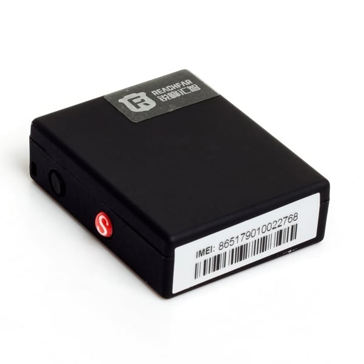

# Reachfar - RF-V9 (Rastreador GPS compacto)

El RF-V9 es un rastreador GPS compacto de Reachfar diseñado para ofrecer seguimiento en tiempo real fiable de vehículos, objetos personales y activos que requieren discreción. Integra radio GSM cuatribanda y una batería recargable para enviar actualizaciones de posición y telemetría de forma continua a plataformas en internet, aplicaciones móviles, WeChat y por SMS. Entre sus funciones principales se encuentran alarmas por vibración y sonido, reproducción de trazas, alertas por geocerca y comunicación de voz bidireccional para monitoreo de audio bajo demanda.

Como dispositivo compatible con Plaspy, el RF-V9 puede transmitir información de ubicación, movimiento y estado a Plaspy para una visibilidad consolidada y supervisión operativa. Sus mensajes de alerta listos para plataforma y la telemetría básica lo convierten en una opción práctica para organizaciones que buscan un rastreador sencillo que se integre a flujos de trabajo de seguimiento basados en Plaspy para monitoreo de flotas, alertas antirrobo y visibilidad de activos.

## Aspectos destacados

- Seguimiento en tiempo real compatible con Plaspy para actualizaciones continuas de posición y visibilidad en plataforma
- Radio GSM cuatribanda para cobertura celular amplia donde hay señal GSM
- Factor de forma compacto y discreto, apto para vehículos y activos portátiles
- Alarmas por sensor de vibración y sonido para detectar manipulación o movimientos inesperados
- Voz bidireccional y escucha remota para verificación situacional bajo demanda
- Batería recargable integrada con alertas remotas de batería baja y capacidad de espera prolongada
- Soporte para funciones de plataforma como alertas por geocerca y reproducción de trazas para revisión de incidentes

## Cómo funciona con Plaspy

Al integrarse con Plaspy, el RF-V9 envía su ubicación y mensajes de alerta para que despachadores y gerentes puedan ver los dispositivos en mapas en vivo, recibir notificaciones y generar informes sencillos. Plaspy ingiere la telemetría del dispositivo y la presenta junto con otros datos de la flota para apoyar el monitoreo diario y la respuesta a incidentes.

- Las actualizaciones de posición en vivo aparecen en los mapas de Plaspy para visibilidad de vehículos y activos en tiempo real
- Las alertas de movimiento y manipulación disparan notificaciones en la plataforma para que los equipos respondan con rapidez
- La reproducción histórica de trazas y los eventos de geocerca están disponibles para revisión de rutas y auditorías
- Los mensajes de batería y estado ayudan a programar cargas o recuperaciones antes de que los dispositivos queden fuera de línea
- Los eventos de voz bidireccional y los registros de incidentes pueden usarse para verificar situaciones detectadas por el equipo

## Casos de uso típicos

- Anti robo y recuperación de vehículos con alertas por manipulación y verificación de audio remota
- Seguimiento de flotas pequeñas y medianas para monitoreo básico de rutas y supervisión operativa
- Protección discreta de activos de alto valor y objetos portátiles que requieren vigilancia oculta
- Verificaciones puntuales y chequeos situacionales mediante voz bidireccional y escucha remota
- Alertas basadas en geocercas para control perimetral y monitoreo de entradas y salidas

## Por qué elegir este rastreador con Plaspy

El RF-V9 ofrece un equilibrio práctico entre tamaño, autonomía y telemetría esencial para organizaciones e individuos que requieren hardware compatible con Plaspy sin complejidad adicional. Sus funciones de alerta, su huella compacta y la compatibilidad con plataformas lo hacen apropiado para gestión básica de flotas, mitigación de robos y programas de visibilidad de activos donde importan la integración sencilla y el comportamiento predecible.

Si sus requisitos se centran en actualizaciones de posición fiables, detección de manipulación y herramientas básicas de investigación como la reproducción de trazas y la escucha remota, el RF-V9 es un candidato sensato para emparejar con Plaspy. Su conjunto de funciones común ayuda a reducir la fricción en la configuración, de modo que los equipos puedan comenzar a monitorear, alertar e informar con mínima configuración en la plataforma.

Learn more about Plaspy and how compatible devices work with the platform at https://www.plaspy.com. Please note that product specifications, availability and manufacturer details can change over time, so verify current specifications and official documentation on the Reachfar website https://www.reachfargps.com/.
