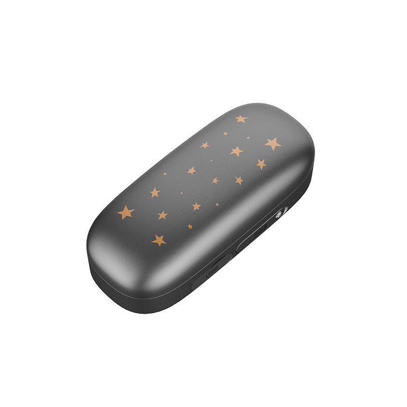

# Reachfar - V53

El V53 Smart GPS Tracker de Reachfar es un dispositivo compacto diseñado para colocarse en el collar y pensado para propietarios de mascotas que necesitan localización confiable y telemetría básica. Combina posicionamiento GNSS múltiple con conectividad LTE 4G y una carcasa con clasificación IP67, además de un cierre físico anti-manipulación, lo que lo hace adecuado para el uso diario al aire libre y el monitoreo rutinario de la actividad de la mascota. Incluye funciones orientadas a la seguridad de la mascota, como podómetro de actividad, alertas por batería baja, timbre y luces LED intermitentes, así como comunicación bidireccional por voz para facilitar la recuperación rápida.

Como dispositivo compatible con Plaspy, el V53 puede transmitir ubicaciones y datos de estado a Plaspy para monitoreo y reportes centralizados. Esta compatibilidad permite a los propietarios y pequeños operadores ver la posición en vivo, revisar rutas históricas, configurar geocercas y recibir alertas inmediatas desde las interfaces web y móvil de Plaspy. La telemetría centrada en mascotas del V53 encaja de forma natural en los flujos de trabajo de Plaspy para ofrecer conciencia situacional y supervisión diaria sin necesidad de integraciones complejas.

## Características principales

- Diseño compacto para colocarse en el collar con resistencia al polvo y al agua IP67, ideal para uso cotidiano de mascotas.
- Compatibilidad con Plaspy para seguimiento en vivo, reproducción de rutas históricas y alertas centralizadas.
- Posicionamiento GNSS múltiple que incluye GPS, BeiDou y GLONASS para obtener fijaciones de ubicación fiables en exteriores.
- Conectividad LTE 4G para transmisión continua de datos y entrega rápida de alertas.
- Funciones orientadas a mascotas: podómetro de actividad, alarmas por batería baja, timbre y luces LED intermitentes para localización nocturna.
- Cierre físico anti-manipulación y comunicación de voz bidireccional para disuasión y comprobaciones remotas de audio.

## Cómo funciona con Plaspy

Al emparejarse con Plaspy, el V53 envía actualizaciones de ubicación y estado a la plataforma en casi tiempo real, de modo que usted puede supervisar a sus mascotas desde una única interfaz. Plaspy procesa las posiciones y la telemetría del dispositivo y las muestra mediante mapas en vivo, reglas de alerta y registros históricos para facilitar la supervisión.

- Seguimiento de posición en vivo y vista de mapa para visibilidad continua de la ubicación de la mascota.
- Reproducción de rutas históricas para revisar movimientos en periodos de tiempo seleccionados.
- Configuración de geocercas y alertas inmediatas de salida de zonas designadas.
- Notificaciones de telemetría y estado, como resúmenes de actividad y advertencias por batería baja.
- Opciones de localización remota y comunicación expuestas en Plaspy junto con los controles del dispositivo.

## Casos de uso típicos

- Monitoreo diario de la seguridad de la mascota para rastrear comportamientos de paseo y descanso.
- Recuperación de mascotas perdidas mediante alertas de geocerca, timbre, localización con LED y comunicación por voz.
- Seguimiento de actividad para vigilar patrones de ejercicio mediante resúmenes del podómetro.
- Localización en la noche o con visibilidad reducida soportada por luces LED intermitentes y tonos audibles.
- Gestión centralizada de dispositivos para mascotas para propietarios o pequeños operadores usando los paneles de Plaspy.

## Por qué elegir este rastreador con Plaspy

El Reachfar V53 está diseñado específicamente para el rastreo de mascotas y ofrece una combinación práctica de robustez, conectividad y funciones específicas para animales. Su formato para collar, protección IP67 y herramientas sencillas de localización facilitan su colocación en las mascotas, mientras que LTE 4G y el posicionamiento GNSS múltiple aseguran actualizaciones de ubicación confiables en escenarios exteriores habituales.

Si ya utiliza Plaspy o está evaluando una plataforma para supervisión consolidada, el V53 es una adición lógica para implementaciones orientadas a mascotas, ya que la compatibilidad permite mapas unificados, alertas e informes históricos junto con otros dispositivos. Para obtener más información sobre Plaspy visite el sitio principal https://www.plaspy.com. Las especificaciones y la disponibilidad del producto pueden cambiar con el tiempo, por favor verifique los detalles actuales y la documentación oficial en el sitio del fabricante https://www.reachfargps.com/.
