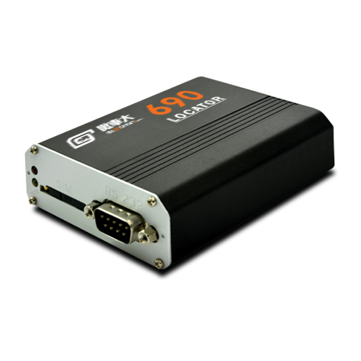

# Riti - 690 (IDU-400)

Locator 690 (IDU-400) es una unidad de datos inteligente profesional con GNSS diseñada para la gestión de flotas y el IoT en vehículos comerciales. Integra posicionamiento satelital de alta sensibilidad, telemetría celular multibanda y una amplia gama de entradas y salidas vehiculares para capturar la telemetría esencial que requieren las flotas. El equipo está pensado para usos operativos exigentes donde se necesita ubicación continua, reporte de eventos e integración con periféricos.

Como dispositivo compatible con Plaspy listo para usar, el Locator 690 se integra con Plaspy para ofrecer seguimiento en vivo, alertas e informes históricos. Su almacenamiento a bordo y el reenvío de eventos permiten que Plaspy mantenga una visibilidad consolidada de la flota incluso durante interrupciones temporales de conectividad, lo que convierte al 690 en una opción práctica para operadores que buscan integración rápida y datos confiables para paneles e análisis.

## Características principales

- Rastreador compatible con Plaspy para una integración sencilla en flujos de monitoreo de flotas
- GNSS multiconstelación de alta sensibilidad para fijaciones de posición rápidas y precisas
- Soporte celular multibanda y mecanismos de respaldo para un enlace de telemetría confiable en distintas regiones
- Varias entradas digitales y analógicas además de canales de temperatura para capturar eventos de vehículo y sensores
- Almacenamiento interno con rellenado automático para evitar brechas de datos durante cortes
- Detección de movimiento y manipulación integrada con alertas de eventos para apoyar la seguridad y la respuesta a incidentes

## Cómo funciona con Plaspy

Al utilizarlo con Plaspy, el Locator 690 provee las posiciones y la telemetría de vehículo que Plaspy necesita para poblar mapas, activar alertas y generar reportes. Plaspy procesa fijaciones GNSS, cambios en el estado de entradas y registros de eventos para ofrecer una visibilidad unificada en flotas mixtas y apoyar flujos de trabajo de despacho automatizado y cumplimiento.

- Actualizaciones de posición en tiempo real y monitoreo de rutas visibles en mapas y paneles de flota de Plaspy
- Reporte de entradas digitales y eventos en Plaspy para estado de ignición, puertas y condiciones de alarma
- Reproducción histórica y rellenado de registros almacenados para reconstrucción de recorridos y reportes sin huecos
- Datos de sensores y auxiliares como entradas de temperatura y eventos SOS presentados en Plaspy para monitoreo y escalamiento
- Alertas y eventos de geocercas enviados a Plaspy para notificar a despachadores y activar reglas de automatización

## Casos de uso típicos

- Gestión de flotas y despacho donde la posición continua y los datos de eventos mejoran el enrutamiento y la coordinación
- Prevención de robo y monitoreo de seguridad usando alertas de manipulación y movimiento para respuesta rápida
- Monitoreo de cadena de frío o transporte refrigerado mediante entradas de temperatura y sondas opcionales
- Integraciones con MDVR y seguridad del conductor para combinar telemetría del vehículo con video grabado o registros de eventos
- Escenarios regulatorios o exigidos por normativa que requieren seguimiento continuo confiable y registros históricos

## Por qué elegir este rastreador con Plaspy

El Locator 690 es una buena opción para organizaciones que buscan un terminal duradero y con abundante información que se conecte a Plaspy para las operaciones diarias de flota y los análisis a largo plazo. Su combinación de GNSS sensible, amplia cobertura celular y múltiples opciones de E/S lo hace versátil según el tipo de vehículo y las necesidades operativas, mientras que el almacenamiento a bordo y la retransmisión automática ayudan a preservar la continuidad en los informes de Plaspy.

Si usted desea telemetría concisa y fiable alimentando una única plataforma de flota, el Riti 690 emparejado con Plaspy ofrece los elementos básicos para monitoreo en vivo, alertas y reportes. Para obtener más información sobre Plaspy y cómo se utilizan los dispositivos compatibles en la plataforma visite https://www.plaspy.com. Las especificaciones y la disponibilidad del producto pueden cambiar con el tiempo, por lo que le recomendamos verificar los detalles y accesorios actuales en el sitio del fabricante https://www.riti.com.tw/
