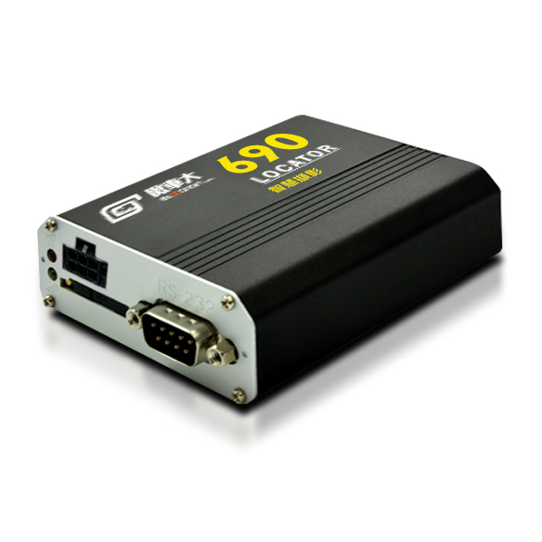

# Riti - 690 (IDU-401)

Locator 690 (IDU-401) es un dispositivo móvil IoT montado en vehículo, diseñado para la gestión moderna de flotas. Combina telemetría GPS con captura de imágenes integrada y detección con IA en el propio equipo para identificar eventos de conducción anómalos. Está pensado para funcionar junto a los sistemas DVR y MDVR ya instalados, capturando y almacenando en búfer imágenes previas, durante y posteriores al evento para facilitar una revisión más rápida de incidentes.

Como rastreador compatible con Plaspy, el Locator 690 incorpora evidencia fotográfica y seguimiento en tiempo real a la plataforma Plaspy sin necesidad de reemplazar los grabadores de vídeo instalados. Sus flujos de trabajo orientados a eventos, disparadores configurables de entradas y salidas, y el almacenamiento local permiten a los gerentes de flota obtener imágenes en vivo bajo demanda, indexar fotos de eventos con datos de ubicación y acelerar decisiones basadas en evidencias en sus operaciones.

## Puntos clave

- Rastreador vehicular compatible con Plaspy con IA en el dispositivo para detección de eventos y captura automática de imágenes
- Evidencia fotográfica por evento para vuelcos, colisiones, maniobras bruscas, exceso de velocidad, SOS y otros eventos anómalos
- Recuperación de imágenes en vivo a través de la plataforma Plaspy y las aplicaciones móviles para conocimiento situacional inmediato
- Entradas y salidas configurables con soporte para hasta cinco entradas digitales y múltiples puertos analógicos y de temperatura
- Conectividad celular 2G, 3G y 4G y GNSS MT3333 para un seguimiento en tiempo real confiable
- Almacenamiento local aproximado de 30,000 registros GPS y almacenamiento circular de imágenes para preservar datos durante cortes de conexión
- Diseño compacto montado en vehículo, adecuado para entornos de flotas comerciales

## Cómo funciona con Plaspy

Al conectarse a Plaspy, el Locator 690 sincroniza la telemetría GPS y la evidencia fotográfica indexada con la plataforma en la nube, de modo que los equipos de flota puedan investigar eventos con fotografías vinculadas directamente a trayectos y marcas de tiempo. Plaspy muestra alertas, imágenes en vivo e historiales de eventos para que los responsables puedan correlacionar el comportamiento del conductor con pruebas fotográficas y contexto de ubicación.

- Telemetría e imágenes sincronizadas y subidas a Plaspy para líneas de tiempo y búsquedas unificadas de eventos
- Alertas basadas en eventos y captura automática de imágenes para una detección y respuesta más rápida ante incidentes
- Recuperación de imágenes en vivo bajo demanda desde los paneles de Plaspy y las aplicaciones móviles para verificar situaciones en tiempo real
- Disparadores de E/S configurables para ampliar la detección de eventos usando entradas del vehículo y periféricos conectados
- Almacenamiento local y reenvío al reconectarse para asegurar que los registros GPS y las imágenes de eventos se conserven durante pérdidas temporales de conectividad

## Casos de uso típicos

- Investigación de incidentes de flota donde las imágenes previas, durante y posteriores al evento agilizan la recopilación de pruebas
- Programas de seguridad y conducta del conductor que vinculan eventos bruscos con evidencia fotográfica para la retroalimentación y capacitación
- Flotas de transporte público y municipales que requieren reportes de eventos indexados y acceso a imágenes en vivo bajo demanda
- Operaciones de logística y entrega que combinan telemetría GPS con evidencia fotográfica y sensores periféricos para comprobantes de servicio
- Operaciones que mantienen sistemas DVR o MDVR pero necesitan imágenes indexadas en la nube y buscables sin reemplazar los grabadores existentes

## Por qué elegir este rastreador con Plaspy

El Locator 690 es una opción práctica para organizaciones que requieren más que solo datos de posición. Al combinar detección de eventos con IA en el dispositivo, disparadores de E/S configurables y un robusto almacenamiento en búfer con las capacidades de la plataforma Plaspy, la unidad añade una capa de imágenes indexadas y buscables al seguimiento y reporte en tiempo real. Esto acelera la reconstrucción de incidentes y proporciona a los gerentes de flota pruebas más claras para respaldar decisiones sobre seguridad, cumplimiento y operaciones.

Si desea explorar cómo puede integrarse el Locator 690 en su implementación de Plaspy, conozca más sobre Plaspy en el sitio principal https://www.plaspy.com. Las especificaciones y la disponibilidad del producto pueden cambiar con el tiempo, por lo que le recomendamos verificar los detalles técnicos actuales y las opciones de accesorios en el sitio del fabricante https://www.riti.com.tw/ antes de comprar.
