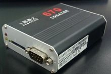

# Riti - IDU-300

El Riti IDU-300 es una Unidad de Datos Inteligente 3G diseñada para la gestión de flotas moderna. Ofrece seguimiento en tiempo real, soporte para despacho y reporte de anomalías del vehículo, e integra con plataformas de gestión de flotas y aplicaciones móviles. El IDU-300 también admite accesorios opcionales como un panel de despacho y un sensor de temperatura, lo que permite una supervisión más amplia además de los datos básicos de ubicación.

Como dispositivo compatible con Plaspy, el IDU-300 puede enviar datos de ubicación y de accesorios a Plaspy para mejorar la visibilidad y el control operativo. Los usuarios de Plaspy pueden aprovechar el rastreador para monitorear vehículos, recibir alertas y utilizar herramientas de informes que apoyen la toma de decisiones en la flota, manteniendo la flexibilidad de trabajar junto a las integraciones nativas del dispositivo.

## Aspectos destacados

- Conectividad 3G para capacidades de rastreo mejoradas en comparación con dispositivos 2G antiguos
- Seguimiento en tiempo real y funciones de despacho que facilitan la supervisión operativa
- Compatibilidad con accesorios como paneles de despacho y sensores de temperatura para ampliar el monitoreo
- Diseñado para ayudar a los administradores de flota con soporte a la toma de decisiones y reporte de anomalías
- Integración sencilla con plataformas de gestión de flotas, incluyendo el sistema nativo eLocation del dispositivo y Plaspy
- Adecuado tanto para flotas pequeñas como para operaciones a mayor escala que busquen visibilidad centralizada

## Cómo funciona con Plaspy

Cuando se conecta con Plaspy, el IDU-300 transmite la ubicación del vehículo y la información de los accesorios para que los administradores de flota puedan ver y actuar sobre esos datos desde la plataforma Plaspy. Esto permite una supervisión consolidada en flotas mixtas y respalda tanto las operaciones en vivo como el análisis posterior a los eventos.

- Visualización en vivo de la ubicación y movimientos de los vehículos en los paneles de Plaspy
- Monitoreo de entradas de accesorios, como estado del panel de despacho y lecturas de temperatura cuando están disponibles
- Alertas y notificaciones por anomalías reportadas y eventos relevantes
- Soporte para flujos de trabajo de despacho y supervisión operativa mediante las herramientas de Plaspy
- Historial de seguimiento e informes para facilitar el análisis y la revisión de desempeño

## Casos de uso típicos

- Despacho centralizado y supervisión de rutas para flotas de reparto y servicios
- Monitoreo de transporte sensible a la temperatura cuando se instala un sensor de temperatura
- Reporte de anomalías a nivel de flota y revisión de incidentes
- Escalamiento desde pilotos en flotas pequeñas hasta despliegues más amplios en vehículos mixtos
- Coordinación de recursos móviles y mejora en la toma de decisiones con datos de ubicación oportunos

## Por qué elegir este rastreador con Plaspy

El IDU-300 es una opción práctica para organizaciones que avanzan más allá de equipos 2G heredados y buscan un dispositivo que permita expansión mediante accesorios y operaciones en tiempo real. Su enfoque en el soporte a la toma de decisiones para flotas se alinea con los casos de uso de Plaspy en torno a visibilidad, alertas e informes, por lo que es una alternativa sensata para combinar con la plataforma en muchos escenarios operativos.

Aunque las especificaciones del producto y los conjuntos de accesorios compatibles pueden variar, la combinación del IDU-300 de integración con plataformas y compatibilidad con accesorios lo convierte en un candidato útil para flotas que necesitan monitoreo flexible y supervisión centralizada a través de Plaspy.

Para obtener más información sobre cómo Plaspy puede trabajar con dispositivos como el Riti IDU-300 visite https://www.plaspy.com. Las especificaciones del producto, disponibilidad y datos del fabricante pueden cambiar con el tiempo, por lo que le recomendamos verificar las especificaciones actuales y la compatibilidad de accesorios en el sitio oficial de Riti https://www.riti.com.tw/.
