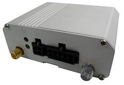

# Riti - SLS-00886

El Riti SLS-00886 es un rastreador GPS para vehículos diseñado para ofrecer seguimiento de ubicación confiable y monitoreo remoto. Integra un receptor GPS de alta sensibilidad SiRF Star III con un módulo GSM cuatribanda y admite reportes por SMS y GPRS. El dispositivo puede enviar coordenadas a un servidor o mensajes SMS a números definidos por el usuario, e incluye funciones prácticas como detección de voltaje de batería del vehículo, monitoreo de rutas y registro de datos históricos.

Como equipo compatible con Plaspy, el SLS-00886 puede enviar datos de ubicación e historial a Plaspy para supervisión y generación de informes centralizados. Sus opciones de reporte flexibles y la plataforma profesional incluida hacen que sea una opción práctica para usuarios particulares y empresas pequeñas y medianas que desean visibilidad sobre la ubicación del vehículo, el historial de desplazamientos y el estado básico del equipo.

## Aspectos clave

- Receptor GPS SiRF Star III de alta sensibilidad para fijaciones de posición confiables
- Opciones de transmisión por SMS y GPRS para entrega de datos flexible
- Módulo GSM cuatribanda para amplia cobertura de redes móviles
- Capacidad para enviar coordenadas a un servidor o mensajes SMS directos a usuarios
- Plataforma profesional incluida sin costo, adecuada para flotas pequeñas y uso personal
- Soporta instalación en motocicletas y bicicletas eléctricas y registra datos históricos
- Detección del voltaje de la batería del vehículo para monitoreo básico de energía

## Cómo funciona con Plaspy

Al integrarse con Plaspy, el SLS-00886 proporciona los mensajes de ubicación y el historial que Plaspy necesita para ofrecer una vista consolidada de la flota y datos operativos. Plaspy procesa los reportes del dispositivo y los presenta junto con otros activos, permitiendo un seguimiento unificado y supervisión centralizada.

- Visualización en tiempo real en los mapas de Plaspy usando los reportes del dispositivo
- Reproducción del historial y monitoreo de rutas a partir de los datos registrados por el rastreador
- El reporte por SMS puede funcionar como método alternativo o como canal de alertas directo además del reporte al servidor
- Visión general de flota y paneles de estado para supervisar múltiples unidades SLS-00886 simultáneamente
- Generación de informes y alertas basadas en los mensajes recibidos y en los datos históricos registrados

## Casos de uso típicos

- Seguimiento de ubicación y supervisión operativa básica para flotas pequeñas y medianas
- Monitoreo de motocicletas y bicicletas eléctricas para servicios de entrega o urbanos
- Rastreo de vehículos personales para conocimiento de ubicación y revisión de historial
- Seguimiento de rutas de servicios de campo o reparto donde un reporte sencillo es suficiente
- Monitoreo de activos cuando el voltaje de la batería y el historial de movimiento son relevantes

## Por qué elegir este rastreador con Plaspy

El SLS-00886 es una opción simple y económica para organizaciones e individuos que necesitan reportes de posición confiables con múltiples opciones de entrega. Su combinación de sensibilidad GPS, reporte celular y plataforma incluida lo hace práctico para implementaciones en las que la sencillez y el reporte de estado básico son prioritarios.

Con Plaspy, los datos de ubicación e historial del dispositivo se pueden centralizar en una vista única de gestión de flota, ayudando a los operadores a supervisar movimientos, revisar rutas pasadas y mantener control operativo sin una configuración compleja. Con la información disponible, el SLS-00886 resulta especialmente adecuado para flotas pequeñas, motocicletas y bicicletas eléctricas donde la economía del rastreo y la telemetría básica son importantes.

Para obtener más información sobre Plaspy y cómo presenta datos de dispositivos compatibles como el Riti SLS-00886 visite https://www.plaspy.com. Las especificaciones del producto, la disponibilidad y los datos del fabricante pueden cambiar con el tiempo, por lo que usted debe verificar las especificaciones actuales y la documentación en el sitio del fabricante https://www.riti.com.tw/.
